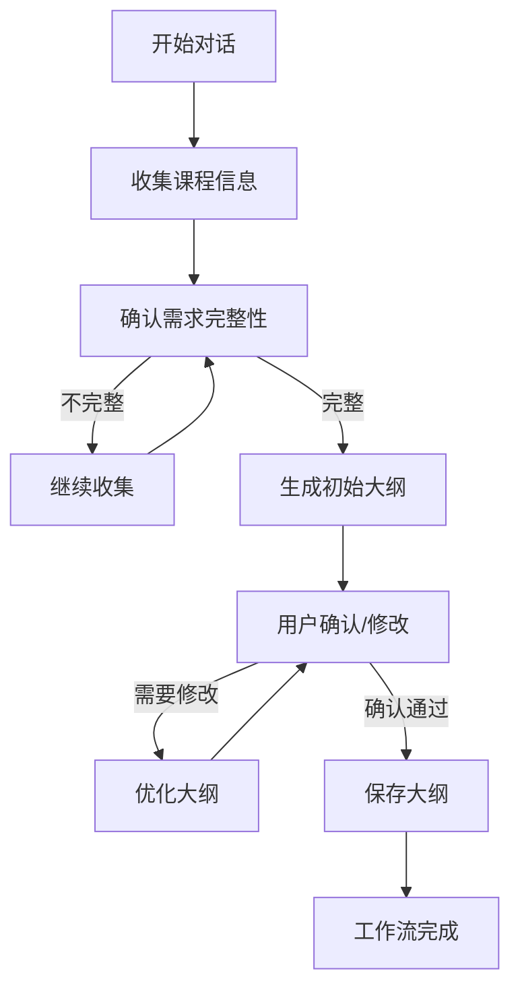
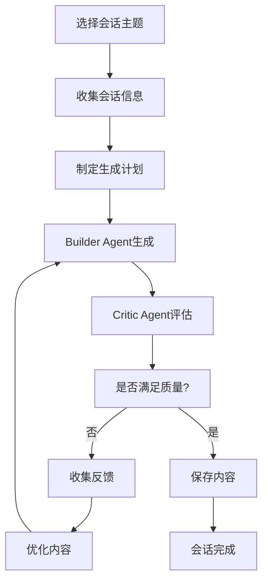
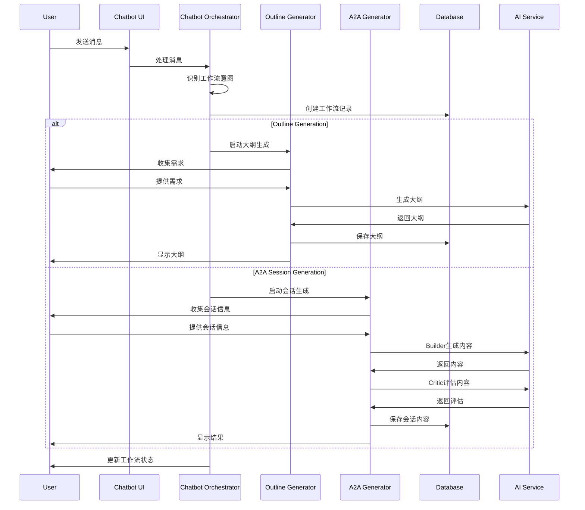

# AI Chatbot工作流工具架构设计

## 1. 系统架构设计

### 1.1 整体架构概览

```
┌─────────────────────────────────────────────────────────────┐
│                    AI Chatbot 工作流系统                        │
├─────────────────────────────────────────────────────────────┤
│  前端层 (Frontend Layer)                                      │
│  ┌─────────────┐ ┌─────────────┐ ┌─────────────┐              │
│  │ Chatbot UI  │ │ Workflow UI │ │ Tool Panel  │              │
│  │  聊天界面    │ │  工作流界面  │ │  工具面板   │              │
│  └─────────────┘ └─────────────┘ └─────────────┘              │
├─────────────────────────────────────────────────────────────┤
│  API层 (API Layer)                                           │
│  ┌─────────────┐ ┌─────────────┐ ┌─────────────┐              │
│  │ Chat API    │ │ Workflow API│ │ Tool API    │              │
│  │  聊天接口    │ │  工作流接口  │ │  工具接口   │              │
│  └─────────────┘ └─────────────┘ └─────────────┘              │
├─────────────────────────────────────────────────────────────┤
│  编排层 (Orchestration Layer)                                │
│  ┌─────────────┐ ┌─────────────┐ ┌─────────────┐              │
│  │ Workflow    │ │ State Mgmt  │ │ Progress    │              │
│  │ Orchestrator│ │  状态管理    │ │ Tracker     │              │
│  └─────────────┘ └─────────────┘ └─────────────┘              │
├─────────────────────────────────────────────────────────────┤
│  工具层 (Tool Layer)                                         │
│  ┌─────────────┐ ┌─────────────┐ ┌─────────────┐              │
│  │ Outline     │ │ A2A Session │ │ Course Edit │              │
│  │ Generator   │ │ Generator   │ │ Tools       │              │
│  └─────────────┘ └─────────────┘ └─────────────┘              │
├─────────────────────────────────────────────────────────────┤
│  AI层 (AI Layer)                                             │
│  ┌─────────────┐ ┌─────────────┐ ┌─────────────┐              │
│  │ Builder     │ │ Critic      │ │ Teacher     │              │
│  │ Agent       │ │ Agent       │ │ Agent       │              │
│  └─────────────┘ └─────────────┘ └─────────────┘              │
├─────────────────────────────────────────────────────────────┤
│  数据层 (Data Layer)                                         │
│  ┌─────────────┐ ┌─────────────┐ ┌─────────────┐              │
│  │ Supabase DB │ │ Redis Cache │ │ File Store  │              │
│  │  数据库      │ │  缓存       │ │  文件存储   │              │
│  └─────────────┘ └─────────────┘ └─────────────┘              │
└─────────────────────────────────────────────────────────────┘
```

### 1.2 核心组件架构

#### 1.2.1 Chatbot Orchestrator (聊天机器人编排器)
```typescript
interface ChatbotOrchestrator {
  // 工作流管理
  createWorkflow(context: WorkflowContext): Promise<WorkflowSession>
  executeWorkflow(workflowId: string, step: WorkflowStep): Promise<WorkflowResult>

  // 状态管理
  getWorkflowState(workflowId: string): Promise<WorkflowState>
  updateWorkflowState(workflowId: string, state: Partial<WorkflowState>): Promise<void>

  // 进度跟踪
  trackProgress(workflowId: string, progress: ProgressData): Promise<void>

  // 错误处理
  handleError(workflowId: string, error: WorkflowError): Promise<void>
}
```

#### 1.2.2 Outline Generation Tool (大纲生成工具)
```typescript
interface OutlineGenerationTool {
  // 需求收集
  collectRequirements(conversation: ConversationContext): Promise<CourseRequirements>

  // 大纲生成
  generateOutline(requirements: CourseRequirements): Promise<CourseOutline>

  // 用户确认
  confirmOutline(outline: CourseOutline, feedback?: string): Promise<OutlineConfirmation>

  // 编辑优化
  editOutline(outlineId: string, modifications: OutlineModification[]): Promise<CourseOutline>
}
```

#### 1.2.3 A2A Session Generation Tool (A2A会话生成工具)
```typescript
interface A2ASessionGenerationTool {
  // 会话规划
  planSession(sessionContext: SessionContext): Promise<SessionPlan>

  // Builder Agent生成
  generateContent(sessionPlan: SessionPlan): Promise<GeneratedContent>

  // Critic Agent评估
  reviewContent(content: GeneratedContent, criteria: ReviewCriteria): Promise<ReviewResult>

  // 迭代优化
  refineContent(content: GeneratedContent, feedback: ReviewResult): Promise<RefinedContent>

  // 最终确认
  finalizeContent(content: RefinedContent): Promise<FinalContent>
}
```

### 1.3 工具接口设计

#### 1.3.1 统一工具接口
```typescript
interface UnifiedAITool {
  // 工具标识
  id: string
  name: string
  category: 'outline' | 'session' | 'edit' | 'analyze'

  // 工具能力
  capabilities: ToolCapability[]

  // 执行方法
  execute(params: ToolParameters, context: ExecutionContext): Promise<ToolResult>

  // 状态查询
  getStatus(executionId: string): Promise<ToolStatus>

  // 取消执行
  cancel(executionId: string): Promise<void>
}
```

#### 1.3.2 工具注册表
```typescript
interface ToolRegistry {
  // 注册工具
  registerTool(tool: UnifiedAITool): void

  // 获取工具
  getTool(id: string): UnifiedAITool | undefined

  // 列出工具
  listTools(category?: string): UnifiedAITool[]

  // 工具发现
  discoverTools(userRole: UserRole): UnifiedAITool[]
}
```

### 1.4 状态管理设计

#### 1.4.1 工作流状态机
```typescript
type WorkflowState =
  | 'initializing'        // 初始化
  | 'collecting_requirements' // 收集中
  | 'generating_outline' // 生成大纲
  | 'confirming_outline' // 确认大纲
  | 'planning_sessions'  // 规划会话
  | 'generating_content' // 生成内容
  | 'refining_content'   // 细化内容
  | 'finalizing'         // 最终确定
  | 'completed'          // 完成
  | 'error'              // 错误
  | 'cancelled'          // 取消

interface WorkflowContext {
  id: string
  userId: string
  userRole: 'teacher' | 'student'
  organizationId?: string
  classId?: string
  courseId?: string
  currentState: WorkflowState
  steps: WorkflowStep[]
  progress: number
  metadata: Record<string, any>
}
```

#### 1.4.2 状态持久化
```typescript
interface WorkflowStorage {
  // 保存状态
  saveState(workflowId: string, state: WorkflowState): Promise<void>

  // 加载状态
  loadState(workflowId: string): Promise<WorkflowState | null>

  // 历史记录
  getHistory(workflowId: string): Promise<WorkflowHistory[]>

  // 清理过期状态
  cleanupExpiredStates(): Promise<void>
}
```

## 2. 功能整合设计

### 2.1 Outline Generation工作流



#### 2.1.1 需求收集阶段
```typescript
interface RequirementCollector {
  // 启动收集
  startCollection(userId: string, context: CollectionContext): Promise<CollectionSession>

  // 处理用户输入
  processInput(sessionId: string, input: UserInput): Promise<ProcessingResult>

  // 评估需求完整性
  evaluateCompleteness(requirements: Partial<CourseRequirements>): Promise<CompletenessAssessment>

  // 生成确认摘要
  generateSummary(requirements: CourseRequirements): Promise<RequirementsSummary>
}
```

#### 2.1.2 大纲生成阶段
```typescript
interface OutlineGenerator {
  // 生成初始大纲
  generateInitial(requirements: CourseRequirements): Promise<GeneratedOutline>

  // 优化大纲结构
  optimizeStructure(outline: GeneratedOutline): Promise<OptimizedOutline>

  // 验证大纲质量
  validateOutline(outline: GeneratedOutline): Promise<ValidationResult>

  // 导出为标准格式
  exportOutline(outline: OptimizedOutline): Promise<CourseOutline>
}
```

### 2.2 A2A Session Generation工作流



#### 2.2.1 Builder Agent
```typescript
interface BuilderAgent {
  // 生成内容
  generateContent(
    context: SessionContext,
    previousFeedback?: string
  ): Promise<GeneratedContent>

  // 改进内容
  refineContent(
    originalContent: GeneratedContent,
    feedback: ReviewFeedback
  ): Promise<RefinedContent>

  // 生成多版本
  generateAlternatives(
    context: SessionContext,
    count: number
  ): Promise<GeneratedContent[]>
}
```

#### 2.2.2 Critic Agent
```typescript
interface CriticAgent {
  // 评估内容质量
  evaluateContent(
    content: GeneratedContent,
    criteria: EvaluationCriteria
  ): Promise<EvaluationResult>

  // 生成改进建议
  generateImprovementSuggestions(
    content: GeneratedContent,
    evaluation: EvaluationResult
  ): Promise<ImprovementSuggestion[]>

  // 评分排名
  rankVersions(
    versions: GeneratedContent[]
  ): Promise<RankedVersions>
}
```

### 2.3 用户交互和选项选择机制

#### 2.3.1 交互式选项生成
```typescript
interface InteractiveOptionGenerator {
  // 生成多选项问题
  generateMultipleChoice(
    question: string,
    context: SessionContext,
    count: number
  ): Promise<MultipleChoiceOptions>

  // 生成填空选项
  generateFillBlanks(
    text: string,
    context: SessionContext
  ): Promise<FillBlankOptions>

  // 生成滑块选项
  generateSliderOptions(
    min: number,
    max: number,
    step: number,
    default: number
  ): Promise<SliderOptions>
}
```

#### 2.3.2 实时反馈机制
```typescript
interface RealTimeFeedback {
  // 发送进度更新
  sendProgressUpdate(
    workflowId: string,
    progress: ProgressUpdate
  ): Promise<void>

  // 发送状态变化
  sendStateChange(
    workflowId: string,
    oldState: WorkflowState,
    newState: WorkflowState
  ): Promise<void>

  // 发送错误通知
  sendErrorNotification(
    workflowId: string,
    error: WorkflowError
  ): Promise<void>
}
```

### 2.4 进度跟踪和状态反馈

#### 2.4.1 进度指标
```typescript
interface ProgressMetrics {
  // 总体进度百分比
  overallProgress: number

  // 当前阶段进度
  currentPhaseProgress: number

  // 预计完成时间
  estimatedTimeRemaining: number

  // 已完成步骤
  completedSteps: string[]

  // 当前活跃步骤
  activeStep: string

  // 下一步建议
  nextSteps: string[]
}
```

#### 2.4.2 可视化组件
```typescript
interface ProgressVisualization {
  // 进度条
  renderProgressBar(metrics: ProgressMetrics): JSX.Element

  // 步骤指示器
  renderStepIndicator(steps: WorkflowStep[]): JSX.Element

  // 时间估算
  renderTimeEstimate(metrics: ProgressMetrics): JSX.Element

  // 状态徽章
  renderStatusBadge(state: WorkflowState): JSX.Element
}
```

## 3. API设计

### 3.1 API架构概览

```
/api/chatbot/
├── /workflows/          # 工作流管理
│   ├── POST /create     # 创建工作流
│   ├── GET /:id         # 获取工作流状态
│   ├── PUT /:id/state   # 更新工作流状态
│   └── DELETE /:id      # 取消工作流
│
├── /tools/              # 工具调用
│   ├── POST /execute    # 执行工具
│   ├── GET /:id/status  # 获取执行状态
│   └── POST /:id/cancel # 取消执行
│
├── /outline/            # 大纲生成
│   ├── POST /collect    # 收集需求
│   ├── POST /generate   # 生成大纲
│   ├── PUT /:id/edit    # 编辑大纲
│   └── POST /:id/confirm # 确认大纲
│
├── /session/            # 会话生成
│   ├── POST /plan       # 规划会话
│   ├── POST /generate   # 生成内容
│   ├── POST /review     # 评估内容
│   └── POST /refine     # 细化内容
│
└── /chat/               # 聊天接口
    ├── POST /message    # 发送消息
    ├── GET /history     # 获取历史
    └── WebSocket /stream # 流式响应
```

### 3.2 请求/响应格式

#### 3.2.1 统一响应格式
```typescript
interface StandardApiResponse<T = any> {
  success: boolean
  data?: T
  error?: {
    code: string
    message: string
    details?: any
  }
  metadata: {
    timestamp: string
    requestId: string
    processingTimeMs: number
  }
}
```

#### 3.2.2 工作流API示例

**创建工作流**
```typescript
// POST /api/chatbot/workflows/create
interface CreateWorkflowRequest {
  type: 'outline_generation' | 'a2a_session_generation' | 'combined'
  context: {
    userId: string
    userRole: 'teacher' | 'student'
    organizationId?: string
    classId?: string
    courseId?: string
    initialData?: Record<string, any>
  }
  options?: {
    autoSave: boolean
    enableNotifications: boolean
    maxIterations: number
  }
}

interface CreateWorkflowResponse {
  workflowId: string
  initialState: WorkflowState
  firstStep: WorkflowStep
  estimatedDuration: number
}
```

**执行工作流步骤**
```typescript
// PUT /api/chatbot/workflows/:id/execute
interface ExecuteWorkflowRequest {
  stepId: string
  input: {
    type: 'user_input' | 'tool_result' | 'system_event'
    data: any
  }
  options?: {
    skipValidation: boolean
    forceExecute: boolean
  }
}

interface ExecuteWorkflowResponse {
  success: boolean
  nextStep?: WorkflowStep
  output?: any
  progress: ProgressMetrics
  suggestions?: string[]
}
```

### 3.3 错误处理和重试机制

#### 3.3.1 错误分类
```typescript
type WorkflowErrorType =
  | 'validation_error'     // 验证错误
  | 'tool_execution_error' // 工具执行错误
  | 'ai_service_error'     // AI服务错误
  | 'user_cancelled'       // 用户取消
  | 'timeout_error'        // 超时错误
  | 'system_error'         // 系统错误

interface WorkflowError {
  type: WorkflowErrorType
  code: string
  message: string
  details?: any
  recoverable: boolean
  retryAfter?: number
  suggestedActions?: string[]
}
```

#### 3.3.2 重试策略
```typescript
interface RetryStrategy {
  maxAttempts: number
  baseDelayMs: number
  maxDelayMs: number
  backoffMultiplier: number
  jitterEnabled: boolean
  retryableErrors: WorkflowErrorType[]
}

const DEFAULT_RETRY_STRATEGY: RetryStrategy = {
  maxAttempts: 3,
  baseDelayMs: 1000,
  maxDelayMs: 10000,
  backoffMultiplier: 2,
  jitterEnabled: true,
  retryableErrors: ['tool_execution_error', 'ai_service_error', 'timeout_error']
}
```

### 3.4 权限验证和安全控制

#### 3.4.1 权限模型
```typescript
interface Permission {
  resource: string
  action: string
  conditions?: Record<string, any>
}

interface UserRole {
  id: string
  name: string
  permissions: Permission[]
  restrictions?: Record<string, any>
}

const ROLES: Record<string, UserRole> = {
  teacher: {
    id: 'teacher',
    name: '教师',
    permissions: [
      { resource: 'workflow', action: 'create' },
      { resource: 'workflow', action: 'execute' },
      { resource: 'outline', action: 'edit' },
      { resource: 'session', action: 'generate' },
      { resource: 'session', action: 'review' }
    ]
  },
  student: {
    id: 'student',
    name: '学生',
    permissions: [
      { resource: 'workflow', action: 'view' },
      { resource: 'session', action: 'consume' }
    ]
  }
}
```

#### 3.4.2 安全控制
```typescript
interface SecurityContext {
  userId: string
  organizationId: string
  roles: string[]
  permissions: Permission[]
  restrictions: Record<string, any>
  sessionId: string
  ipAddress: string
  userAgent: string
}

interface SecurityValidator {
  validateAccess(
    context: SecurityContext,
    resource: string,
    action: string
  ): Promise<boolean>

  validateDataAccess(
    context: SecurityContext,
    dataId: string,
    dataType: string
  ): Promise<boolean>

  validateWorkflowAccess(
    context: SecurityContext,
    workflowId: string
  ): Promise<boolean>
}
```

## 4. 前端组件设计

### 4.1 Chatbot界面设计

#### 4.1.1 主聊天界面
```typescript
interface ChatbotInterfaceProps {
  userRole: 'teacher' | 'student'
  initialContext?: ChatContext
  onWorkflowCreate?: (workflow: WorkflowContext) => void
  onWorkflowUpdate?: (workflow: WorkflowContext) => void
  theme?: 'light' | 'dark' | 'auto'
}

const ChatbotInterface: React.FC<ChatbotInterfaceProps> = ({
  userRole,
  initialContext,
  onWorkflowCreate,
  onWorkflowUpdate,
  theme = 'auto'
}) => {
  // 组件实现
}
```

#### 4.1.2 消息组件
```typescript
interface MessageBubbleProps {
  message: ChatMessage
  isTyping?: boolean
  showActions?: boolean
  onAction?: (action: MessageAction) => void
}

const MessageBubble: React.FC<MessageBubbleProps> = ({
  message,
  isTyping = false,
  showActions = true,
  onAction
}) => {
  return (
    <div className={cn(
      "flex gap-3",
      message.role === 'user' ? 'justify-end' : 'justify-start'
    )}>
      {/* 头像 */}
      {message.role === 'assistant' && (
        <Avatar className="w-8 h-8 bg-gradient-to-r from-blue-500 to-purple-600">
          <Bot className="w-4 h-4 text-white" />
        </Avatar>
      )}

      {/* 消息内容 */}
      <div className={cn(
        "max-w-[80%] rounded-lg p-3",
        message.role === 'user'
          ? 'bg-blue-500 text-white ml-auto'
          : 'bg-gray-100 text-gray-900'
      )}>
        <MessageContent message={message} />
        {message.actions && showActions && (
          <MessageActions actions={message.actions} onAction={onAction} />
        )}
      </div>

      {/* 用户头像 */}
      {message.role === 'user' && (
        <Avatar className="w-8 h-8 bg-gray-500">
          <User className="w-4 h-4 text-white" />
        </Avatar>
      )}
    </div>
  )
}
```

### 4.2 工作流工具集成

#### 4.2.1 工作流面板
```typescript
interface WorkflowPanelProps {
  workflowId?: string
  onWorkflowStart?: (type: WorkflowType) => void
  onWorkflowPause?: () => void
  onWorkflowResume?: () => void
  onWorkflowCancel?: () => void
}

const WorkflowPanel: React.FC<WorkflowPanelProps> = ({
  workflowId,
  onWorkflowStart,
  onWorkflowPause,
  onWorkflowResume,
  onWorkflowCancel
}) => {
  return (
    <Card className="p-4">
      <div className="flex items-center justify-between mb-4">
        <h3 className="text-lg font-semibold">AI工作流</h3>
        <WorkflowControls
          workflowId={workflowId}
          onPause={onWorkflowPause}
          onResume={onWorkflowResume}
          onCancel={onWorkflowCancel}
        />
      </div>

      <WorkflowVisualization workflowId={workflowId} />
      <WorkflowProgress workflowId={workflowId} />
    </Card>
  )
}
```

#### 4.2.2 工具选择器
```typescript
interface ToolSelectorProps {
  userRole: 'teacher' | 'student'
  context?: ToolContext
  onToolSelect?: (tool: AITool) => void
  onToolExecute?: (tool: AITool, params: any) => void
}

const ToolSelector: React.FC<ToolSelectorProps> = ({
  userRole,
  context,
  onToolSelect,
  onToolExecute
}) => {
  const availableTools = useMemo(() => {
    return getAvailableToolsForRole(userRole, context)
  }, [userRole, context])

  return (
    <div className="grid grid-cols-2 gap-3">
      {availableTools.map(tool => (
        <ToolCard
          key={tool.id}
          tool={tool}
          onClick={() => onToolSelect?.(tool)}
        />
      ))}
    </div>
  )
}
```

### 4.3 用户交互组件

#### 4.3.1 多选按钮组
```typescript
interface MultiChoiceGroupProps {
  question: string
  options: ChoiceOption[]
  selected?: string[]
  onSelectionChange?: (selection: string[]) => void
  allowMultiple?: boolean
  layout?: 'vertical' | 'horizontal' | 'grid'
}

const MultiChoiceGroup: React.FC<MultiChoiceGroupProps> = ({
  question,
  options,
  selected = [],
  onSelectionChange,
  allowMultiple = false,
  layout = 'vertical'
}) => {
  return (
    <div className="space-y-3">
      <h4 className="font-medium text-sm">{question}</h4>
      <div className={cn(
        "space-y-2",
        layout === 'grid' && "grid grid-cols-2 gap-2",
        layout === 'horizontal' && "flex gap-2 flex-wrap"
      )}>
        {options.map(option => (
          <Button
            key={option.id}
            variant={selected.includes(option.id) ? "default" : "outline"}
            className="justify-start text-left h-auto p-3"
            onClick={() => {
              const newSelection = allowMultiple
                ? selected.includes(option.id)
                  ? selected.filter(id => id !== option.id)
                  : [...selected, option.id]
                : [option.id]
              onSelectionChange?.(newSelection)
            }}
          >
            <div>
              <div className="font-medium">{option.label}</div>
              {option.description && (
                <div className="text-xs text-muted-foreground mt-1">
                  {option.description}
                </div>
              )}
            </div>
          </Button>
        ))}
      </div>
    </div>
  )
}
```

#### 4.3.2 滑块组件
```typescript
interface SliderInputProps {
  label: string
  value: number
  min: number
  max: number
  step?: number
  unit?: string
  onChange?: (value: number) => void
  showValue?: boolean
}

const SliderInput: React.FC<SliderInputProps> = ({
  label,
  value,
  min,
  max,
  step = 1,
  unit = '',
  onChange,
  showValue = true
}) => {
  return (
    <div className="space-y-2">
      <div className="flex items-center justify-between">
        <label className="text-sm font-medium">{label}</label>
        {showValue && (
          <span className="text-sm text-muted-foreground">
            {value}{unit}
          </span>
        )}
      </div>
      <Slider
        value={[value]}
        min={min}
        max={max}
        step={step}
        onValueChange={(values) => onChange?.(values[0])}
        className="w-full"
      />
    </div>
  )
}
```

### 4.4 状态可视化组件

#### 4.4.1 进度条组件
```typescript
interface ProgressBarProps {
  progress: number // 0-100
  label?: string
  showPercentage?: boolean
  color?: 'blue' | 'green' | 'purple' | 'orange'
  size?: 'sm' | 'md' | 'lg'
  animated?: boolean
}

const ProgressBar: React.FC<ProgressBarProps> = ({
  progress,
  label,
  showPercentage = true,
  color = 'blue',
  size = 'md',
  animated = true
}) => {
  const colorClasses = {
    blue: 'bg-blue-500',
    green: 'bg-green-500',
    purple: 'bg-purple-500',
    orange: 'bg-orange-500'
  }

  const sizeClasses = {
    sm: 'h-2',
    md: 'h-3',
    lg: 'h-4'
  }

  return (
    <div className="space-y-2">
      {(label || showPercentage) && (
        <div className="flex items-center justify-between text-sm">
          {label && <span className="font-medium">{label}</span>}
          {showPercentage && (
            <span className="text-muted-foreground">{progress}%</span>
          )}
        </div>
      )}
      <div className={cn(
        "w-full bg-gray-200 rounded-full overflow-hidden",
        sizeClasses[size]
      )}>
        <div
          className={cn(
            "h-full transition-all duration-500 ease-out",
            colorClasses[color],
            animated && "animate-pulse"
          )}
          style={{ width: `${Math.min(100, Math.max(0, progress))}%` }}
        />
      </div>
    </div>
  )
}
```

#### 4.4.2 步骤指示器
```typescript
interface StepIndicatorProps {
  steps: WorkflowStep[]
  currentStepIndex: number
  completedSteps: Set<number>
  onStepClick?: (stepIndex: number) => void
  orientation?: 'horizontal' | 'vertical'
}

const StepIndicator: React.FC<StepIndicatorProps> = ({
  steps,
  currentStepIndex,
  completedSteps,
  onStepClick,
  orientation = 'horizontal'
}) => {
  return (
    <div className={cn(
      "flex",
      orientation === 'vertical' ? 'flex-col' : 'flex-row',
      orientation === 'horizontal' && 'items-center space-x-4'
    )}>
      {steps.map((step, index) => {
        const isCompleted = completedSteps.has(index)
        const isCurrent = index === currentStepIndex
        const isClickable = onStepClick && (isCompleted || index <= currentStepIndex)

        return (
          <div key={step.id} className={cn(
            "flex items-center",
            orientation === 'vertical' ? 'mb-4' : 'mr-4'
          )}>
            <button
              className={cn(
                "flex items-center justify-center w-8 h-8 rounded-full border-2 transition-colors",
                isCompleted && "bg-green-500 border-green-500 text-white",
                isCurrent && !isCompleted && "bg-blue-500 border-blue-500 text-white",
                !isCompleted && !isCurrent && "bg-gray-100 border-gray-300 text-gray-500",
                isClickable && "hover:scale-110 cursor-pointer"
              )}
              onClick={() => isClickable && onStepClick?.(index)}
              disabled={!isClickable}
            >
              {isCompleted ? (
                <Check className="w-4 h-4" />
              ) : (
                <span className="text-xs font-medium">{index + 1}</span>
              )}
            </button>

            <div className={cn(
              "ml-3 text-sm",
              (isCompleted || isCurrent) ? "font-medium" : "text-muted-foreground"
            )}>
              {step.title}
            </div>

            {orientation === 'horizontal' && index < steps.length - 1 && (
              <div className={cn(
                "ml-4 w-8 h-px",
                completedSteps.has(index) ? "bg-green-500" : "bg-gray-300"
              )} />
            )}
          </div>
        )
      })}
    </div>
  )
}
```

## 5. 数据流设计

### 5.1 完整数据流

#### 5.1.1 从Chat到生成的完整流程


#### 5.1.2 数据流架构
```typescript
interface DataFlowArchitecture {
  // 输入流
  inputStream: {
    userMessages: MessageStream
    toolOutputs: ToolResultStream
    systemEvents: EventStream
  }

  // 处理流
  processingStream: {
    workflowOrchestrator: WorkflowProcessor
    stateManager: StateProcessor
    progressTracker: ProgressProcessor
  }

  // 输出流
  outputStream: {
    chatResponses: ResponseStream
    workflowUpdates: UpdateStream
    progressNotifications: NotificationStream
  }

  // 存储层
  storageLayer: {
    primaryDatabase: SupabaseStorage
    cache: RedisCache
    fileStore: FileStorage
  }
}
```

### 5.2 数据持久化和状态同步

#### 5.2.1 工作流数据模型
```typescript
interface WorkflowDatabaseModel {
  id: string
  user_id: string
  organization_id?: string
  class_id?: string
  course_id?: string
  type: WorkflowType
  status: WorkflowState
  current_step: string
  progress_percentage: number
  context: WorkflowContext
  metadata: Record<string, any>
  created_at: string
  updated_at: string
  completed_at?: string
  error_message?: string
}

interface WorkflowStepModel {
  id: string
  workflow_id: string
  step_order: number
  step_type: string
  step_name: string
  status: 'pending' | 'running' | 'completed' | 'failed' | 'skipped'
  input_data: Record<string, any>
  output_data: Record<string, any>
  error_details?: string
  started_at?: string
  completed_at?: string
  execution_time_ms?: number
}
```

#### 5.2.2 状态同步机制
```typescript
interface StateSynchronizer {
  // 实时同步
  syncState(workflowId: string, state: WorkflowState): Promise<void>

  // 批量同步
  batchSyncStates(updates: StateUpdate[]): Promise<void>

  // 冲突解决
  resolveConflicts(conflicts: StateConflict[]): Promise<ConflictResolution>

  // 状态验证
  validateState(state: WorkflowState): Promise<ValidationResult>
}
```

#### 5.2.3 缓存策略
```typescript
interface CacheStrategy {
  // 工作流状态缓存
  workflowStateCache: {
    ttl: 300 // 5分钟
    strategy: 'write-through'
    invalidation: ['state_change', 'step_complete']
  }

  // 工具结果缓存
  toolResultCache: {
    ttl: 1800 // 30分钟
    strategy: 'write-back'
    invalidation: ['tool_reexecution']
  }

  // 用户会话缓存
  userSessionCache: {
    ttl: 3600 // 1小时
    strategy: 'write-through'
    invalidation: ['user_logout', 'session_timeout']
  }
}
```

### 5.3 错误恢复和回滚机制

#### 5.3.1 错误分类和处理
```typescript
interface ErrorRecoveryStrategy {
  // 自动恢复策略
  autoRecovery: {
    validation_errors: 'request_user_correction'
    tool_execution_errors: 'retry_with_backoff'
    ai_service_errors: 'retry_with_fallback_model'
    network_errors: 'retry_with_exponential_backoff'
    timeout_errors: 'extend_timeout_and_retry'
  }

  // 手动恢复策略
  manualRecovery: {
    user_cancelled: 'offer_resume_option'
    insufficient_permissions: 'request_elevated_access'
    resource_exhausted: 'queue_for_later'
    system_error: 'escalate_to_support'
  }
}
```

#### 5.3.2 回滚机制
```typescript
interface RollbackManager {
  // 创建快照
  createSnapshot(workflowId: string, stepId: string): Promise<Snapshot>

  // 回滚到快照
  rollbackToSnapshot(snapshotId: string): Promise<RollbackResult>

  // 部分回滚
  partialRollback(workflowId: string, targetStep: string): Promise<RollbackResult>

  // 回滚历史
  getRollbackHistory(workflowId: string): Promise<RollbackHistory[]>
}
```

#### 5.3.3 数据一致性保证
```typescript
interface ConsistencyManager {
  // 事务管理
  executeTransaction<T>(operations: TransactionOperation[]): Promise<T>

  // 乐观锁
  acquireOptimisticLock(resourceId: string, version: number): Promise<LockResult>

  // 最终一致性
  ensureEventualConsistency(workflowId: string): Promise<ConsistencyResult>

  // 数据校验
  validateDataIntegrity(workflowId: string): Promise<IntegrityResult>
}
```

## 6. 实现计划和时间线

### 6.1 开发阶段规划

#### 6.1.1 第一阶段：核心架构 (4周)
**Week 1-2: 基础设施搭建**
- [ ] 创建工作流编排器基础框架
- [ ] 实现状态管理系统
- [ ] 设计数据库schema和API接口
- [ ] 建立基础的错误处理和重试机制

**Week 3-4: 工具注册和发现系统**
- [ ] 实现工具注册表
- [ ] 创建统一的工具接口
- [ ] 开发工具发现和权限控制
- [ ] 实现基础的工具执行框架

#### 6.1.2 第二阶段：Outline Generation工具 (3周)
**Week 5-6: 需求收集和确认**
- [ ] 开发交互式需求收集组件
- [ ] 实现需求完整性验证
- [ ] 创建需求摘要生成功能
- [ ] 集成到聊天界面

**Week 7: 大纲生成和编辑**
- [ ] 实现AI大纲生成功能
- [ ] 开发大纲编辑和优化工具
- [ ] 创建用户确认和修改流程
- [ ] 集成到工作流系统

#### 6.1.3 第三阶段：A2A Session Generation工具 (4周)
**Week 8-9: Builder和Critic Agent集成**
- [ ] 集成现有的Builder Agent
- [ ] 集成现有的Critic Agent
- [ ] 实现迭代优化流程
- [ ] 开发内容质量评估机制

**Week 10-11: 会话生成工作流**
- [ ] 实现会话规划功能
- [ ] 开发多轮对话优化
- [ ] 创建内容版本管理
- [ ] 集成进度跟踪和状态反馈

#### 6.1.4 第四阶段：前端集成和用户体验 (3周)
**Week 12-13: UI组件开发**
- [ ] 开发统一的聊天界面
- [ ] 实现工作流可视化组件
- [ ] 创建交互式工具选择器
- [ ] 开发状态和进度显示组件

**Week 14: 用户体验优化**
- [ ] 优化响应速度和用户体验
- [ ] 实现实时状态同步
- [ ] 添加错误处理和用户反馈
- [ ] 完善移动端适配

#### 6.1.5 第五阶段：测试和部署 (2周)
**Week 15: 测试和调试**
- [ ] 单元测试覆盖所有核心功能
- [ ] 集成测试验证端到端流程
- [ ] 性能测试和优化
- [ ] 安全测试和漏洞修复

**Week 16: 部署和上线**
- [ ] 生产环境部署
- [ ] 监控系统配置
- [ ] 用户培训和文档
- [ ] 正式发布和推广

### 6.2 技术债务和重构计划

#### 6.2.1 代码重构
- [ ] 重构现有的AI工具调用代码，提高复用性
- [ ] 统一错误处理模式，减少重复代码
- [ ] 优化数据库查询，提高性能
- [ ] 改进TypeScript类型定义，增强类型安全

#### 6.2.2 架构优化
- [ ] 实现微服务架构，提高系统可扩展性
- [ ] 添加消息队列，处理异步任务
- [ ] 实现分布式缓存，提高响应速度
- [ ] 建立监控和日志系统

### 6.3 资源需求和预算

#### 6.3.1 人力资源
- **技术架构师**: 1人，负责整体架构设计 (4周)
- **后端开发工程师**: 2人，负责API和工具开发 (6周)
- **前端开发工程师**: 2人，负责UI组件开发 (5周)
- **AI工程师**: 1人，负责AI工具集成 (4周)
- **测试工程师**: 1人，负责测试和质量保证 (3周)
- **产品经理**: 1人，负责需求管理和项目协调 (8周)

#### 6.3.2 技术资源
- **开发环境**: 增强现有开发环境配置
- **测试环境**: 部署独立的测试环境
- **监控工具**: 集成APM和日志监控系统
- **AI服务**: 扩展Vercel AI Gateway配额

### 6.4 风险评估和缓解策略

#### 6.4.1 技术风险
**风险**: AI服务稳定性问题
- **影响**: 工作流执行失败，用户体验下降
- **缓解**: 实现多模型备用方案，添加重试机制

**风险**: 数据库性能瓶颈
- **影响**: 响应速度慢，用户等待时间长
- **缓解**: 实现Redis缓存，优化查询语句

#### 6.4.2 项目风险
**风险**: 开发进度延期
- **影响**: 项目上线时间推迟
- **缓解**: 采用敏捷开发方法，分阶段交付

**风险**: 需求变更频繁
- **影响**: 开发方向偏离，资源浪费
- **缓解**: 完善需求管理流程，加强沟通

## 7. 安全性和权限控制

### 7.1 安全架构设计

#### 7.1.1 认证和授权
```typescript
interface SecurityArchitecture {
  // 身份认证
  authentication: {
    method: 'jwt' | 'oauth2' | 'supabase_auth'
    tokenExpiry: number
    refreshStrategy: 'rotation' | 'extension'
  }

  // 权限控制
  authorization: {
    model: 'rbac' | 'abac' | 'pbac'
    granularity: 'resource' | 'field' | 'action'
    caching: 'redis' | 'memory' | 'database'
  }

  // 数据安全
  dataSecurity: {
    encryption: 'aes256' | 'rsa'
    keyManagement: 'vault' | 'kms' | 'internal'
    audit: 'comprehensive' | 'selective'
  }
}
```

#### 7.1.2 工作流安全控制
```typescript
interface WorkflowSecurity {
  // 工作流访问控制
  accessControl: {
    creator: 'user_only' | 'organization_members' | 'public'
    executor: 'creator' | 'designated_users' | 'role_based'
    viewer: 'creator' | 'organization_members' | 'public'
  }

  // 数据隔离
  dataIsolation: {
    tenant: 'organization' | 'user' | 'class'
    scope: 'workflow' | 'step' | 'tool'
    enforcement: 'database' | 'application' | 'both'
  }

  // 审计日志
  auditLogging: {
    events: ['create', 'execute', 'modify', 'delete', 'view']
    details: 'minimal' | 'standard' | 'comprehensive'
    retention: number // days
  }
}
```

### 7.2 数据隐私保护

#### 7.2.1 数据分类和标记
```typescript
interface DataClassification {
  public: {
    description: '公开可访问的数据'
    examples: ['工具列表', '帮助文档']
    protections: ['basic_access_control']
  }

  internal: {
    description: '组织内部数据'
    examples: ['工作流模板', '组织配置']
    protections: ['authentication', 'authorization', 'encryption']
  }

  confidential: {
    description: '敏感业务数据'
    examples: ['用户对话', '生成内容', '个人偏好']
    protections: ['authentication', 'authorization', 'encryption', 'audit']
  }

  restricted: {
    description: '高度敏感数据'
    examples: ['用户密码', '支付信息']
    protections: ['multi_factor', 'encryption', 'comprehensive_audit']
  }
}
```

#### 7.2.2 隐私保护措施
```typescript
interface PrivacyProtection {
  // 数据最小化
  dataMinimization: {
    collectOnlyNecessary: boolean
    automaticPurging: boolean
    retentionLimits: Record<string, number>
  }

  // 数据匿名化
  dataAnonymization: {
    anonymizeLogs: boolean
    pseudonymizeIdentifiers: boolean
    removePII: boolean
  }

  // 用户控制
  userControl: {
    dataExport: boolean
    dataDeletion: boolean
    consentManagement: boolean
    privacySettings: boolean
  }
}
```

## 8. 性能和可扩展性

### 8.1 性能优化策略

#### 8.1.1 前端性能优化
```typescript
interface FrontendOptimization {
  // 代码分割
  codeSplitting: {
    routeBased: boolean
    componentBased: boolean
    vendorBundling: boolean
  }

  // 缓存策略
  caching: {
    staticAssets: 'cdn' | 'browser' | 'service_worker'
    apiResponses: 'memory' | 'local_storage' | 'indexeddb'
    workflowState: 'memory' | 'local_storage'
  }

  // 加载优化
  loadingOptimization: {
    lazyLoading: boolean
    prefetching: boolean
    skeletonScreens: boolean
    progressiveLoading: boolean
  }
}
```

#### 8.1.2 后端性能优化
```typescript
interface BackendOptimization {
  // 数据库优化
  databaseOptimization: {
    indexing: 'comprehensive' | 'selective' | 'minimal'
    connectionPooling: boolean
    queryOptimization: boolean
    readReplicas: boolean
  }

  // 缓存层
  caching: {
    redisCluster: boolean
    applicationCache: boolean
    queryResultCache: boolean
    sessionCache: boolean
  }

  // 异步处理
  asyncProcessing: {
    messageQueues: boolean
    backgroundJobs: boolean
    eventDriven: boolean
    webhooks: boolean
  }
}
```

### 8.2 可扩展性设计

#### 8.2.1 水平扩展
```typescript
interface HorizontalScaling {
  // 负载均衡
  loadBalancing: {
    strategy: 'round_robin' | 'least_connections' | 'weighted'
    healthChecks: boolean
    failover: boolean
  }

  // 微服务架构
  microservices: {
    apiGateway: boolean
    serviceDiscovery: boolean
    circuitBreakers: boolean
    distributedTracing: boolean
  }

  // 容器化部署
  containerization: {
    dockerSupport: boolean
    kubernetes: boolean
    autoScaling: boolean
    rollingUpdates: boolean
  }
}
```

#### 8.2.2 垂直扩展
```typescript
interface VerticalScaling {
  // 资源管理
  resourceManagement: {
    cpuOptimization: boolean: boolean

    memoryOptimization storageOptimization: boolean
    networkOptimization: boolean
  }

  // AI服务扩展
  aiServiceScaling: {
    modelCaching: boolean
    requestBatching: boolean
    parallelProcessing: boolean
    modelOptimization: boolean
  }
}
```

## 9. 监控和运维

### 9.1 监控体系

#### 9.1.1 应用监控
```typescript
interface ApplicationMonitoring {
  // 性能监控
  performanceMetrics: {
    responseTime: 'p50' | 'p95' | 'p99'
    throughput: 'requests_per_second'
    errorRate: 'percentage'
    availability: 'uptime_percentage'
  }

  // 业务监控
  businessMetrics: {
    workflowCompletionRate: number
    userEngagement: 'session_duration' | 'interaction_count'
    toolUsage: 'execution_count' | 'success_rate'
    satisfaction: 'user_rating' | 'feedback_score'
  }

  // 资源监控
  resourceMetrics: {
    cpu: 'percentage'
    memory: 'usage_percentage'
    disk: 'usage_percentage' | 'io_operations'
    network: 'bandwidth' | 'connections'
  }
}
```

#### 9.1.2 日志管理
```typescript
interface LoggingManagement {
  // 日志级别
  logLevels: {
    error: 'always'
    warn: 'always'
    info: 'production' | 'development'
    debug: 'development_only'
  }

  // 日志格式
  logFormat: {
    structured: boolean
    correlationIds: boolean
    userIds: boolean
    timestamps: boolean
    severity: boolean
  }

  // 日志存储
  logStorage: {
    retention: number // days
    compression: boolean
    archival: boolean
    searchability: boolean
  }
}
```

### 9.2 运维自动化

#### 9.2.1 部署自动化
```typescript
interface DeploymentAutomation {
  // CI/CD流水线
  cicdPipeline: {
    sourceControl: 'github' | 'gitlab' | 'bitbucket'
    buildSystem: 'github_actions' | 'jenkins' | 'gitlab_ci'
    testing: 'unit' | 'integration' | 'e2e' | 'security'
    deployment: 'manual' | 'automated' | 'blue_green' | 'canary'
  }

  // 环境管理
  environmentManagement: {
    development: 'local' | 'docker'
    staging: 'dedicated' | 'shared'
    production: 'dedicated' | 'multi_region'
    rollbackStrategy: 'immediate' | 'gradual' | 'manual'
  }
}
```

#### 9.2.2 告警系统
```typescript
interface AlertingSystem {
  // 告警规则
  alertRules: {
    performance: 'response_time > threshold'
    availability: 'uptime < threshold'
    errors: 'error_rate > threshold'
    resources: 'cpu > 80%'
  }

  // 通知渠道
  notificationChannels: {
    email: boolean
    slack: boolean
    sms: boolean
    webhook: boolean
  }

  // 响应流程
  responseProcess: {
    escalation: boolean
    autoRemediation: boolean
    incidentManagement: boolean
    postMortem: boolean
  }
}
```

## 10. 总结

### 10.1 架构优势

1. **模块化设计**: 每个工具和组件都是独立的模块，便于维护和扩展
2. **统一接口**: 所有AI工具都通过统一接口调用，降低复杂度
3. **状态管理**: 完整的工作流状态管理，确保流程可控
4. **安全优先**: 多层安全控制，保护用户数据和隐私
5. **性能优化**: 多级缓存和异步处理，保证响应速度
6. **可扩展性**: 支持水平和垂直扩展，适应业务增长

### 10.2 技术创新点

1. **A2A双智能体系统**: Builder和Critic Agent的迭代优化
2. **智能工具发现**: 根据用户角色和上下文自动推荐工具
3. **实时状态同步**: WebSocket实现的工作流状态实时更新
4. **多模态交互**: 支持文本、语音、选项等多种交互方式
5. **自适应工作流**: 根据用户行为动态调整工作流路径

### 10.3 业务价值

1. **提升效率**: 自动化课程生成和内容优化，减少人工工作
2. **保证质量**: A2A系统确保生成内容的教学质量和逻辑性
3. **个性化体验**: 根据用户角色和偏好提供定制化服务
4. **降低门槛**: 通过对话式交互降低AI工具使用门槛
5. **数据驱动**: 完整的使用数据分析，持续优化服务质量

### 10.4 未来发展

1. **多语言支持**: 扩展对更多语言的支持
2. **高级AI模型**: 集成更先进的AI模型和服务
3. **协作功能**: 支持多用户协作编辑和工作流
4. **移动端优化**: 开发专门的移动应用
5. **第三方集成**: 与更多教育平台和工具集成

这个架构设计为WeaveMind平台提供了一个强大、灵活、安全的AI chatbot工作流工具系统，能够有效整合outline generation和A2A session generation功能，为用户提供卓越的AI辅助教育体验。