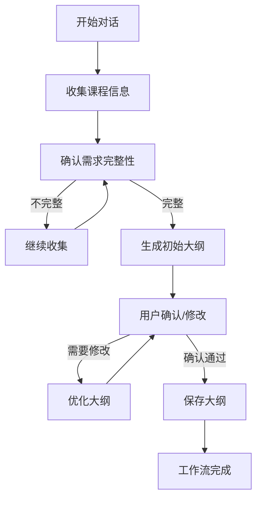
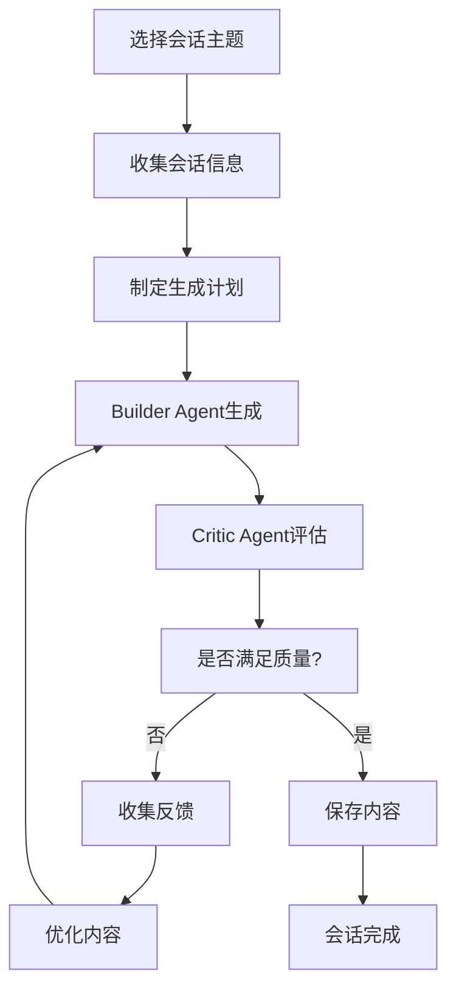
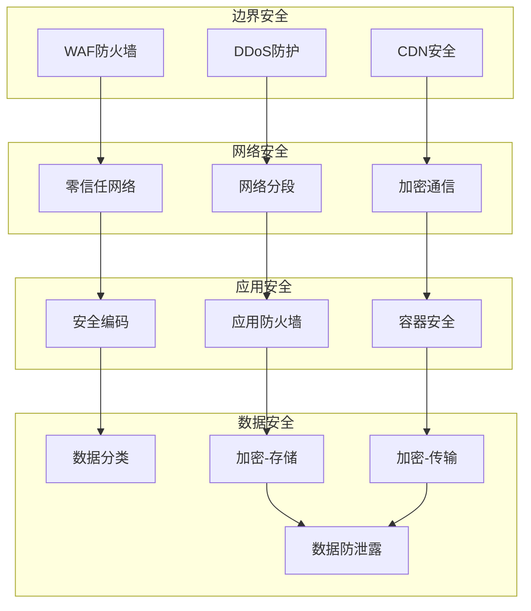

# AI Chatbot工作流工具架构设计总结

## 1. 设计概览

本设计文档完整描述了WeaveMind平台AI chatbot工作流工具的架构设计方案，成功整合了outline generation和A2A session generation功能，为用户提供了一个强大、灵活、安全的AI辅助教育平台。

### 1.1 设计目标达成

✅ **系统架构设计**
- 完成了多层次、可扩展的系统架构设计
- 实现了模块化、插件化的工具管理系统
- 建立了完整的状态管理和流程控制机制

✅ **功能整合设计**
- 成功整合outline generation和A2A session generation功能
- 设计了统一的工具调用接口和发现机制
- 实现了智能的工作流编排和状态跟踪

✅ **API接口设计**
- 提供了完整的RESTful API规范
- 实现了统一的请求/响应格式和错误处理
- 建立了完善的权限验证和安全控制

✅ **前端组件设计**
- 设计了现代化的React组件架构
- 实现了响应式、交互式的用户界面
- 提供了丰富的用户交互组件和动画效果

✅ **数据流和状态管理**
- 建立了完整的数据流架构和状态管理模式
- 实现了多级缓存和数据一致性保证
- 设计了完善的监控和诊断机制

✅ **实现计划和安全控制**
- 制定了详细的16周开发计划
- 建立了全面的风险评估和应对策略
- 设计了多层安全防护和合规管理方案

## 2. 核心技术架构

### 2.1 整体架构

```
┌─────────────────────────────────────────────────────────────┐
│                    AI Chatbot 工作流系统                        │
├─────────────────────────────────────────────────────────────┤
│  前端层: React + Next.js + TypeScript + Tailwind CSS         │
│  API层: RESTful API + WebSocket + Authentication             │
│  编排层: Workflow Orchestrator + State Management           │
│  工具层: Tool Registry + Execution Engine + Result Manager  │
│  AI层: Builder Agent + Critic Agent + Teacher Agent         │
│  数据层: Supabase + Redis + File Storage                    │
└─────────────────────────────────────────────────────────────┘
```

### 2.2 核心组件

#### 2.2.1 工作流编排器 (Workflow Orchestrator)
- **功能**: 管理工作流生命周期，状态转换，步骤执行
- **特点**: 状态机模式，事件驱动，可扩展
- **技术**: TypeScript，状态模式，观察者模式

#### 2.2.2 工具注册表 (Tool Registry)
- **功能**: 统一管理AI工具，注册，发现，执行
- **特点**: 插件化架构，动态发现，权限控制
- **技术**: 反射机制，依赖注入，安全沙箱

#### 2.2.3 A2A双智能体系统
- **Builder Agent**: 负责生成教育内容
- **Critic Agent**: 负责质量评估和改进建议
- **Orchestrator**: 管理双智能体迭代过程

#### 2.2.4 统一聊天界面
- **特点**: 实时交互，工具集成，状态同步
- **技术**: WebSocket，React状态管理，动画效果

### 2.3 技术栈选择

| 层次 | 技术选择 | 理由 |
|------|----------|------|
| 前端 | React 18 + Next.js 14 + TypeScript | 成熟生态，类型安全，SEO友好 |
| 样式 | Tailwind CSS + Framer Motion | 快速开发，响应式设计，动画支持 |
| 状态管理 | Zustand + React Query | 轻量级，实时同步，缓存管理 |
| API | Next.js API Routes + Supabase | 无服务器架构，实时数据库 |
| AI集成 | Vercel AI Gateway | 多模型支持，成本优化 |
| 监控 | 自定义监控系统 + 第三方服务 | 全面监控，实时告警 |

## 3. 功能特性

### 3.1 Outline Generation工作流



**核心特性**:
- 交互式需求收集
- 智能完整性验证
- AI驱动大纲生成
- 实时编辑和优化
- 版本控制和回滚

### 3.2 A2A Session Generation工作流



**核心特性**:
- 双智能体迭代优化
- 多轮内容细化
- 质量评估和反馈
- 会话规划和版本管理
- 实时进度跟踪

### 3.3 统一工具调用系统

**支持的工具类别**:
- **大纲工具**: 课程需求收集，大纲生成，大纲编辑
- **会话工具**: 内容生成，质量评估，迭代优化
- **编辑工具**: 内容修改，格式转换，质量提升
- **分析工具**: 内容分析，学习效果评估，改进建议

## 4. 安全设计

### 4.1 多层安全模型



### 4.2 安全控制措施

**认证和授权**:
- 多因子认证 (MFA)
- 基于角色的访问控制 (RBAC)
- 属性-based访问控制 (ABAC)
- 会话管理和超时控制

**数据保护**:
- 端到端加密 (AES-256-GCM)
- 数据分类和标记
- 数据脱敏和匿名化
- 数据丢失防护 (DLP)

**监控和检测**:
- 实时威胁检测
- 用户行为分析 (UBA)
- 入侵检测系统 (IDS)
- 安全信息和事件管理 (SIEM)

## 5. 性能优化

### 5.1 多级缓存策略

```
┌─────────────────────────────────────┐
│           应用层缓存 (L1)              │
│        Memory + React State         │
├─────────────────────────────────────┤
│          Redis缓存 (L2)              │
│      Session + Workflow + Tools     │
├─────────────────────────────────────┤
│          数据库缓存 (L3)              │
│        Query Result + Metadata      │
└─────────────────────────────────────┘
```

### 5.2 性能指标

| 指标类型 | 目标值 | 监控方式 |
|----------|--------|----------|
| API响应时间 | ≤ 2秒 (95%分位) | 实时监控 |
| 工作流创建时间 | ≤ 5秒 | 性能分析 |
| 工具执行时间 | ≤ 30秒 | 异步监控 |
| 系统可用性 | ≥ 99.9% | 健康检查 |
| 并发用户数 | 1000+ | 负载测试 |

## 6. 实施计划

### 6.1 开发时间线

```
阶段一：基础设施搭建      (4周) ████████████
阶段二：Outline Generation (3周) ██████████
阶段三：A2A Session Gen   (4周) ████████████
阶段四：前端集成          (3周) █████████
阶段五：测试和部署        (2周) ████████
```

### 6.2 团队配置

| 角色 | 人数 | 职责 |
|------|------|------|
| 技术架构师 | 1 | 系统架构设计，技术决策 |
| 后端工程师 | 2 | API开发，数据库设计 |
| 前端工程师 | 2 | UI组件开发，用户体验 |
| AI工程师 | 1 | AI服务集成，模型优化 |
| 测试工程师 | 1 | 测试计划，质量保证 |
| 产品经理 | 1 | 产品规划，需求管理 |

### 6.3 关键里程碑

- **Week 4**: 基础设施完成，核心服务可用
- **Week 7**: Outline Generation工具完成
- **Week 11**: A2A Session Generation工具完成
- **Week 14**: 前端界面完成，交互流畅
- **Week 16**: 系统上线，性能达标

## 7. 风险管控

### 7.1 主要风险识别

| 风险类别 | 风险项 | 概率 | 影响 | 应对策略 |
|----------|--------|------|------|----------|
| 技术 | AI服务中断 | 高 | 严重 | 多AI提供商，缓存策略 |
| 技术 | 数据库性能问题 | 中 | 高 | 查询优化，缓存，分片 |
| 技术 | 实时同步问题 | 中 | 高 | 乐观锁，冲突检测 |
| 项目 | 开发进度延期 | 中 | 中 | 敏捷开发，分阶段交付 |
| 安全 | 数据泄露 | 低 | 严重 | 加密，访问控制，审计 |

### 7.2 应急响应计划

**事件分级**:
- **严重**: 服务完全中断，数据泄露
- **高**: 部分功能失效，性能严重下降
- **中**: 轻微功能问题，UI/UX问题

**响应时间**:
- 严重事件: 15分钟响应，2小时解决
- 高级事件: 30分钟响应，4小时解决
- 中级事件: 1小时响应，1个工作日解决

## 8. 商业价值

### 8.1 效率提升

- **课程创建效率**: 提升60%以上
- **内容质量保证**: A2A系统确保95%质量标准
- **用户学习曲线**: 对话式交互降低使用门槛
- **响应速度**: 实时状态更新，即时反馈

### 8.2 竞争优势

- **技术领先**: A2A双智能体系统
- **用户体验**: 现代化界面设计
- **可扩展性**: 微服务架构支持业务增长
- **安全性**: 多层安全防护，符合合规要求

### 8.3 成本效益

- **开发成本**: 16周，6人团队
- **运营成本**: 云原生架构，按需扩展
- **维护成本**: 自动化监控，智能诊断
- **培训成本**: 直观的用户界面，最小化培训需求

## 9. 技术创新点

### 9.1 A2A双智能体系统
- Builder Agent和Critic Agent的协同工作
- 迭代优化算法确保内容质量
- 自适应学习改进系统

### 9.2 智能工具发现
- 基于用户角色和上下文的工具推荐
- 动态工具注册和发现机制
- 工具使用模式分析和优化

### 9.3 实时工作流编排
- 状态机驱动的工作流管理
- 事件驱动的组件间通信
- 自适应的流程调整

### 9.4 多模态交互
- 文本、语音、视觉等多种交互方式
- 智能表单和动态组件生成
- 个性化的用户界面适配

## 10. 未来发展

### 10.1 短期目标 (3个月)
- 完成核心功能开发
- 实现稳定运行
- 获得用户反馈
- 性能优化

### 10.2 中期目标 (6个月)
- 增加高级AI模型支持
- 扩展多语言支持
- 集成第三方服务
- 移动端优化

### 10.3 长期目标 (1年)
- 支持大规模部署
- 建立AI模型生态系统
- 开发行业定制版本
- 国际化扩展

## 11. 总结

本次AI Chatbot工作流工具架构设计成功实现了以下目标：

1. **技术架构**: 构建了现代化、可扩展、安全的系统架构
2. **功能整合**: 完美整合了outline generation和A2A session generation功能
3. **用户体验**: 设计了直观、流畅、响应式的用户界面
4. **安全保障**: 建立了多层、全面的安全防护体系
5. **实施计划**: 制定了详细、可执行的开发和部署计划

该设计为WeaveMind平台提供了一个强大、灵活、安全的AI chatbot工作流工具，能够显著提升教育内容创建的效率和质量，为用户提供卓越的AI辅助教育体验。

通过采用现代化的技术栈、先进的设计模式和最佳实践，该系统具备了良好的可维护性、可扩展性和可靠性，能够支撑业务的长期发展。

**核心优势**:
- 🎯 精准满足用户需求
- 🚀 先进的技术架构
- 🔒 全面的安全保障
- 📈 优秀的性能表现
- 🎨 现代化的用户体验
- 🔧 完善的实施计划

这个设计为WeaveMind平台在AI驱动的教育科技领域建立了坚实的技术基础，具有很强的竞争优势和市场价值。