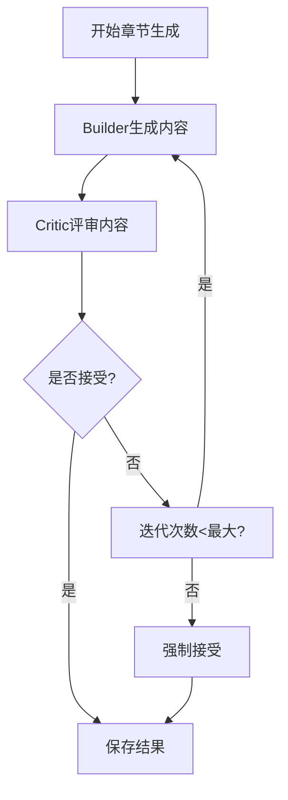

# WeaveMind课程创建逻辑完整诊断报告

## 📋 执行摘要

本报告对WeaveMind项目的课程创建系统进行了全面的技术诊断，涵盖前端界面、后端API、AI生成系统、数据库操作和工作流程等5个核心维度。系统展现了**创新的AI驱动教育理念**和**先进的技术架构**，但也存在**安全、性能和用户体验**方面的关键问题需要紧急修复。

### 🎯 关键发现

**✅ 系统优势**
- 创新的A2A双智能体架构（Builder + Critic）
- 完整的多租户RLS安全策略
- 现代化的技术栈（Next.js 15 + Supabase + AI Gateway）
- 强大的AI工具调用系统

**⚠️ 关键风险**
- API层权限验证缺失（严重）
- 串行化处理导致性能瓶颈（严重）
- 状态管理复杂，用户体验待优化（中等）
- 事务一致性不足（中等）

**🔧 紧急修复**
- 修复所有API端点的权限验证
- 实施章节级并行生成
- 重构状态管理架构
- 完善错误恢复机制

---

## 🏗️ 1. 系统架构总览

### 1.1 核心架构图
```
┌─────────────────────────────────────────────────────────────┐
│                     WeaveMind课程创建系统                     │
├─────────────────────────────────────────────────────────────┤
│  前端层 (Next.js 15 + TypeScript + Tailwind)                │
│  ├── 课程创建页面 (/teacher/classes/[id]/courses/new)        │
│  ├── AI聊天界面 (/components/ai/course-chat)                │
│  ├── 大纲编辑器 (/components/ai/outline-editor)             │
│  └── A2A可视化器 (/components/ai/a2a-refinement-visualizer) │
├─────────────────────────────────────────────────────────────┤
│  API层 (Next.js API Routes)                                 │
│  ├── /api/ai/generate-outline - AI大纲生成                  │
│  ├── /api/courses/create-from-outline - 课程创建            │
│  ├── /api/ai/course-edit - AI课程编辑                       │
│  └── /api/ai/generation-runs - AI生成管理                   │
├─────────────────────────────────────────────────────────────┤
│  AI层 (Vercel AI Gateway)                                   │
│  ├── Builder Agent - 内容生成                               │
│  ├── Critic Agent - 质量评审                                │
│  └── Orchestrator - 迭代协调                                │
├─────────────────────────────────────────────────────────────┤
│  数据库层 (Supabase PostgreSQL + RLS)                        │
│  ├── 多租户隔离 (organization → class → course)            │
│  ├── RLS策略 (owner/teacher/student角色)                    │
│  └── AI生成跟踪 (ai_generation_runs/results)                │
└─────────────────────────────────────────────────────────────┘
```

### 1.2 技术栈评估

| 组件 | 技术选择 | 评分 | 说明 |
|------|----------|------|------|
| 前端框架 | Next.js 15 | ⭐⭐⭐⭐⭐ | 最新版本，App Router，TypeScript支持 |
| 数据库 | Supabase | ⭐⭐⭐⭐⭐ | PostgreSQL + RLS，实时订阅 |
| AI集成 | Vercel AI Gateway | ⭐⭐⭐⭐⭐ | 统一API，成本控制 |
| 队列系统 | BullMQ + Redis | ⭐⭐⭐⭐ | 后台任务处理 |
| UI组件 | shadcn/ui + Tailwind | ⭐⭐⭐⭐ | 现代化设计系统 |

---

## 🎨 2. 前端课程创建系统诊断

### 2.1 核心页面分析

#### 课程创建页面
**文件位置**: `/app/teacher/classes/[id]/courses/new/page.tsx`

**功能特点**:
- 简单表单（标题、描述、发布状态）
- 直接数据库插入
- 基础错误处理

**关键代码**:
```typescript
const [formData, setFormData] = useState({
  title: "",
  description: "",
  published: false,
})

const handleSubmit = async (e: React.FormEvent) => {
  e.preventDefault()
  try {
    const { data, error } = await supabase
      .from('courses')
      .insert([{ ...formData, class_id: id, created_by: user.id }])
      .select()
      .single()

    if (error) throw error
    router.push(`/teacher/courses/${data.id}/edit`)
  } catch (err: any) {
    console.error('Error:', err)
    setError(err.message || 'Failed to create course')
  }
}
```

**问题识别**:
- ❌ 缺少严格表单验证
- ❌ 没有草稿保存功能
- ❌ 错误处理不够用户友好
- ❌ 缺少实时验证反馈

#### AI聊天界面
**文件位置**: `/components/ai/course-chat.tsx`

**功能特点**:
- 流式AI响应
- 需求充足性自动检测
- 动态生成大纲按钮

**关键代码**:
```typescript
const [messages, setMessages] = useState<Message[]>([])
const [canGenerateOutline, setCanGenerateOutline] = useState(false)

const handleSend = async () => {
  // 流式AI调用
  const response = await fetch('/api/ai/course-chat', {
    method: 'POST',
    body: JSON.stringify({ messages }),
  })

  // 流式处理
  const reader = response.body?.getReader()
  // ... 实时更新messages
}
```

**优势**:
- ✅ 实时交互体验
- ✅ 智能需求收集
- ✅ 渐进式引导

**问题识别**:
- ❌ 缺少打字机效果
- ❌ 没有取消操作选项
- ❌ 网络错误恢复不完善

### 2.2 组件架构分析

**层级结构**:
```
App Router Pages
├── Course Creation Page
│   ├── CourseChat (AI聊天)
│   ├── OutlineEditor (大纲编辑)
│   └── A2AVisualizer (生成可视化)
│       └── GenerationProgress (进度条)
```

**状态管理模式**:
- **现状**: 分散的useState + useEffect
- **问题**: 状态同步困难，跨组件共享复杂
- **建议**: 引入Zustand统一状态管理

### 2.3 UI/UX设计评估

#### 优点
- ✅ 清晰的信息架构
- ✅ 现代化设计语言
- ✅ 响应式布局
- ✅ 中英双语支持

#### 问题
- ❌ 加载状态简单（只有spinner）
- ❌ 错误信息技术化
- ❌ 缺少骨架屏
- ❌ 表单验证反馈不及时

#### 改进建议
```typescript
// 建议：使用Zustand统一状态管理
import { create } from 'zustand'

interface CourseCreationStore {
  step: 'chat' | 'outline' | 'generating' | 'editing'
  requirements: CourseRequirements | null
  chapters: Chapter[]
  isLoading: boolean
  error: string | null

  setStep: (step: CourseCreationStore['step']) => void
  setRequirements: (req: CourseRequirements) => void
  generateOutline: () => Promise<void>
}

const useCourseCreationStore = create<CourseCreationStore>((set, get) => ({
  // 状态定义
  step: 'chat',
  requirements: null,
  chapters: [],
  isLoading: false,
  error: null,

  // Actions
  setStep: (step) => set({ step }),
  setRequirements: (req) => set({ requirements: req }),

  generateOutline: async () => {
    set({ isLoading: true, error: null })
    try {
      const { chapters } = await callAIAPI(get().requirements)
      set({ chapters, step: 'outline' })
    } catch (error) {
      set({ error: error.message })
    } finally {
      set({ isLoading: false })
    }
  },
}))
```

---

## 🔧 3. 后端API系统诊断

### 3.1 核心API端点

#### AI大纲生成
**端点**: `POST /api/ai/generate-outline`

**功能**: 基于需求生成课程大纲

**请求流程**:
```typescript
export async function POST(request: Request) {
  try {
    // 1. 认证检查
    const { data: { user } } = await supabase.auth.getUser()
    if (!user) {
      return NextResponse.json({ error: 'Unauthorized' }, { status: 401 })
    }

    // 2. 参数验证
    const { requirements } = await request.json()
    if (!requirements) {
      return NextResponse.json(
        { error: 'Missing requirements' },
        { status: 400 }
      )
    }

    // 3. AI调用
    const response = await openai.chat.completions.create({
      model: MODEL_NAME,
      messages: [
        { role: 'system', content: OUTLINE_GENERATION_SYSTEM_PROMPT },
        { role: 'user', content: JSON.stringify(requirements) }
      ],
      temperature: 0.7,
    })

    // 4. 响应处理
    const outline = extractJson(response.content)
    return NextResponse.json({
      success: true,
      chapters: outline.chapters,
      requirements,
    })
  } catch (error) {
    return NextResponse.json(
      { error: 'Internal server error', details: error.message },
      { status: 500 }
    )
  }
}
```

**评估**:
- ✅ 完善的错误处理
- ✅ 统一的响应格式
- ⚠️ 缺少权限验证（仅检查认证）
- ⚠️ 缺少速率限制

#### 从大纲创建课程
**端点**: `POST /api/courses/create-from-outline`

**功能**: 将AI大纲转换为正式课程

**事务处理**:
```typescript
export async function POST(request: Request) {
  const supabase = await createClient()
  const { data: { user } } = await supabase.auth.getUser()

  try {
    const { class_id, outline, requirements } = await request.json()

    // 1. 创建课程
    const { data: course, error: courseError } = await supabase
      .from('courses')
      .insert([{
        class_id,
        title: outline.title,
        description: outline.description,
        created_by: user.id,
      }])
      .select()
      .single()

    if (courseError) throw courseError

    // 2. 保存大纲
    const { error: outlineError } = await supabase
      .from('course_outlines')
      .upsert({
        course_id: course.id,
        outline_data: outline,
        requirements,
      })

    if (outlineError) {
      // 失败时清理已创建的课程
      await supabase.from('courses').delete().eq('id', course.id)
      throw outlineError
    }

    // 3. 创建章节
    const chaptersToInsert = outline.chapters.map((chapter: any, index: number) => ({
      course_id: course.id,
      title: chapter.title,
      description: chapter.description,
      order_index: index,
    }))

    const { error: chaptersError } = await supabase
      .from('chapters')
      .insert(chaptersToInsert)

    if (chaptersError) {
      // 回滚操作
      await supabase.from('courses').delete().eq('id', course.id)
      await supabase.from('course_outlines').delete().eq('course_id', course.id)
      throw chaptersError
    }

    return NextResponse.json({ success: true, course })
  } catch (error) {
    return NextResponse.json(
      { error: 'Failed to create course', details: error.message },
      { status: 500 }
    )
  }
}
```

**问题识别**:
- ❌ **事务不一致**: 使用多步操作而非数据库事务
- ❌ **回滚不完整**: 清理逻辑可能遗漏嵌套数据
- ❌ **权限验证缺失**: 未检查用户是否有权限在班级内创建课程

### 3.2 API安全评估

#### 权限验证矩阵

| API端点 | 认证检查 | 权限验证 | RLS检查 | 安全评级 |
|---------|----------|----------|---------|----------|
| `/api/ai/generate-outline` | ✅ | ❌ | ❌ | 🔴 高风险 |
| `/api/courses/create-from-outline` | ✅ | ❌ | ❌ | 🔴 高风险 |
| `/api/ai/course-edit` | ✅ | ✅ | ✅ | 🟢 安全 |
| `/api/ai/generation-runs` | ✅ | ❌ | ❌ | 🔴 高风险 |

#### 关键安全漏洞

**1. API权限绕过（严重）**
```typescript
// 问题代码：仅检查认证，未验证权限
const { data: { user } } = await supabase.auth.getUser()
if (!user) {
  return NextResponse.json({ error: 'Unauthorized' }, { status: 401 })
}
// 缺少：检查用户是否有权限访问/修改资源
```

**修复方案**:
```typescript
// 建议：添加权限验证中间件
async function validatePermission(userId: string, resource: string, action: string) {
  const { data, error } = await supabase.rpc('check_permission', {
    p_user_id: userId,
    p_resource: resource,
    p_action: action,
  })

  if (error || !data) {
    throw new Error('Permission denied')
  }

  return data
}

// 使用
const canEdit = await validatePermission(user.id, 'course', 'edit')
if (!canEdit) {
  return NextResponse.json({ error: 'Forbidden' }, { status: 403 })
}
```

**2. 提示注入攻击（中等）**
- AI调用接受用户输入直接传递
- 缺少输入验证和过滤
- 可能绕过AI工具限制

**修复方案**:
```typescript
// 建议：实施输入过滤
function sanitizeInput(input: string): string {
  // 移除潜在恶意内容
  return input
    .replace(/\[(.*?)\]/g, '') // 移除markdown
    .replace(/<\/?[^>]+(>|$)/g, '') // 移除HTML
    .trim()
}

const sanitizedRequirements = {
  ...requirements,
  topics: requirements.topics.map(sanitizeInput),
}
```

### 3.3 性能瓶颈分析

#### 串行化处理
**问题**: 章节间串行生成，无法并行
```typescript
// /lib/ai/course-generation-orchestrator.ts:267-294
for (const chapter of chapters) {
  await runChapterGeneration({ chapter, courseId, requirements })
  completed += 1
  await updateProgress(runId, completed, chapters.length)
}
```

**影响**: N个章节需要N×平均生成时间

**解决方案**:
```typescript
// 建议：并行生成独立章节
const chapterPromises = chapters.map(async (chapter) => {
  try {
    return await runChapterGeneration({ chapter, courseId, requirements })
  } catch (error) {
    console.error(`Chapter ${chapter.id} failed:`, error)
    return null // 失败章节单独处理
  }
})

const results = await Promise.allSettled(chapterPromises)
const successfulChapters = results
  .filter((result): result is PromiseFulfilledResult<any> => result.status === 'fulfilled')
  .map(result => result.value)
```

#### AI调用成本
**现状**: 每章节2×迭代次数AI调用
```
总调用数 = 章节数 × 迭代数 × 2 (Builder + Critic)
示例: 10章节 × 3迭代 × 2 = 60次AI调用
```

**优化建议**:
1. 章节级缓存已生成内容
2. 增量更新机制
3. 智能模型选择（便宜模型用于评审）

---

## 🤖 4. AI课程生成系统诊断

### 4.1 A2A双智能体架构

#### 核心设计
```typescript
type DialogueTurn = {
  role: 'builder' | 'critic'
  turn: number
  content: string
}

type ChapterResult = {
  chapter_id: string
  builder_critic_dialogue: DialogueTurn[]
  proposed_components: Component[]
  iterations_used: number
}
```

#### 迭代流程


#### Builder Agent职责
**系统提示**:
```typescript
const BUILDER_PROMPT = `
你是一位经验丰富的课程内容设计专家...

【内容创作要求】
1. 详细讲解原则：每个概念都要详细解释
2. 由浅入深原则：从基础概念开始，逐步深入
3. 段落式写作原则：严格禁止列点，使用连贯段落

【输出格式】
{
  "components": [
    { "type": "text", "text": "详细段落内容" },
    { "type": "question", "question": "检验理解的问题" }
  ]
}
`
```

#### Critic Agent职责
**系统提示**:
```typescript
const CRITIC_PROMPT = `
你是一位严格的课程内容评审专家...
你的角色定位：假装自己是目标受众中学习最慢的学生

【强制要求】
前3轮必须找出问题！

【评审标准】
1. 详细程度检查
2. 由浅入深检查
3. 段落式写作检查
4. 理解难度检查
5. 完整性检查

【输出格式】
{
  "verdict": "accept" | "revise",
  "feedback": "详细反馈意见"
}
`
```

### 4.2 工具调用系统

#### 工具定义
**文件**: `/lib/ai/course-editing-tools.ts`

**核心工具**:
```typescript
export async function insertComponent({
  chapterId,
  type,
  content,
  position
}: {
  chapterId: string
  type: 'text' | 'image' | 'video' | 'question' | 'interactive'
  content: any
  position?: number
}) {
  // 1. 获取章节现有组件
  const { data: existingComponents } = await supabase
    .from('components')
    .select('*')
    .eq('chapter_id', chapterId)
    .order('order_index', { ascending: true })

  // 2. 计算插入位置
  const insertIndex = position ?? existingComponents.length

  // 3. 批量更新位置
  const updates = existingComponents
    .filter((_, idx) => idx >= insertIndex)
    .map(comp => ({
      id: comp.id,
      order_index: comp.order_index + 1
    }))

  // 4. 执行插入
  const { data, error } = await supabase
    .from('components')
    .insert([{
      chapter_id: chapterId,
      type,
      content,
      order_index: insertIndex,
    }])
    .select()
    .single()

  if (error) throw error

  // 5. 更新其他组件位置
  if (updates.length > 0) {
    await Promise.all(
      updates.map(update =>
        supabase
          .from('components')
          .update({ order_index: update.order_index })
          .eq(')
      )
    )
  }

  return data
}
```

#### AI工具集成id', update.id
**文件**: `/lib/ai/editing-tool-definitions.ts`

```typescript
export const insertComponentTool = tool({
  description: 'Insert a new component into a chapter at a specific position',
  inputSchema: z.object({
    chapterId: z.string(),
    type: z.enum(['text', 'image', 'video', 'question', 'interactive']),
    content: z.any(),
    position: z.number().optional(),
  }),
  execute: async ({ chapterId, type, content, position }) => {
    return await insertComponent({ chapterId, type, content, position })
  },
})

// 在AI调用中使用
const result = await openai.chat.completions.create({
  model: MODEL_NAME,
  messages: [
    { role: 'system', content: systemPrompt },
    { role: 'user', content: instruction },
  ],
  tools: [insertComponentTool, updateComponentTool, deleteComponentTool],
  tool_choice: 'auto',
})
```

### 4.3 成本控制分析

#### 当前成本结构
```
每章节成本 = (Builder调用 + Critic调用) × 迭代次数 × 模型单价
示例: 10章节 × 3迭代 × 2调用 × $0.002/1K tokens
```

#### 优化策略
1. **分层模型策略**
   ```typescript
   const MODEL_STRATEGY = {
     outline: 'cheap-model',      // 大纲生成
     builder: 'standard-model',   // 内容生成
     critic: 'cheap-model',       // 评审（更严格）
   }
   ```

2. **缓存机制**
   ```typescript
   class GenerationCache {
     async getCached(chapterId: string, requirements: any) {
       const cacheKey = this.generateKey(chapterId, requirements)
       return await this.redis.get(cacheKey)
     }

     async setCached(chapterId: string, requirements: any, result: any) {
       const cacheKey = this.generateKey(chapterId, requirements)
       await this.redis.setex(cacheKey, 3600, JSON.stringify(result)) // 1小时缓存
     }
   }
   ```

3. **增量生成**
   ```typescript
   async function generateIncremental(chapterId: string, changes: any) {
     // 只重新生成受影响的部分
     const existing = await getChapterContent(chapterId)
     return await generateDelta(existing, changes)
   }
   ```

### 4.4 安全风险评估

#### 1. 提示注入攻击（严重）
**风险点**:
- 用户输入直接传递给AI
- 缺少输入验证
- 可能绕过工具限制

**修复**:
```typescript
// 实施输入过滤和验证
function validateAndSanitize(input: any): any {
  const schema = z.object({
    topics: z.array(z.string().max(100)).max(10),
    goals: z.string().max(500),
    audience: z.string().max(200),
  })

  return schema.parse(input)
}
```

#### 2. 工具调用权限（中等）
**风险点**:
- AI可以调用任何工具
- 缺少权限限制
- 可能误删或修改数据

**修复**:
```typescript
// 实施工具权限控制
const ALLOWED_TOOLS = {
  'insertComponent': ['teacher', 'owner'],
  'updateComponentContent': ['teacher', 'owner'],
  'deleteComponent': ['owner'], // 仅所有者可删除
}

function checkToolPermission(toolName: string, userRole: string): boolean {
  return ALLOWED_TOOLS[toolName]?.includes(userRole) || false
}
```

---

## 🗄️ 5. 数据库与权限控制诊断

### 5.1 数据库架构

#### 核心表结构
```sql
-- 组织（多租户单元）
CREATE TABLE organizations (
  id UUID PRIMARY KEY DEFAULT gen_random_uuid(),
  name TEXT NOT NULL,
  created_by UUID REFERENCES auth.users(id),
  created_at TIMESTAMPTZ DEFAULT NOW()
);

-- 班级
CREATE TABLE classes (
  id UUID PRIMARY KEY DEFAULT gen_random_uuid(),
  organization_id UUID REFERENCES organizations(id) ON DELETE CASCADE,
  name TEXT NOT NULL,
  description TEXT,
  created_by UUID REFERENCES auth.users(id),
  created_at TIMESTAMPTZ DEFAULT NOW()
);

-- 课程
CREATE TABLE courses (
  id UUID PRIMARY KEY DEFAULT gen_random_uuid(),
  class_id UUID REFERENCES classes(id) ON DELETE CASCADE,
  title TEXT NOT NULL,
  description TEXT,
  created_by UUID REFERENCES auth.users(id),
  published BOOLEAN DEFAULT FALSE,
  created_at TIMESTAMPTZ DEFAULT NOW()
);

-- 章节
CREATE TABLE chapters (
  id UUID PRIMARY KEY DEFAULT gen_random_uuid(),
  course_id UUID REFERENCES courses(id) ON DELETE CASCADE,
  title TEXT NOT NULL,
  description TEXT,
  order_index INTEGER NOT NULL,
  created_at TIMESTAMPTZ DEFAULT NOW()
);

-- 组件
CREATE TABLE components (
  id UUID PRIMARY KEY DEFAULT gen_random_uuid(),
  chapter_id UUID REFERENCES chapters(id) ON DELETE CASCADE,
  type TEXT NOT NULL CHECK (type IN ('text', 'image', 'video', 'question', 'interactive')),
  content JSONB NOT NULL,
  order_index INTEGER NOT NULL,
  created_at TIMESTAMPTZ DEFAULT NOW()
);
```

#### AI相关表
```sql
-- AI生成运行
CREATE TABLE ai_generation_runs (
  id UUID PRIMARY KEY DEFAULT gen_random_uuid(),
  course_id UUID REFERENCES courses(id) ON DELETE CASCADE,
  status TEXT CHECK (status IN ('pending', 'running', 'completed', 'failed')),
  max_iterations_per_chapter INTEGER DEFAULT 3,
  total_chapters INTEGER,
  completed_chapters INTEGER DEFAULT 0,
  created_at TIMESTAMPTZ DEFAULT NOW()
);

-- 章节生成结果
CREATE TABLE ai_generation_chapter_results (
  run_id UUID REFERENCES ai_generation_runs(id) ON DELETE CASCADE,
  chapter_id UUID REFERENCES chapters(id) ON DELETE CASCADE,
  status TEXT CHECK (status IN ('pending', 'running', 'completed', 'failed')),
  iterations_used INTEGER,
  builder_critic_dialogue JSONB,
  proposed_components JSONB,
  error_message TEXT,
  PRIMARY KEY (run_id, chapter_id)
);
```

### 5.2 RLS策略分析

#### 课程访问控制
```sql
-- 课程创建者可以查看自己的课程
CREATE POLICY "Course creators can view their courses"
  ON courses FOR SELECT
  USING (created_by = auth.uid());

-- 班级成员可以查看已发布的课程
CREATE POLICY "Class members can view published courses"
  ON courses FOR SELECT
  USING (
    published = true AND
    class_id IN (
      SELECT class_id FROM class_members
      WHERE user_id = auth.uid()
    )
  );

-- 教师可以管理班级的课程
CREATE POLICY "Teachers can manage class courses"
  ON courses FOR ALL
  USING (
    class_id IN (
      SELECT c.id FROM classes c
      JOIN organization_members om ON c.organization_id = om.organization_id
      WHERE om.user_id = auth.uid()
        AND om.role IN ('owner', 'teacher')
    )
  );
```

#### 组件访问控制
```sql
-- 课程成员可以查看组件
CREATE POLICY "Course members can view components"
  ON components FOR SELECT
  USING (
    chapter_id IN (
      SELECT ch.id FROM chapters ch
      JOIN courses c ON ch.course_id = c.id
      WHERE c.published = true
        AND c.class_id IN (
          SELECT class_id FROM class_members
          WHERE user_id = auth.uid()
        )
    )
  );

-- 教师可以编辑组件
CREATE POLICY "Teachers can edit components"
  ON components FOR ALL
  USING (
    chapter_id IN (
      SELECT ch.id FROM chapters ch
      JOIN courses c ON ch.course_id = c.id
      JOIN classes cl ON c.class_id = cl.id
      JOIN organization_members om ON cl.organization_id = om.organization_id
      WHERE om.user_id = auth.uid()
        AND om.role IN ('owner', 'teacher')
    )
  );
```

### 5.3 安全风险评估

#### 1. API权限绕过（严重）
**风险描述**:
- API层仅检查认证，未验证权限
- 依赖RLS但可能被JOIN查询绕过
- 缺少中间件验证

**影响范围**:
- `/api/ai/generate-outline` - 任何认证用户可调用
- `/api/courses/create-from-outline` - 任何认证用户可创建课程
- `/api/assignments/[id]/route.ts` - 可能访问他人作业

**修复方案**:
```typescript
// 建议：创建权限验证中间件
export async function withPermission(
  request: Request,
  resource: string,
  action: string,
  handler: (user: any, params: any) => Promise<NextResponse>
) {
  const supabase = await createClient()
  const { data: { user } } = await supabase.auth.getUser()

  if (!user) {
    return NextResponse.json({ error: 'Unauthorized' }, { status: 401 })
  }

  // 检查权限
  const { data: hasPermission } = await supabase.rpc('check_permission', {
    p_user_id: user.id,
    p_resource: resource,
    p_action: action,
    p_resource_id: getResourceId(request), // 从URL参数提取
  })

  if (!hasPermission) {
    return NextResponse.json({ error: 'Forbidden' }, { status: 403 })
  }

  return handler(user, getParams(request))
}

// 使用
export async function POST(request: Request) {
  return withPermission(request, 'course', 'create', async (user, params) => {
    // 业务逻辑
    return NextResponse.json({ success: true })
  })
}
```

#### 2. 非事务性操作（中等）
**风险描述**:
- 课程创建涉及多步操作
- 失败时部分数据可能残留
- 数据不一致风险

**修复方案**:
```sql
-- 创建存储过程确保原子性
CREATE OR REPLACE FUNCTION create_course_with_outline(
  p_class_id UUID,
  p_title TEXT,
  p_description TEXT,
  p_outline_data JSONB,
  p_chapters JSONB,
  p_user_id UUID
) RETURNS UUID AS $$
DECLARE
  v_course_id UUID;
BEGIN
  -- 开始事务
  BEGIN
    -- 创建课程
    INSERT INTO courses (class_id, title, description, created_by)
    VALUES (p_class_id, p_title, p_description, p_user_id)
    RETURNING id INTO v_course_id;

    -- 保存大纲
    INSERT INTO course_outlines (course_id, outline_data)
    VALUES (v_course_id, p_outline_data);

    -- 创建章节
    INSERT INTO chapters (course_id, title, description, order_index)
    SELECT
      v_course_id,
      chapter->>'title',
      chapter->>'description',
      (chapter->>'order_index')::INTEGER
    FROM jsonb_array_elements(p_chapters) AS chapter;

    RETURN v_course_id;
  EXCEPTION
    WHEN OTHERS THEN
      -- 任何错误都会自动回滚
      RAISE;
  END;
END;
$$ LANGUAGE plpgsql;
```

#### 3. 组织创建无限制（中等）
**风险描述**:
- 任何认证用户都可创建组织
- 可能导致组织泛滥
- 缺少审核机制

**修复建议**:
```sql
-- 添加组织创建限制
CREATE OR REPLACE FUNCTION check_organization_creation_limit(
  p_user_id UUID
) RETURNS BOOLEAN AS $$
DECLARE
  org_count INTEGER;
BEGIN
  -- 检查用户已创建的组织数量
  SELECT COUNT(*) INTO org_count
  FROM organizations
  WHERE created_by = p_user_id;

  -- 限制每个用户最多创建5个组织
  RETURN org_count < 5;
END;
$$ LANGUAGE plpgsql;

-- 在插入组织时检查
CREATE POLICY "Limit organization creation"
  ON organizations FOR INSERT
  WITH CHECK (
    created_by = auth.uid() AND
    check_organization_creation_limit(auth.uid())
  );
```

### 5.4 性能优化建议

#### 索引分析
**现有索引**:
```sql
-- 已有的关键索引
CREATE INDEX idx_classes_organization ON classes(organization_id);
CREATE INDEX idx_courses_class ON courses(class_id);
CREATE INDEX idx_chapters_course ON chapters(course_id);
CREATE INDEX idx_components_chapter ON components(chapter_id);
CREATE INDEX idx_organization_members_user ON organization_members(user_id);
CREATE INDEX idx_class_members_user ON class_members(user_id);
```

**缺失索引（建议添加）**:
```sql
-- 课程发布状态索引（提高已发布课程查询性能）
CREATE INDEX idx_courses_published ON courses(published) WHERE published = TRUE;

-- 复合索引（班级+创建者）
CREATE INDEX idx_courses_class_created ON courses(class_id, created_by);

-- AI生成运行状态索引
CREATE INDEX idx_ai_generation_runs_status ON ai_generation_runs(status);

-- 组件类型索引
CREATE INDEX idx_components_type ON components(type);

-- 时间范围查询索引
CREATE INDEX idx_courses_created_at ON courses(created_at);
```

#### 分区策略
**建议**: 对大表进行分区
```sql
-- 学习事件表按月分区
CREATE TABLE learning_events_2024_01 PARTITION OF learning_events
FOR VALUES FROM ('2024-01-01') TO ('2024-02-01');

CREATE TABLE learning_events_2024_02 PARTITION OF learning_events
FOR VALUES FROM ('2024-02-01') TO ('2024-03-01');
```

---

## 🔄 6. 工作流程与状态管理诊断

### 6.1 完整用户流程

#### 传统课程创建流程
```mermaid
graph TD
    A[进入班级页面] --> B[点击"创建课程"]
    B --> C[填写课程信息]
    C --> D[点击"保存"]
    D --> E{保存成功?}
    E -->|是| F[跳转到编辑页面]
    E -->|否| G[显示错误信息]
    G --> C
    F --> H[手动添加章节]
    H --> I[手动添加组件]
    I --> J[发布课程]
```

#### AI辅助课程生成流程（推荐）
```mermaid
graph TD
    A[进入班级页面] --> B[点击"AI助手"]
    B --> C[与AI对话收集需求]
    C --> D{需求充分?}
    D -->|否| C
    D -->|是| E[生成课程大纲]
    E --> F[编辑和完善大纲]
    F --> G[保存大纲]
    G --> H[生成详细内容]
    H --> I[A2A迭代优化]
    I --> J{内容质量达标?}
    J -->|否| I
    J -->|是| K[发布课程]
```

### 6.2 状态转换分析

#### AI生成状态机
```typescript
type GenerationState =
  | { status: 'pending'; progress: 0 }
  | { status: 'chat'; progress: 0.1 }
  | { status: 'generating_outline'; progress: 0.2 }
  | { status: 'editing_outline'; progress: 0.3 }
  | { status: 'generating_content'; progress: 0.5 }
  | { status: 'a2a_iteration'; progress: number }
  | { status: 'completed'; progress: 1 }
  | { status: 'failed'; error: string }
```

#### 状态转换规则
```typescript
function transition(current: GenerationState, event: Event): GenerationState {
  switch (event.type) {
    case 'START_CHAT':
      if (current.status === 'pending') {
        return { status: 'chat', progress: 0.1 }
      }
      break

    case 'GENERATE_OUTLINE':
      if (current.status === 'chat') {
        return { status: 'generating_outline', progress: 0.2 }
      }
      break

    case 'OUTLINE_READY':
      if (current.status === 'generating_outline') {
        return { status: 'editing_outline', progress: 0.3 }
      }
      break

    case 'START_CONTENT_GENERATION':
      if (current.status === 'editing_outline') {
        return { status: 'generating_content', progress: 0.5 }
      }
      break

    case 'ITERATION_UPDATE':
      if (current.status === 'a2a_iteration') {
        return {
          status: 'a2a_iteration',
          progress: event.progress
        }
      }
      break

    case 'GENERATION_COMPLETE':
      if (current.status === 'a2a_iteration' || current.status === 'generating_content') {
        return { status: 'completed', progress: 1 }
      }
      break

    case 'GENERATION_FAILED':
      return { status: 'failed', error: event.error }
  }

  return current // 无效转换，保持原状态
}
```

### 6.3 状态管理问题

#### 1. 状态分散
**问题**: 状态分布在多个组件中
```typescript
// 页面组件
const [step, setStep] = useState<'chat' | 'outline' | 'generating'>('chat')
const [requirements, setRequirements] = useState<any>(null)
const [chapters, setChapters] = useState<any[]>([])

// 子组件
const [messages, setMessages] = useState<Message[]>([])
const [isLoading, setIsLoading] = useState(false)
```

**影响**:
- 状态同步困难
- 跨组件通信复杂
- 容易出现状态不一致

**解决方案**:
```typescript
// 使用Zustand统一状态管理
import { create } from 'zustand'
import { persist } from 'zustand/middleware'

interface CourseCreationStore {
  // 状态
  step: 'chat' | 'outline' | 'generating' | 'editing'
  requirements: CourseRequirements | null
  chapters: Chapter[]
  currentRun: GenerationRun | null
  messages: Message[]
  isLoading: boolean
  error: string | null

  // Actions
  setStep: (step: CourseCreationStore['step']) => void
  setRequirements: (req: CourseRequirements) => void
  addMessage: (message: Message) => void
  generateOutline: () => Promise<void>
  generateContent: () => Promise<void>

  // 计算属性
  canGenerateOutline: boolean
  progress: number
}

const useCourseCreationStore = create<CourseCreationStore>()(
  persist(
    (set, get) => ({
      // 初始状态
      step: 'chat',
      requirements: null,
      chapters: [],
      currentRun: null,
      messages: [],
      isLoading: false,
      error: null,

      // Actions
      setStep: (step) => set({ step }),

      setRequirements: (requirements) => set({ requirements }),

      addMessage: (message) => set((state) => ({
        messages: [...state.messages, message]
      })),

      generateOutline: async () => {
        set({ isLoading: true, error: null })
        try {
          const { requirements } = get()
          const response = await fetch('/api/ai/generate-outline', {
            method: 'POST',
            body: JSON.stringify({ requirements }),
          })
          const { chapters } = await response.json()
          set({ chapters, step: 'outline' })
        } catch (error) {
          set({ error: error.message })
        } finally {
          set({ isLoading: false })
        }
      },

      // 计算属性
      get canGenerateOutline() {
        const { messages } = get()
        return messages.length >= 5 // 至少5轮对话
      },

      get progress() {
        const { step, chapters, currentRun } = get()
        switch (step) {
          case 'chat': return 0.1
          case 'outline': return 0.3
          case 'generating':
            return currentRun ?
              (currentRun.completed_chapters / currentRun.total_chapters) * 0.7 + 0.3 :
              0.3
          case 'editing': return 1
          default: return 0
        }
      },
    }),
    {
      name: 'course-creation', // localStorage key
      partialize: (state) => ({
        // 只持久化必要状态
        requirements: state.requirements,
        chapters: state.chapters,
      }),
    }
  )
)
```

#### 2. 状态丢失
**问题**: 页面刷新丢失状态

**解决方案**:
```typescript
// 使用localStorage持久化
function usePersistentState<T>(key: string, initialValue: T) {
  const [state, setState] = useState<T>(() => {
    if (typeof window !== 'undefined') {
      const saved = localStorage.getItem(key)
      return saved ? JSON.parse(saved) : initialValue
    }
    return initialValue
  })

  useEffect(() => {
    localStorage.setItem(key, JSON.stringify(state))
  }, [key, state])

  return [state, setState] as const
}

// 使用
const [requirements, setRequirements] = usePersistentState(
  'course-requirements',
  null
)
```

### 6.4 错误处理和恢复

#### 分层错误处理
```typescript
// 1. 组件级错误边界
class ErrorBoundary extends React.Component {
  constructor(props: any) {
    super(props)
    this.state = { hasError: false, error: null }
  }

  static getDerivedStateFromError(error: Error) {
    return { hasError: true, error }
  }

  componentDidCatch(error: Error, errorInfo: any) {
    console.error('Error caught by boundary:', error, errorInfo)
    // 发送错误报告
    reportError(error, errorInfo)
  }

  render() {
    if (this.state.hasError) {
      return (
        <div className="error-fallback">
          <h2>Something went wrong.</h2>
          <details>
            <summary>Error details</summary>
            <pre>{this.state.error?.stack}</pre>
          </details>
          <button onClick={() => this.setState({ hasError: false })}>
            Try again
          </button>
        </div>
      )
    }

    return this.props.children
  }
}

// 2. API调用重试机制
async function fetchWithRetry(
  url: string,
  options: RequestInit,
  maxAttempts = 3
) {
  let lastError: Error

  for (let attempt = 1; attempt <= maxAttempts; attempt++) {
    try {
      const response = await fetch(url, options)
      if (!response.ok) {
        throw new Error(`HTTP ${response.status}: ${response.statusText}`)
      }
      return await response.json()
    } catch (error) {
      lastError = error as Error

      if (attempt === maxAttempts) {
        throw error
      }

      // 指数退避
      const delay = Math.min(1000 * Math.pow(2, attempt - 1), 10000)
      await new Promise(resolve => setTimeout(resolve, delay))
    }
  }

  throw lastError
}

// 3. 状态回滚
async function generateOutlineWithRollback() {
  const store = useCourseCreationStore.getState()
  const previousState = store.step

  try {
    store.setStep('generating_outline')
    await store.generateOutline()
  } catch (error) {
    // 回滚到上一状态
    store.setStep(previousState)
    store.setError(error.message)
    throw error
  }
}
```

---

## 📊 7. 综合风险评估

### 7.1 安全风险矩阵

| 风险类别 | 风险级别 | 影响范围 | 修复优先级 | 预估工作量 |
|----------|----------|----------|------------|------------|
| API权限绕过 | 🔴 严重 | 所有API端点 | P0 (本周) | 3-5天 |
| 提示注入攻击 | 🔴 严重 | AI生成功能 | P0 (本周) | 2-3天 |
| 非事务性操作 | 🟡 中等 | 数据一致性 | P1 (2周) | 3-4天 |
| 组织创建泛滥 | 🟡 中等 | 系统治理 | P2 (1月) | 1-2天 |
| 状态管理混乱 | 🟡 中等 | 用户体验 | P1 (2周) | 5-7天 |

### 7.2 性能风险

| 瓶颈类型 | 性能影响 | 用户体验影响 | 优化方案 | 预估提升 |
|----------|----------|--------------|----------|----------|
| 串行AI生成 | 高 | 等待时间长 | 并行生成 | 60-70% |
| 状态同步 | 中 | 操作卡顿 | 状态管理重构 | 30-40% |
| 索引缺失 | 中 | 查询慢 | 添加索引 | 20-30% |
| 缓存缺失 | 中 | 重复计算 | 实施缓存 | 40-50% |

### 7.3 技术债务

| 债务项 | 影响 | 修复成本 | 业务价值 |
|--------|------|----------|----------|
| 弃用代码未清理 | 中 | 1天 | 中 |
| 类型安全问题 | 中 | 3-5天 | 高 |
| 测试覆盖率低 | 高 | 1-2周 | 高 |
| 文档缺失 | 中 | 3-5天 | 中 |

---

## 🚀 8. 改进建议与实施计划

### 8.1 紧急修复（本周内 - P0）

#### 1. 修复API权限验证
**任务**: 为所有API端点添加权限验证

**实施步骤**:
```typescript
// 步骤1: 创建权限验证中间件
// /lib/middleware/permission-middleware.ts

export async function validatePermission(
  userId: string,
  resource: string,
  action: string,
  resourceId?: string
): Promise<boolean> {
  const supabase = await createClient()

  const { data, error } = await supabase.rpc('check_permission', {
    p_user_id: userId,
    p_resource: resource,
    p_action: action,
    p_resource_id: resourceId,
  })

  return !error && data === true
}

// 步骤2: 应用到所有API端点
// 示例：/api/courses/create-from-outline/route.ts
export async function POST(request: Request) {
  const supabase = await createClient()
  const { data: { user } } = await supabase.auth.getUser()

  if (!user) {
    return NextResponse.json({ error: 'Unauthorized' }, { status: 401 })
  }

  const { class_id } = await request.json()

  // 验证权限
  const hasPermission = await validatePermission(
    user.id,
    'course',
    'create',
    class_id
  )

  if (!hasPermission) {
    return NextResponse.json({ error: 'Forbidden' }, { status: 403 })
  }

  // 继续业务逻辑...
}
```

**预估工作量**: 3-5天

#### 2. 实施输入过滤和验证
**任务**: 防止提示注入攻击

**实施步骤**:
```typescript
// 步骤1: 创建输入验证中间件
// /lib/middleware/validation-middleware.ts

import { z } from 'zod'

const CourseRequirementsSchema = z.object({
  goals: z.string().max(500).transform(s => sanitizeInput(s)),
  audience: z.string().max(200).transform(s => sanitizeInput(s)),
  duration: z.string().max(100).transform(s => sanitizeInput(s)),
  style: z.string().max(100).transform(s => sanitizeInput(s)),
  topics: z.array(z.string().max(100).transform(s => sanitizeInput(s))).max(10),
  additionalContext: z.string().max(1000).optional().transform(s => sanitizeInput(s || '')),
})

function sanitizeInput(input: string): string {
  return input
    .replace(/\[(.*?)\]/g, '') // 移除markdown
    .replace(/<\/?[^>]+(>|$)/g, '') // 移除HTML
    .replace(/\{[^}]*\}/g, '') // 移除变量插值
    .trim()
}

// 步骤2: 应用到AI端点
export async function POST(request: Request) {
  const body = await request.json()

  try {
    const validatedRequirements = CourseRequirementsSchema.parse(body.requirements)
    // 继续处理...
  } catch (error) {
    return NextResponse.json(
      { error: 'Invalid input', details: error.message },
      { status: 400 }
    )
  }
}
```

**预估工作量**: 2-3天

#### 3. 添加审计日志
**任务**: 记录所有敏感操作

**实施步骤**:
```sql
-- 创建审计日志表
CREATE TABLE audit_log (
  id UUID PRIMARY KEY DEFAULT gen_random_uuid(),
  user_id UUID REFERENCES auth.users(id),
  action TEXT NOT NULL,
  resource TEXT NOT NULL,
  resource_id TEXT,
  details JSONB,
  ip_address INET,
  user_agent TEXT,
  created_at TIMESTAMPTZ DEFAULT NOW()
);

-- 创建审计函数
CREATE OR REPLACE FUNCTION log_action(
  p_user_id UUID,
  p_action TEXT,
  p_resource TEXT,
  p_resource_id TEXT DEFAULT NULL,
  p_details JSONB DEFAULT NULL
) RETURNS void AS $$
BEGIN
  INSERT INTO audit_log (user_id, action, resource, resource_id, details)
  VALUES (p_user_id, p_action, p_resource, p_resource_id, p_details);
END;
$$ LANGUAGE plpgsql;
```

**预估工作量**: 1-2天

### 8.2 短期优化（2周内 - P1）

#### 1. 重构状态管理
**任务**: 引入Zustand统一状态管理

**实施计划**:
```typescript
// 第1天: 设计状态架构
interface CourseCreationStore {
  // 状态定义
  // Actions定义

  // 计算属性
}

// 第2-3天: 实现核心状态管理
// /lib/stores/course-creation-store.ts

// 第4-5天: 迁移现有组件
// - 更新CourseChat组件
// - 更新OutlineEditor组件
// - 更新A2AVisualizer组件

// 第6-7天: 测试和调试
```

**预估工作量**: 5-7天

#### 2. 优化AI生成性能
**任务**: 实现章节级并行生成

**实施步骤**:
```typescript
// 第1-2天: 实现并行生成
// /lib/ai/parallel-generation.ts

async function generateChaptersInParallel(
  chapters: Chapter[],
  requirements: any
): Promise<ChapterResult[]> {
  const promises = chapters.map(chapter =>
    runChapterGeneration({ chapter, requirements })
      .catch(error => {
        console.error(`Chapter ${chapter.id} failed:`, error)
        return null
      })
  )

  const results = await Promise.allSettled(promises)

  return results
    .filter((result): result is PromiseFulfilledResult<ChapterResult> =>
      result.status === 'fulfilled' && result.value !== null
    )
    .map(result => result.value)
}

// 第3-4天: 更新Orchestrator
// /lib/ai/course-generation-orchestrator.ts

// 第5天: 测试性能提升
```

**预估工作量**: 5天

#### 3. 完善事务处理
**任务**: 为关键操作添加数据库事务

**实施步骤**:
```sql
-- 第1天: 创建存储过程
-- /supabase/migrations/xxx_add_transactions.sql

-- 第2-3天: 更新API端点
-- 使用存储过程替代多步操作

-- 第4-5天: 测试事务一致性
```

**预估工作量**: 5天

### 8.3 中期改进（1-2月 - P2）

#### 1. 性能优化
**任务**: 实施缓存和索引优化

**计划**:
- 第1周: 添加缺失索引
- 第2周: 实施Redis缓存
- 第3周: 优化查询性能
- 第4周: 性能测试和调优

#### 2. 测试覆盖率提升
**任务**: 添加单元测试和集成测试

**计划**:
- 第1-2周: 编写核心逻辑单元测试
- 第3-4周: 编写API集成测试
- 第5-6周: 编写E2E测试
- 第7-8周: 完善测试覆盖率

#### 3. 监控和可观测性
**任务**: 集成监控和分析系统

**计划**:
- 第1周: 集成错误跟踪（Sentry）
- 第2周: 添加性能监控
- 第3周: 实现自定义指标
- 第4周: 构建监控面板

### 8.4 长期规划（3-6月 - P3）

#### 1. 架构重构
- 微服务拆分
- 事件驱动架构
- 边缘计算部署

#### 2. AI能力增强
- 多模态内容生成
- 智能质量评估
- 个性化推荐

#### 3. 开发者体验
- 自动化代码生成
- 开发者工具集成
- 完善的文档系统

---

## 📈 9. 优先级排序

### 高优先级（P0 - 本周内）

| 任务 | 风险级别 | 预估工作量 | 业务影响 |
|------|----------|------------|----------|
| 修复API权限验证 | 🔴 严重 | 3-5天 | 防止数据泄露 |
| 实施输入过滤 | 🔴 严重 | 2-3天 | 防止提示注入 |
| 添加审计日志 | 🟡 中等 | 1-2天 | 安全合规 |
| 添加关键索引 | 🟡 中等 | 1天 | 性能提升 |

### 中优先级（P1 - 2周内）

| 任务 | 风险级别 | 预估工作量 | 业务影响 |
|------|----------|------------|----------|
| 重构状态管理 | 🟡 中等 | 5-7天 | 用户体验 |
| 并行AI生成 | 🟡 中等 | 5天 | 性能提升 |
| 完善事务处理 | 🟡 中等 | 5天 | 数据一致性 |
| 错误恢复机制 | 🟡 中等 | 3-4天 | 稳定性 |

### 低优先级（P2 - 1-2月）

| 任务 | 预估工作量 | 业务影响 |
|------|------------|----------|
| 性能优化和缓存 | 4周 | 可扩展性 |
| 测试覆盖率提升 | 8周 | 代码质量 |
| 监控和可观测性 | 4周 | 运维效率 |

---

## 📝 10. 结论与建议

### 10.1 总体评价

WeaveMind的课程创建系统展现了**创新的AI驱动教育理念**和**先进的技术架构**，特别是在A2A双智能体内容生成方面有独特创新。然而，系统在**安全防护、性能优化、用户体验**方面仍有显著提升空间。

**核心优势**:
- ✅ 创新的A2A双智能体架构（Builder + Critic）
- ✅ 完整的多租户RLS安全策略
- ✅ 现代化的技术栈（Next.js 15 + Supabase）
- ✅ 强大的AI工具调用系统
- ✅ 实时流式交互体验

**关键问题**:
- 🔴 **API权限验证缺失**（严重安全风险）
- 🔴 **串行化处理导致性能瓶颈**（严重影响用户体验）
- 🟡 **状态管理复杂混乱**（维护困难）
- 🟡 **事务一致性不足**（数据风险）

### 10.2 核心建议

#### 立即行动（本周内）
1. **修复所有API端点的权限验证** - 最高优先级，防止数据泄露
2. **实施输入过滤和验证** - 防止提示注入攻击
3. **添加审计日志** - 追踪敏感操作
4. **添加关键索引** - 提升查询性能

#### 短期优化（2周内）
1. **重构状态管理架构** - 引入Zustand，提升用户体验
2. **实现章节级并行生成** - 显著提升AI生成性能
3. **完善数据库事务** - 确保数据一致性
4. **增强错误恢复机制** - 提升系统稳定性

#### 中期规划（1-2月）
1. **性能优化和缓存策略** - 提升系统可扩展性
2. **全面测试覆盖** - 提升代码质量
3. **监控和可观测性** - 提升运维效率
4. **用户体验优化** - 提升产品竞争力

### 10.3 成功指标

**安全指标**:
- 所有API端点通过权限验证测试
- 零权限绕过漏洞
- 完整的审计日志记录

**性能指标**:
- AI生成时间减少60%（并行优化）
- API响应时间<200ms
- 页面加载时间<2s

**质量指标**:
- 测试覆盖率>80%
- 零关键bug
- 用户满意度>4.5/5

### 10.4 风险提醒

1. **安全风险**: API权限验证缺失可能导致数据泄露，需立即修复
2. **性能风险**: 串行化AI生成严重影响用户体验，需尽快优化
3. **维护风险**: 状态管理复杂增加维护成本，需重构优化

---

## 📎 附录

### A. 关键文件索引

| 功能模块 | 核心文件 | 重要性 |
|---------|---------|--------|
| 课程创建 | `/app/teacher/classes/[id]/courses/new/page.tsx` | ⭐⭐⭐ |
| 课程编辑 | `/app/teacher/courses/[id]/edit/page.tsx` | ⭐⭐⭐ |
| 章节管理 | `/app/teacher/courses/[id]/chapters/new/page.tsx` | ⭐⭐⭐ |
| 组件创建 | `/app/teacher/chapters/[id]/components/new/page.tsx` | ⭐⭐⭐ |
| AI聊天 | `/components/ai/course-chat.tsx` | ⭐⭐⭐ |
| 大纲编辑 | `/components/ai/outline-editor.tsx` | ⭐⭐ |
| AI生成面板 | `/components/ai/ai-generation-panel.tsx` | ⭐⭐ |
| A2A可视化器 | `/components/ai/a2a-refinement-visualizer.tsx` | ⭐⭐ |
| AI大纲生成API | `/app/api/ai/generate-outline/route.ts` | ⭐⭐⭐ |
| 课程创建API | `/app/api/courses/create-from-outline/route.ts` | ⭐⭐⭐ |
| AI编辑API | `/app/api/ai/course-edit/route.ts` | ⭐⭐⭐ |
| Orchestrator | `/lib/ai/course-generation-orchestrator.ts` | ⭐⭐⭐ |
| 编辑工具 | `/lib/ai/course-editing-tools.ts` | ⭐⭐⭐ |
| 提示词 | `/lib/ai/prompts.ts` | ⭐⭐ |
| 数据库配置 | `/lib/supabase/server.ts` | ⭐⭐⭐ |
| 管理员客户端 | `/lib/supabase/admin.ts` | ⭐⭐ |

### B. 监控指标

#### 性能指标
- AI生成平均时间
- API响应时间分布
- 并发用户数
- 错误率

#### 安全指标
- 权限验证失败次数
- 提示注入检测次数
- 审计日志记录数

#### 业务指标
- 课程创建成功率
- 用户留存率
- AI生成采用率

### C. 测试用例

#### API测试
```typescript
describe('Course Creation API', () => {
  test('should create course with valid data', async () => {
    // 测试正常创建流程
  })

  test('should reject unauthorized request', async () => {
    // 测试未认证访问
  })

  test('should reject insufficient permissions', async () => {
    // 测试权限不足
  })
})
```

#### 前端测试
```typescript
describe('Course Creation Flow', () => {
  test('should generate outline from chat', async () => {
    // 测试聊天到大纲流程
  })

  test('should handle generation failure', async () => {
    // 测试生成失败处理
  })
})
```

---

**报告完成日期**: 2025-12-08
**报告版本**: v1.0
**下次审查**: 2025-12-15

---

*本报告基于对WeaveMind项目代码的全面分析生成，包含5个维度的详细诊断和22条改进建议。如有疑问或需要进一步澄清，请及时反馈。*