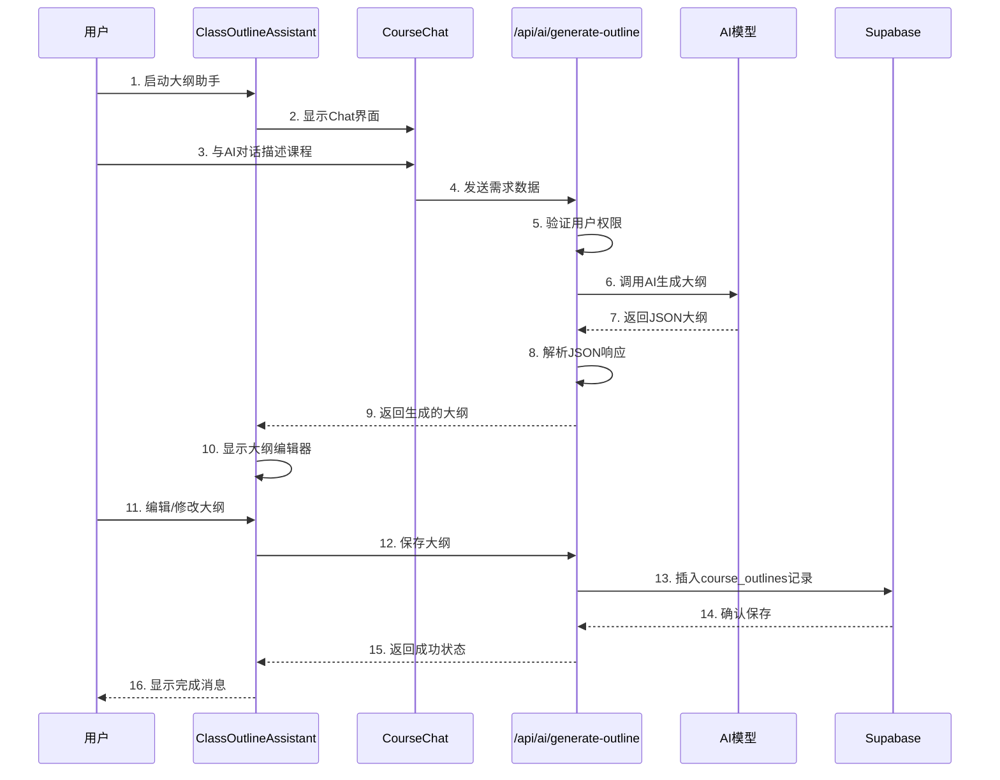
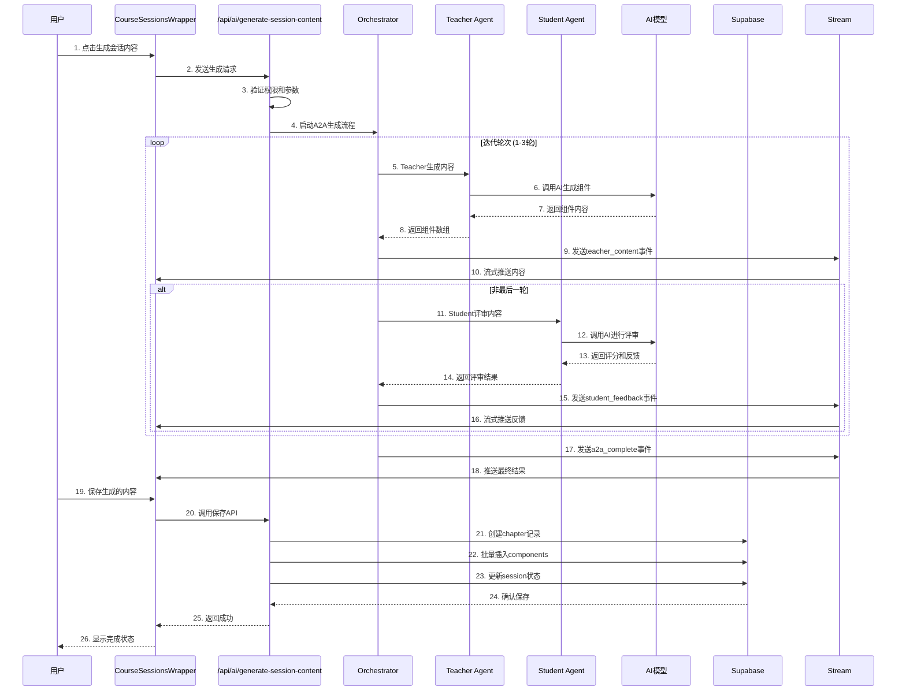
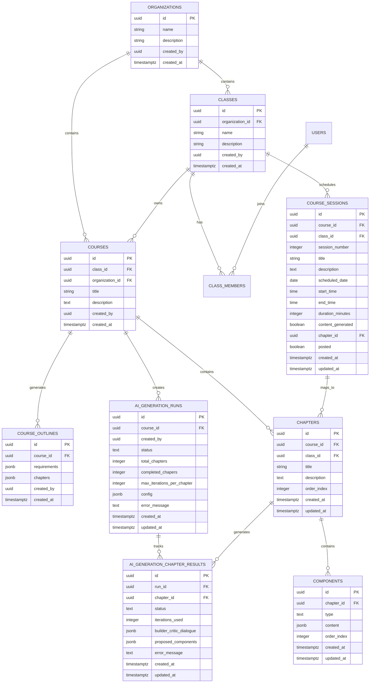
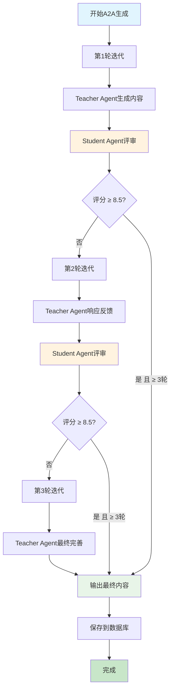
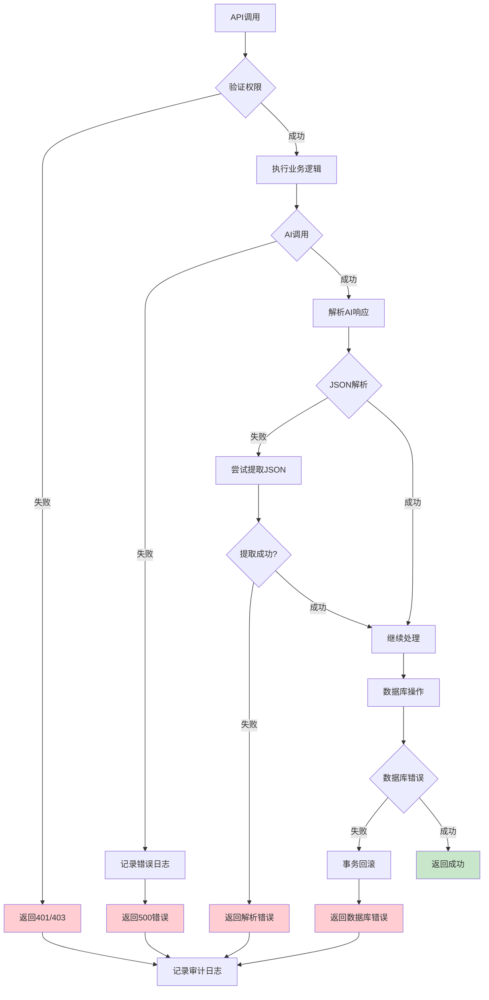
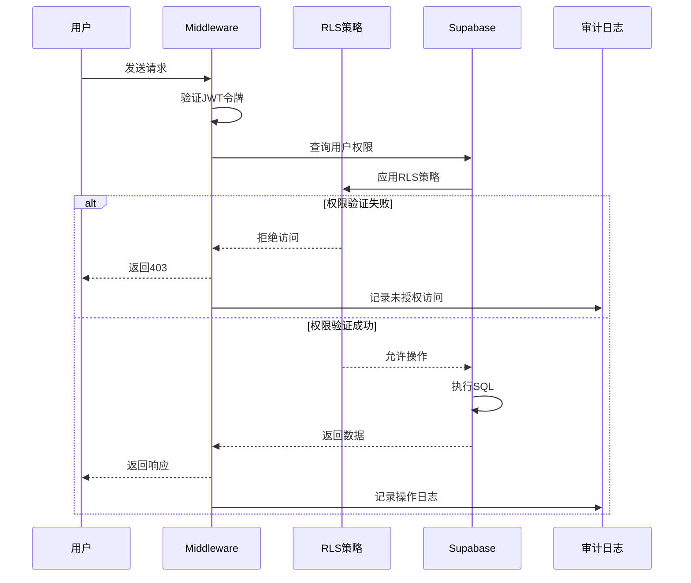
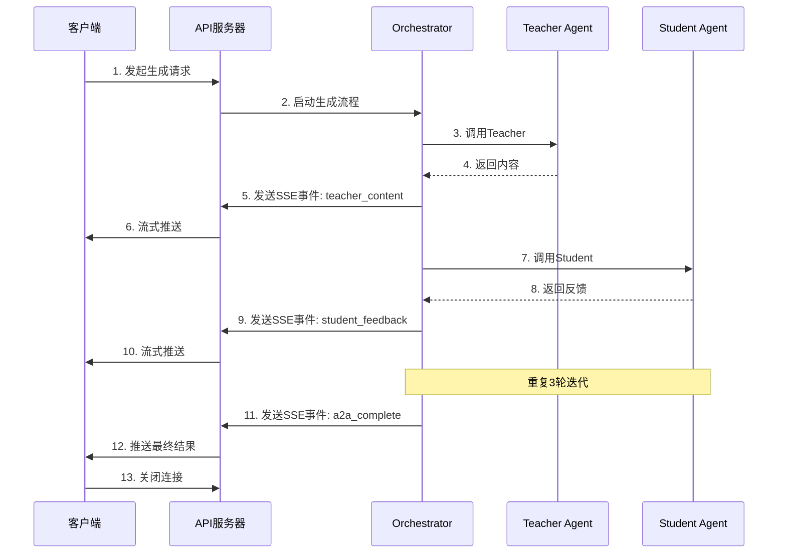

# WeaveMind 数据流程图

## 1. Outline Generation 数据流程



## 2. A2A Session Generation 数据流程



## 3. 数据库表关系图



## 4. A2A 迭代流程图



## 5. API 调用流程图

```mermaid
flowchart LR
    subgraph Client[客户端]
        A[Outline Assistant]
        B[Session Wrapper]
        C[Generation Panel]
    end
    
    subgraph API[API层]
        D[/api/ai/generate-outline]
        E[/api/ai/generate-session-content]
        F[/api/ai/save-session-content]
        G[/api/ai/generation-runs]
        H[/api/ai/generation-runs/[id]/accept]
    end
    
    subgraph Queue[队列系统]
        I[BullMQ Queue]
        J[AI Generation Worker]
    end
    
    subgraph Database[数据库]
        K[(Supabase PostgreSQL)]
        L[(Redis)]
    end
    
    A --> D
    D --> K
    A --> F
    F --> K
    
    B --> E
    E --> I
    I --> J
    J --> K
    
    C --> G
    G --> K
    G --> H
    H --> K
    
    J --> L
    
    style A fill:#bbdefb
    style B fill:#bbdefb
    style C fill:#bbdefb
    style D fill:#f3e5f5
    style E fill:#f3e5f5
    style F fill:#f3e5f5
    style G fill:#f3e5f5
    style I fill:#fff3e0
    style J fill:#fff3e0
    style K fill:#e8f5e8
    style L fill:#e8f5e8
```

## 6. 错误处理流程图



## 7. 数据安全流程图



## 8. 流式响应数据流



---

**图表说明**:
- `||--o{` 表示一对多关系
- `PK` 表示主键
- `FK` 表示外键
- 实线箭头表示直接调用
- 虚线箭头表示返回/响应
- 不同颜色表示不同系统层级

**文件位置**:
- 详细分析报告: `/OUTLINE_AND_A2A_SESSION_ANALYSIS_REPORT.md`
- 总结文档: `/ANALYSIS_SUMMARY.md`
- 数据流程图: `/DATA_FLOW_DIAGRAMS.md`
