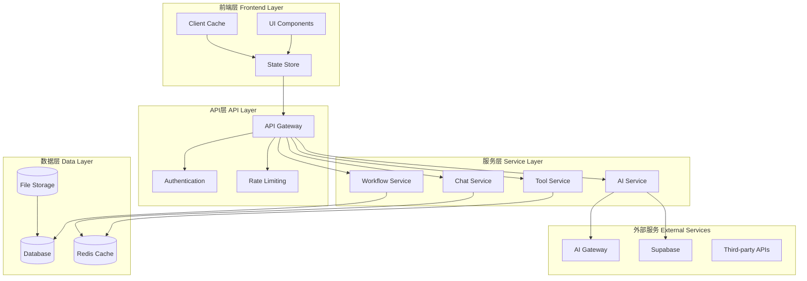

# AI Chatbot工作流工具数据流和状态管理设计

## 1. 数据流架构设计

### 1.1 整体数据流架构



### 1.2 数据流向模式

#### 1.2.1 单向数据流
```typescript
// 数据流向：Action -> Store -> Component -> UI
interface DataFlow {
  // 用户操作
  userAction: UserAction

  // 派发Action
  dispatch: (action: Action) => void

  // 状态更新
  updateState: (reducer: StateReducer) => void

  // 组件渲染
  render: () => JSX.Element

  // UI反馈
  uiFeedback: UIResponse
}
```

#### 1.2.2 双向数据绑定
```typescript
// 输入和输出的双向数据流
interface BidirectionalDataFlow {
  // 输入流
  inputStream: {
    userInput: UserInput
    apiResponse: ApiResponse
    websocketMessage: WebSocketMessage
    systemEvent: SystemEvent
  }

  // 处理流
  processingStream: {
    validation: DataValidator
    transformation: DataTransformer
    enrichment: DataEnricher
    routing: DataRouter
  }

  // 输出流
  outputStream: {
    uiUpdate: UIUpdate
    apiCall: ApiCall
    websocketSend: WebSocketSend
    eventEmit: EventEmit
  }
}
```

### 1.3 数据流事件模式

#### 1.3.1 事件驱动架构
```typescript
interface EventDrivenArchitecture {
  // 事件总线
  eventBus: {
    publish: (event: DomainEvent) => void
    subscribe: (eventType: string, handler: EventHandler) => void
    unsubscribe: (eventType: string, handler: EventHandler) => void
  }

  // 事件类型
  eventTypes: {
    // 工作流事件
    WORKFLOW_CREATED: 'workflow.created'
    WORKFLOW_UPDATED: 'workflow.updated'
    WORKFLOW_COMPLETED: 'workflow.completed'
    WORKFLOW_ERROR: 'workflow.error'

    // 工具事件
    TOOL_EXECUTED: 'tool.executed'
    TOOL_COMPLETED: 'tool.completed'
    TOOL_FAILED: 'tool.failed'

    // 聊天事件
    MESSAGE_SENT: 'message.sent'
    MESSAGE_RECEIVED: 'message.received'
    CONVERSATION_STARTED: 'conversation.started'

    // AI事件
    AI_REQUEST_SENT: 'ai.request.sent'
    AI_RESPONSE_RECEIVED: 'ai.response.received'
    AI_ERROR: 'ai.error'
  }

  // 事件处理器
  eventHandlers: {
    [eventType: string]: EventHandler[]
  }
}
```

#### 1.3.2 消息队列模式
```typescript
interface MessageQueueArchitecture {
  // 队列配置
  queues: {
    workflowQueue: {
      name: 'workflow-processing'
      type: 'priority'
      maxRetries: 3
      visibilityTimeout: 300
    }
    toolQueue: {
      name: 'tool-execution'
      type: 'fifo'
      maxRetries: 3
      visibilityTimeout: 180
    }
    aiQueue: {
      name: 'ai-processing'
      type: 'priority'
      maxRetries: 1
      visibilityTimeout: 600
    }
  }

  // 消息格式
  messageFormat: {
    id: string
    type: string
    priority: number
    payload: any
    metadata: {
      timestamp: string
      retryCount: number
      source: string
    }
  }

  // 队列操作
  operations: {
    enqueue: (queue: string, message: QueueMessage) => Promise<void>
    dequeue: (queue: string) => Promise<QueueMessage | null>
    acknowledge: (queue: string, messageId: string) => Promise<void>
    deadLetter: (queue: string, message: QueueMessage, error: Error) => Promise<void>
  }
}
```

## 2. 状态管理设计

### 2.1 状态管理架构

#### 2.1.1 分层状态管理
```typescript
interface LayeredStateManagement {
  // 全局状态 (Global State)
  globalState: {
    user: UserState
    auth: AuthState
    theme: ThemeState
    notifications: NotificationState
  }

  // 路由状态 (Route State)
  routeState: {
    currentRoute: string
    routeParams: Record<string, string>
    routeQuery: Record<string, string>
  }

  // 页面状态 (Page State)
  pageState: {
    activeTab: string
    modalState: ModalState
    sidebarState: SidebarState
  }

  // 功能状态 (Feature State)
  featureState: {
    chatbot: ChatbotState
    workflow: WorkflowState
    tools: ToolsState
    ai: AIState
  }

  // 临时状态 (Ephemeral State)
  ephemeralState: {
    loading: LoadingState
    errors: ErrorState
    drafts: DraftState
    selections: SelectionState
  }
}
```

#### 2.1.2 状态管理模式
```typescript
// 使用Zustand进行状态管理
interface AppState {
  // 全局状态
  user: User | null
  theme: 'light' | 'dark' | 'auto'
  notifications: Notification[]

  // 聊天状态
  chat: {
    conversations: Conversation[]
    activeConversationId: string | null
    messages: Message[]
    typing: TypingState
    online: boolean
  }

  // 工作流状态
  workflow: {
    activeWorkflow: WorkflowContext | null
    workflows: WorkflowContext[]
    executionHistory: ExecutionRecord[]
    templates: WorkflowTemplate[]
  }

  // 工具状态
  tools: {
    availableTools: AITool[]
    executionQueue: ExecutionRecord[]
    results: Record<string, ToolResult>
    preferences: ToolPreferences
  }

  // AI状态
  ai: {
    modelStatus: ModelStatus
    rateLimits: RateLimitInfo
    usage: UsageStats
    configuration: AIConfiguration
  }

  // UI状态
  ui: {
    sidebarCollapsed: boolean
    modals: ModalState[]
    dropdowns: Record<string, boolean>
    toasts: ToastState[]
  }

  // 操作方法
  actions: {
    // 用户操作
    setUser: (user: User | null) => void
    setTheme: (theme: 'light' | 'dark' | 'auto') => void

    // 聊天操作
    sendMessage: (content: string, attachments?: File[]) => Promise<void>
    receiveMessage: (message: Message) => void
    setTyping: (userId: string, isTyping: boolean) => void

    // 工作流操作
    createWorkflow: (type: WorkflowType, context: WorkflowContext) => Promise<void>
    updateWorkflow: (workflowId: string, updates: Partial<WorkflowContext>) => void
    executeWorkflowStep: (stepId: string, input: any) => Promise<void>

    // 工具操作
    executeTool: (toolId: string, parameters: any) => Promise<void>
    cancelToolExecution: (executionId: string) => Promise<void>

    // UI操作
    showModal: (modal: ModalState) => void
    hideModal: (modalId: string) => void
    showToast: (toast: ToastState) => void
    hideToast: (toastId: string) => void
  }
}
```

### 2.2 状态持久化

#### 2.2.1 多级持久化策略
```typescript
interface PersistenceStrategy {
  // 内存存储 (Memory Storage)
  memoryStorage: {
    // 内存缓存
    cache: LRUCache<string, any>
    // TTL配置
    ttl: {
      user: 3600000 // 1小时
      workflow: 1800000 // 30分钟
      chat: 300000 // 5分钟
      tools: 600000 // 10分钟
    }
  }

  // 本地存储 (Local Storage)
  localStorage: {
    // 持久化数据
    persisted: {
      user: UserPreferences
      theme: ThemeSettings
      workflowTemplates: WorkflowTemplate[]
      toolPreferences: ToolPreferences[]
    }
    // 存储限制
    limits: {
      maxSize: '10MB'
      maxItems: 1000
    }
  }

  // IndexedDB存储
  indexedDB: {
    // 大数据存储
    databases: {
      messages: {
        store: 'messages'
        indexes: ['conversationId', 'timestamp', 'userId']
        maxRecords: 10000
      }
      workflows: {
        store: 'workflows'
        indexes: ['userId', 'status', 'createdAt']
        maxRecords: 1000
      }
      files: {
        store: 'files'
        indexes: ['type', 'size', 'createdAt']
        maxSize: '100MB'
      }
    }
  }

  // 服务器存储 (Server Storage)
  serverStorage: {
    // 数据库表
    tables: {
      workflows: WorkflowTable
      executions: ExecutionTable
      conversations: ConversationTable
      ai_usage: AIUsageTable
    }
    // 缓存策略
    caching: {
      redis: RedisCache
      ttl: {
        workflow: 86400000 // 24小时
        execution: 3600000 // 1小时
        conversation: 604800000 // 7天
      }
    }
  }
}
```

#### 2.2.2 状态同步机制
```typescript
interface StateSynchronization {
  // 实时同步
  realTimeSync: {
    // WebSocket连接
    websocket: {
      url: string
      protocols: string[]
      reconnect: {
        attempts: 5
        delay: 1000
        backoff: 'exponential'
      }
    }

    // 同步事件
    events: {
      workflowUpdate: 'workflow.state.changed'
      toolExecution: 'tool.execution.status'
      messageReceived: 'chat.message.received'
      userPresence: 'user.presence.changed'
    }

    // 冲突解决
    conflictResolution: {
      strategy: 'last-write-wins' | 'merge' | 'manual'
      mergeStrategies: {
        array: 'append' | 'replace' | 'merge'
        object: 'deep-merge' | 'shallow-merge' | 'replace'
      }
    }
  }

  // 定时同步
  periodicSync: {
    // 同步间隔
    intervals: {
      workflowStatus: 30000 // 30秒
      toolResults: 10000 // 10秒
      userPreferences: 300000 // 5分钟
    }

    // 同步策略
    strategies: {
      incremental: boolean
      differential: boolean
      batched: boolean
    }
  }

  // 手动同步
  manualSync: {
    triggers: ['page-refresh', 'user-action', 'error-recovery']
    scope: 'full' | 'partial' | 'selective'
    confirmation: boolean
  }
}
```

### 2.3 状态模式设计

#### 2.3.1 工作流状态机
```typescript
// 工作流状态机实现
class WorkflowStateMachine {
  private states: Map<WorkflowState, WorkflowStateConfig> = new Map()

  constructor() {
    this.initializeStates()
  }

  private initializeStates() {
    // 初始化状态配置
    this.states.set('initializing', {
      allowedTransitions: ['collecting_requirements', 'error'],
      onEnter: (context) => this.handleEnterInitializing(context),
      onExit: (context) => this.handleExitInitializing(context)
    })

    this.states.set('collecting_requirements', {
      allowedTransitions: ['generating_outline', 'initializing', 'error'],
      onEnter: (context) => this.handleEnterCollecting(context),
      onExit: (context) => this.handleExitCollecting(context)
    })

    // ... 其他状态配置
  }

  // 状态转换
  transition(currentState: WorkflowState, event: WorkflowEvent, context: WorkflowContext): WorkflowState {
    const stateConfig = this.states.get(currentState)
    if (!stateConfig) {
      throw new Error(`Invalid state: ${currentState}`)
    }

    // 检查转换是否允许
    if (!stateConfig.allowedTransitions.includes(event.targetState)) {
      throw new Error(`Transition from ${currentState} to ${event.targetState} not allowed`)
    }

    // 执行退出处理
    stateConfig.onExit?.(context)

    // 执行转换
    const result = this.executeTransition(event, context)

    // 执行进入处理
    const newStateConfig = this.states.get(event.targetState)
    newStateConfig?.onEnter?.(context)

    return event.targetState
  }

  // 执行转换逻辑
  private executeTransition(event: WorkflowEvent, context: WorkflowContext): any {
    switch (event.type) {
      case 'USER_INPUT':
        return this.handleUserInput(event.data, context)
      case 'TOOL_RESULT':
        return this.handleToolResult(event.data, context)
      case 'SYSTEM_EVENT':
        return this.handleSystemEvent(event.data, context)
      default:
        throw new Error(`Unknown event type: ${event.type}`)
    }
  }
}

// 工作流状态配置接口
interface WorkflowStateConfig {
  allowedTransitions: WorkflowState[]
  onEnter?: (context: WorkflowContext) => void
  onExit?: (context: WorkflowContext) => void
  validators?: ((context: WorkflowContext) => ValidationResult)[]
  sideEffects?: ((context: WorkflowContext) => Promise<void>)[]
}
```

#### 2.3.2 工具执行状态机
```typescript
class ToolExecutionStateMachine {
  private states: Map<ToolExecutionState, ToolExecutionStateConfig> = new Map()

  constructor() {
    this.initializeStates()
  }

  private initializeStates() {
    this.states.set('queued', {
      allowedTransitions: ['running', 'cancelled', 'error'],
      onEnter: (context) => this.handleEnterQueued(context)
    })

    this.states.set('running', {
      allowedTransitions: ['completed', 'failed', 'cancelled', 'error'],
      onEnter: (context) => this.handleEnterRunning(context),
      onExit: (context) => this.handleExitRunning(context)
    })

    this.states.set('completed', {
      allowedTransitions: [],
      onEnter: (context) => this.handleEnterCompleted(context)
    })

    this.states.set('failed', {
      allowedTransitions: ['queued', 'cancelled'],
      onEnter: (context) => this.handleEnterFailed(context)
    })

    this.states.set('cancelled', {
      allowedTransitions: [],
      onEnter: (context) => this.handleEnterCancelled(context)
    })
  }

  // 状态转换方法
  transition(currentState: ToolExecutionState, event: ToolExecutionEvent, context: ToolExecutionContext): ToolExecutionState {
    // 实现状态转换逻辑
  }
}
```

### 2.4 状态监控和调试

#### 2.4.1 状态监控
```typescript
interface StateMonitoring {
  // 状态变更追踪
  stateTracking: {
    enabled: boolean
    logLevel: 'error' | 'warn' | 'info' | 'debug'
    tracking: {
      stateChanges: boolean
      actionDispatch: boolean
      asyncOperations: boolean
      errorOccurrences: boolean
    }
    storage: {
      maxEntries: number
      retention: number // days
      compression: boolean
    }
  }

  // 性能监控
  performanceMonitoring: {
    metrics: {
      stateUpdateTime: boolean
      renderTime: boolean
      actionProcessingTime: boolean
      memoryUsage: boolean
    }
    thresholds: {
      maxUpdateTime: number // ms
      maxRenderTime: number // ms
      maxMemoryUsage: number // MB
    }
    alerting: {
      enabled: boolean
      channels: ['console', 'webhook', 'email']
      conditions: PerformanceCondition[]
    }
  }

  // 调试工具
  debuggingTools: {
    timeTravel: boolean
    actionHistory: boolean
    stateDiff: boolean
    breakpoint: boolean
    logger: boolean
  }
}
```

#### 2.4.2 状态调试器
```typescript
class StateDebugger {
  private history: StateHistoryEntry[] = []
  private subscribers: DebugSubscriber[] = []

  // 记录状态变更
  recordStateChange(action: string, prevState: any, nextState: any, timestamp: number) {
    const entry: StateHistoryEntry = {
      id: generateId(),
      action,
      prevState: this.cloneState(prevState),
      nextState: this.cloneState(nextState),
      timestamp,
      duration: timestamp - (this.history[this.history.length - 1]?.timestamp || 0)
    }

    this.history.push(entry)
    this.notifySubscribers('state-change', entry)

    // 保持历史记录限制
    if (this.history.length > 1000) {
      this.history.shift()
    }
  }

  // 时间旅行调试
  timeTravelTo(index: number) {
    if (index < 0 || index >= this.history.length) {
      throw new Error('Invalid history index')
    }

    const targetState = this.history[index].nextState
    return this.cloneState(targetState)
  }

  // 状态差异分析
  analyzeStateDiff(index1: number, index2: number) {
    const entry1 = this.history[index1]
    const entry2 = this.history[index2]

    if (!entry1 || !entry2) {
      throw new Error('Invalid history indices')
    }

    return {
      differences: this.computeStateDifferences(entry1.nextState, entry2.nextState),
      path: this.findStatePath(entry1.nextState, entry2.nextState)
    }
  }

  // 性能分析
  analyzePerformance() {
    const analysis = {
      totalActions: this.history.length,
      averageDuration: this.history.reduce((sum, entry) => sum + entry.duration, 0) / this.history.length,
      slowActions: this.history.filter(entry => entry.duration > 100),
      memoryUsage: this.estimateMemoryUsage(),
      bottlenecks: this.identifyBottlenecks()
    }

    return analysis
  }
}
```

## 3. 数据一致性保证

### 3.1 ACID事务管理

#### 3.1.1 事务边界定义
```typescript
interface TransactionBoundary {
  // 工作流事务
  workflowTransaction: {
    scope: 'create_workflow' | 'execute_step' | 'update_state'
    isolation: 'serializable' | 'repeatable_read' | 'read_committed'
    timeout: number // seconds
    retryPolicy: RetryPolicy
    operations: [
      'workflow.create',
      'workflow_step.create',
      'workflow_state.update',
      'ai_usage_log.create'
    ]
  }

  // 工具执行事务
  toolExecutionTransaction: {
    scope: 'execute_tool' | 'update_result' | 'handle_error'
    isolation: 'read_committed'
    timeout: number // seconds
    retryPolicy: RetryPolicy
    operations: [
      'tool_execution.create',
      'tool_execution.update',
      'tool_result.upsert',
      'workflow_step.update'
    ]
  }

  // 聊天事务
  chatTransaction: {
    scope: 'send_message' | 'update_conversation' | 'create_conversation'
    isolation: 'read_committed'
    timeout: number // seconds
    retryPolicy: RetryPolicy
    operations: [
      'message.create',
      'conversation.update',
      'user_activity.create'
    ]
  }
}
```

#### 3.1.2 分布式事务管理
```typescript
interface DistributedTransactionManager {
  // 两阶段提交 (2PC)
  twoPhaseCommit: {
    prepare: (transaction: Transaction) => Promise<PrepareResult>
    commit: (transaction: Transaction) => Promise<CommitResult>
    rollback: (transaction: Transaction) => Promise<RollbackResult>
    timeout: number // milliseconds
  }

  // Saga模式
  sagaPattern: {
    execute: (saga: Saga) => Promise<SagaResult>
    compensate: (saga: Saga, step: number) => Promise<CompensationResult>
    state: 'pending' | 'executing' | 'completed' | 'compensating' | 'failed'
  }

  // 事件溯源 (Event Sourcing)
  eventSourcing: {
    saveEvent: (event: DomainEvent) => Promise<void>
    getEvents: (aggregateId: string) => Promise<DomainEvent[]>
    rebuildState: (events: DomainEvent[]) => Promise<any>
    snapshot: (aggregateId: string, state: any) => Promise<void>
  }
}
```

### 3.2 数据同步策略

#### 3.2.1 乐观锁
```typescript
interface OptimisticLocking {
  // 版本控制
  versionControl: {
    strategy: 'timestamp' | 'increment' | 'hash'
    field: string // 'version', 'updated_at', etc.
    initialValue: number | string
  }

  // 锁验证
  lockValidation: {
    check: (resourceId: string, version: any) => Promise<LockValidationResult>
    acquire: (resourceId: string, version: any) => Promise<LockResult>
    release: (resourceId: string, version: any) => Promise<void>
  }

  // 冲突解决
  conflictResolution: {
    strategy: 'reject' | 'merge' | 'manual' | 'auto-merge'
    mergeRules: {
      array: 'append' | 'prepend' | 'replace' | 'unique'
      object: 'deep-merge' | 'shallow-merge' | 'replace'
      primitive: 'last-writer-wins' | 'first-writer-wins'
    }
  }
}
```

#### 3.2.2 事件溯源
```typescript
interface EventSourcing {
  // 事件存储
  eventStore: {
    save: (event: StoredEvent) => Promise<void>
    load: (aggregateId: string, fromVersion?: number) => Promise<StoredEvent[]>
    loadSince: (timestamp: Date) => Promise<StoredEvent[]>
    loadByType: (eventType: string, fromTimestamp?: Date) => Promise<StoredEvent[]>
  }

  // 快照管理
  snapshotStore: {
    save: (snapshot: Snapshot) => Promise<void>
    load: (aggregateId: string) => Promise<Snapshot | null>
    cleanup: (retentionPolicy: RetentionPolicy) => Promise<void>
  }

  // 投影管理
  projections: {
    create: (projection: ProjectionDefinition) => Promise<void>
    update: (projectionId: string, events: StoredEvent[]) => Promise<void>
    query: (projectionId: string, query: ProjectionQuery) => Promise<ProjectionResult>
  }
}
```

### 3.3 最终一致性

#### 3.3.1 最终一致性模式
```typescript
interface EventualConsistency {
  // 延迟容忍
  latencyTolerance: {
    maxAcceptableDelay: number // milliseconds
    degradationStrategy: 'cache' | 'stale-ok' | 'reject'
    fallbackData: any
  }

  // 冲突解决
  conflictResolution: {
    strategy: 'last-write-wins' | 'vector-clock' | 'causal-order' | 'manual'
    resolutionRules: {
      workflow: 'last-write-wins'
      message: 'causal-order'
      tool_result: 'last-write-wins'
      user_preference: 'manual'
    }
  }

  // 数据修复
  dataRepair: {
    detection: {
      schedule: 'periodic' | 'event-driven' | 'on-demand'
      frequency: number // minutes
      scope: 'full' | 'incremental' | 'selective'
    }
    repair: {
      strategy: 'rebuild' | 'patch' | 'replay-events'
      validation: boolean
      rollback: boolean
    }
  }
}
```

#### 3.3.2 补偿操作
```typescript
interface CompensationPattern {
  // 补偿事务
  compensatingTransaction: {
    define: (originalTransaction: Transaction) => CompensationTransaction
    execute: (compensation: CompensationTransaction) => Promise<CompensationResult>
    validate: (compensation: CompensationTransaction) => Promise<ValidationResult>
  }

  // Saga补偿
  sagaCompensation: {
    execute: (saga: Saga, failedStep: number) => Promise<CompensationResult>
    compensateStep: (step: SagaStep, context: any) => Promise<CompensationResult>
    validateCompensation: (originalStep: SagaStep, compensation: CompensationStep) => Promise<boolean>
  }

  // 幂等性保证
  idempotency: {
    key: string // correlation-id, request-id, etc.
    ttl: number // seconds
    store: 'redis' | 'database' | 'memory'
    check: (key: string) => Promise<boolean>
    mark: (key: string, result: any) => Promise<void>
  }
}
```

## 4. 数据安全和隐私

### 4.1 数据加密

#### 4.1.1 传输加密
```typescript
interface TransportEncryption {
  // TLS配置
  tls: {
    version: '1.2' | '1.3'
    cipherSuites: string[]
    certificateValidation: boolean
    hostnameVerification: boolean
  }

  // WebSocket安全
  websocketSecurity: {
    protocol: 'wss' | 'ws'
    subprotocols: string[]
    originValidation: boolean
    rateLimit: {
      connections: number
      messages: number
      timeWindow: number
    }
  }

  // API安全
  apiSecurity: {
    https: boolean
    hsts: boolean
    cors: {
      allowedOrigins: string[]
      allowedMethods: string[]
      allowedHeaders: string[]
    }
    contentSecurityPolicy: {
      directives: Record<string, string[]>
      reportUri: string
    }
  }
}
```

#### 4.1.2 存储加密
```typescript
interface StorageEncryption {
  // 数据库加密
  databaseEncryption: {
    algorithm: 'AES-256-GCM' | 'ChaCha20-Poly1305'
    keyDerivation: 'PBKDF2' | 'scrypt' | 'argon2'
    keyRotation: {
      enabled: boolean
      frequency: number // days
      gracePeriod: number // days
    }
    fieldLevelEncryption: {
      enabled: boolean
      fields: string[]
      algorithm: string
    }
  }

  // 缓存加密
  cacheEncryption: {
    enabled: boolean
    algorithm: 'AES-128-GCM'
    keyRotation: {
      enabled: boolean
      frequency: number // hours
    }
    sensitiveData: {
      userTokens: boolean
      aiResponses: boolean
      workflowData: boolean
    }
  }

  // 文件存储加密
  fileStorageEncryption: {
    algorithm: 'AES-256-GCM'
    keyManagement: 'aws-kms' | 'azure-keyvault' | 'internal'
    encryptionAtRest: boolean
    encryptionInTransit: boolean
  }
}
```

### 4.2 访问控制

#### 4.2.1 基于角色的访问控制 (RBAC)
```typescript
interface RBAC {
  // 角色定义
  roles: {
    teacher: {
      permissions: [
        'workflow.create',
        'workflow.execute',
        'workflow.view',
        'workflow.edit',
        'tool.execute',
        'chat.send',
        'chat.view'
      ]
      restrictions: {
        maxWorkflows: number
        maxDailyExecutions: number
        dataRetention: number // days
      }
    }
    student: {
      permissions: [
        'workflow.view',
        'chat.send',
        'chat.view'
      ]
      restrictions: {
        maxMessagesPerDay: number
        dataRetention: number // days
      }
    }
    admin: {
      permissions: ['*'] // all permissions
      restrictions: {}
    }
  }

  // 权限检查
  permissionCheck: {
    check: (user: User, resource: string, action: string, context?: any) => Promise<boolean>
    evaluate: (user: User, permission: Permission, resource: any) => Promise<boolean>
    cache: {
      enabled: boolean
      ttl: number // seconds
      strategy: 'lru' | 'ttl'
    }
  }
}
```

#### 4.2.2 属性-based访问控制 (ABAC)
```typescript
interface ABAC {
  // 策略定义
  policies: {
    workflowAccess: {
      condition: (user: User, resource: Workflow, context: any) => boolean
      effect: 'allow' | 'deny'
      obligation: Obligation[]
    }
    toolAccess: {
      condition: (user: User, resource: Tool, context: any) => boolean
      effect: 'allow' | 'deny'
      obligation: Obligation[]
    }
  }

  // 属性评估
  attributeEvaluation: {
    userAttributes: {
      role: string
      department: string
      clearanceLevel: number
      preferences: Record<string, any>
    }
    resourceAttributes: {
      owner: string
      sensitivity: 'public' | 'internal' | 'confidential' | 'restricted'
      tags: string[]
      metadata: Record<string, any>
    }
    contextAttributes: {
      time: Date
      location: string
      device: string
      network: string
    }
  }
}
```

### 4.3 数据脱敏和匿名化

#### 4.3.1 数据脱敏
```typescript
interface DataMasking {
  // 脱敏规则
  maskingRules: {
    userEmail: {
      pattern: /^(.*)@(.*)$/
      replacement: '$1@***'
      reversible: false
    }
    phoneNumber: {
      pattern: /^(\d{3})\d{4}(\d{4})$/
      replacement: '$1****$2'
      reversible: false
    }
    creditCard: {
      pattern: /^(\d{4})\d{8,12}(\d{4})$/
      replacement: '$1****$2'
      reversible: false
    }
    workflowData: {
      pattern: /.*/
      replacement: '[REDACTED]'
      reversible: false
      selective: true
    }
  }

  // 动态脱敏
  dynamicMasking: {
    enabled: boolean
    context: 'display' | 'export' | 'api-response' | 'logs'
    sensitivity: {
      public: 'none'
      internal: 'partial'
      confidential: 'full'
      restricted: 'complete'
    }
  }
}
```

#### 4.3.2 数据匿名化
```typescript
interface DataAnonymization {
  // 匿名化技术
  techniques: {
    kAnonymity: {
      k: number
      quasiIdentifiers: string[]
      sensitiveAttributes: string[]
    }
    lDiversity: {
      l: number
      sensitiveAttribute: string
      diversityRequirement: string
    }
    tCloseness: {
      t: number
      attribute: string
      distanceMetric: string
    }
    differentialPrivacy: {
      epsilon: number
      delta: number
      sensitivity: number
      mechanism: 'laplace' | 'gaussian'
    }
  }

  // 匿名化流程
  anonymizationProcess: {
    identify: (data: any) => PIIFields
    classify: (field: PIIField) => SensitivityLevel
    transform: (data: any, rules: AnonymizationRules) => any
    validate: (anonymizedData: any) => ValidationResult
  }
}
```

## 5. 性能优化

### 5.1 数据缓存策略

#### 5.1.1 多层缓存
```typescript
interface MultiLayerCaching {
  // L1缓存 - 内存缓存
  l1Cache: {
    type: 'in-memory'
    implementation: 'LRU' | 'LFU' | 'ARC'
    maxSize: number
    ttl: {
      user: 3600000 // 1小时
      workflow: 1800000 // 30分钟
      chat: 300000 // 5分钟
      tool: 600000 // 10分钟
    }
  }

  // L2缓存 - Redis
  l2Cache: {
    type: 'redis'
    cluster: boolean
    ttl: {
      user: 86400000 // 24小时
      workflow: 3600000 // 1小时
      chat: 604800000 // 7天
      tool: 1800000 // 30分钟
    }
    eviction: 'allkeys-lru' | 'allkeys-random' | 'volatile-lru'
  }

  // L3缓存 - 数据库查询缓存
  l3Cache: {
    type: 'database'
    tables: {
      workflows: QueryCacheConfig
      executions: QueryCacheConfig
      conversations: QueryCacheConfig
    }
    invalidation: 'manual' | 'automatic' | 'time-based'
  }
}
```

#### 5.1.2 缓存失效策略
```typescript
interface CacheInvalidation {
  // 失效策略
  strategies: {
    // 时间-based失效
    timeBased: {
      defaultTTL: number
      slidingExpiration: boolean
      maxTTL: number
    }

    // 事件-based失效
    eventBased: {
      events: string[]
      subscribers: CacheSubscriber[]
      propagation: boolean
    }

    // 手动失效
    manual: {
      enabled: boolean
      permissions: string[]
      audit: boolean
    }

    // 预测性失效
    predictive: {
      enabled: boolean
      algorithm: 'access-pattern' | 'usage-frequency' | 'time-based'
      threshold: number
    }
  }

  // 失效传播
  propagation: {
    scope: 'local' | 'cluster' | 'global'
    method: 'pub-sub' | 'broadcast' | 'gossip'
    batchSize: number
    timeout: number
  }
}
```

### 5.2 数据预加载和懒加载

#### 5.2.1 预加载策略
```typescript
interface DataPreloading {
  // 预加载规则
  rules: {
    // 用户进入页面时预加载
    pageEntry: {
      triggers: ['chat-open', 'workflow-view', 'tool-select']
      data: {
        userPreferences: UserPreferences
        recentWorkflows: WorkflowContext[]
        availableTools: AITool[]
      }
    }

    // 预测性预加载
    predictive: {
      algorithm: 'collaborative' | 'content-based' | 'hybrid'
      features: {
        userHistory: boolean
        usagePatterns: boolean
        similarUsers: boolean
      }
      confidence: number // 0-1
    }

    // 关联数据预加载
    relational: {
      enabled: boolean
      depth: number // 预加载层级
      circular: boolean // 避免循环引用
      batchSize: number
    }
  }

  // 预加载调度
  scheduling: {
    priority: 'idle' | 'low' | 'normal' | 'high'
    batchSize: number
    concurrency: number
    retryPolicy: RetryPolicy
  }
}
```

#### 5.2.2 懒加载实现
```typescript
interface LazyLoading {
  // 组件懒加载
  componentLazyLoading: {
    threshold: number // 像素
    rootMargin: string
    load: (component: string) => Promise<any>
    placeholder: React.ComponentType
  }

  // 数据懒加载
  dataLazyLoading: {
    triggers: ['scroll' | 'viewport' | 'interaction']
    batchSize: number
    prefetchDistance: number
    load: (query: DataQuery) => Promise<DataResult>
  }

  // 图片懒加载
  imageLazyLoading: {
    threshold: number
    placeholder: string
    quality: number
    formats: ['webp' | 'avif' | 'jpeg']
  }

  // 代码分割
  codeSplitting: {
    strategy: 'route-based' | 'component-based' | 'vendor-based'
    minSize: number
    maxSize: number
    chunks: SplitChunk[]
  }
}
```

## 6. 监控和诊断

### 6.1 数据流监控

#### 6.1.1 性能指标
```typescript
interface DataFlowMetrics {
  // 吞吐量指标
  throughput: {
    messagesPerSecond: number
    workflowsPerMinute: number
    toolExecutionsPerHour: number
    aiRequestsPerMinute: number
  }

  // 延迟指标
  latency: {
    averageResponseTime: number
    p95ResponseTime: number
    p99ResponseTime: number
    databaseQueryTime: number
    cacheHitTime: number
    cacheMissTime: number
  }

  // 错误指标
  error: {
    errorRate: number
    timeoutRate: number
    retryRate: number
    deadLetterRate: number
    dataCorruptionRate: number
  }

  // 资源使用
  resource: {
    memoryUsage: number
    cpuUsage: number
    diskIO: number
    networkIO: number
    databaseConnections: number
    cacheMemoryUsage: number
  }
}
```

#### 6.1.2 健康检查
```typescript
interface HealthChecks {
  // 数据层健康检查
  dataLayer: {
    database: {
      connectionPool: HealthCheck
      queryPerformance: HealthCheck
      replication: HealthCheck
    }
    cache: {
      connectivity: HealthCheck
      performance: HealthCheck
      memoryUsage: HealthCheck
    }
    storage: {
      diskSpace: HealthCheck
      ioPerformance: HealthCheck
      dataIntegrity: HealthCheck
    }
  }

  // 服务层健康检查
  serviceLayer: {
    workflowService: {
      stateMachine: HealthCheck
      persistence: HealthCheck
      eventBus: HealthCheck
    }
    toolService: {
      execution: HealthCheck
      queue: HealthCheck
      results: HealthCheck
    }
    aiService: {
      connectivity: HealthCheck
      rateLimits: HealthCheck
      modelHealth: HealthCheck
    }
  }

  // 集成点健康检查
  integrationPoints: {
    supabase: HealthCheck
    redis: HealthCheck
    aiGateway: HealthCheck
    externalAPIs: HealthCheck
  }
}
```

### 6.2 诊断工具

#### 6.2.1 数据流追踪
```typescript
interface DataFlowTracing {
  // 分布式追踪
  distributedTracing: {
    enabled: boolean
    sampling: {
      rate: number // 0-1
      strategy: 'probabilistic' | 'rate-limiting' | 'dynamic'
    }
    propagation: {
      headers: string[]
      format: 'http' | 'binary' | 'grpc'
    }
    storage: {
      backend: 'jaeger' | 'zipkin' | 'datadog'
      retention: number // days
    }
  }

  // 链路追踪
  traceAnalysis: {
    traceId: string
    spanId: string
    parentSpanId: string
    operationName: string
    startTime: number
    endTime: number
    duration: number
    tags: Record<string, any>
    logs: TraceLog[]
    status: 'ok' | 'error' | 'timeout'
  }

  // 性能分析
  performanceProfiling: {
    cpu: {
      enabled: boolean
      interval: number // ms
      depth: number
    }
    memory: {
      enabled: boolean
      heapSnapshots: boolean
      allocationTracking: boolean
    }
    io: {
      enabled: boolean
      fileIO: boolean
      networkIO: boolean
    }
  }
}
```

#### 6.2.2 实时监控仪表板
```typescript
interface MonitoringDashboard {
  // 实时指标
  realTimeMetrics: {
    dataFlow: {
      currentThroughput: Gauge
      errorRate: Gauge
      activeWorkflows: Gauge
      queuedExecutions: Gauge
    }
    system: {
      cpuUsage: Gauge
      memoryUsage: Gauge
      diskUsage: Gauge
      networkLatency: Gauge
    }
    business: {
      userSessions: Gauge
      workflowCompletion: Counter
      toolUsage: Counter
      aiRequests: Counter
    }
  }

  // 告警配置
  alerting: {
    rules: AlertRule[]
    channels: AlertChannel[]
    escalation: EscalationPolicy
    silence: SilenceRule[]
  }

  // 可视化组件
  visualizations: {
    timeSeries: TimeSeriesChart[]
    gauges: GaugeChart[]
    heatmaps: HeatmapChart[]
    histograms: HistogramChart[]
    tables: DataTable[]
    logs: LogViewer
  }
}
```

这个数据流和状态管理设计文档提供了完整的AI chatbot工作流工具的数据架构，包括数据流模式、状态管理策略、一致性保证、安全控制、性能优化和监控诊断等各个方面，确保系统具有高可靠性、高性能和高可维护性。