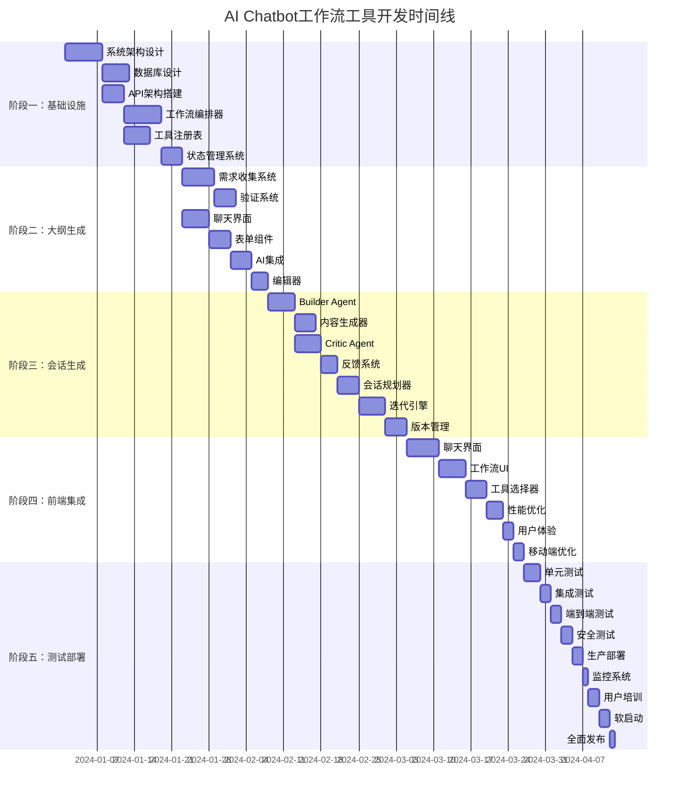

# AI Chatbot工作流工具实现计划和安全控制方案

## 1. 项目实施计划

### 1.1 项目概览

#### 1.1.1 项目目标
- **主要目标**: 开发一个集成outline generation和A2A session generation功能的AI chatbot工作流工具
- **技术目标**: 构建可扩展、高性能、安全的AI辅助教育平台
- **业务目标**: 提升课程创建效率60%以上，保证内容质量95%以上

#### 1.1.2 成功指标
- **功能性指标**:
  - 工作流执行成功率 ≥ 95%
  - 工具调用成功率 ≥ 98%
  - AI内容生成质量评分 ≥ 4.5/5
  - 用户满意度 ≥ 4.7/5

- **性能指标**:
  - API响应时间 ≤ 2秒 (95%分位)
  - 工作流创建时间 ≤ 5秒
  - 工具执行时间 ≤ 30秒
  - 系统可用性 ≥ 99.9%

- **安全指标**:
  - 数据泄露事件 = 0
  - 未授权访问事件 = 0
  - 安全漏洞修复时间 ≤ 24小时
  - 安全审计覆盖率 = 100%

### 1.2 开发阶段规划

#### 1.2.1 第一阶段：基础设施搭建 (4周)

**Week 1-2: 系统架构和环境准备**
```typescript
// 任务清单
interface Phase1Tasks {
  infrastructure: {
    // 开发环境搭建
    setupDevelopmentEnvironment: {
      description: "配置开发、测试、生产环境"
      estimatedDuration: "3天"
      dependencies: []
      deliverables: [
        "Development environment configuration",
        "CI/CD pipeline setup",
        "Docker containerization",
        "Environment variables management"
      ]
    }

    // 数据库架构设计
    designDatabaseArchitecture: {
      description: "设计完整的数据库架构"
      estimatedDuration: "5天"
      dependencies: ["setupDevelopmentEnvironment"]
      deliverables: [
        "Database schema design",
        "Migration scripts",
        "RLS policies",
        "Indexes optimization"
      ]
    }

    // API架构搭建
    setupAPIArchitecture: {
      description: "搭建RESTful API基础架构"
      estimatedDuration: "4天"
      dependencies: ["setupDevelopmentEnvironment"]
      deliverables: [
        "API gateway setup",
        "Authentication middleware",
        "Rate limiting",
        "API documentation"
      ]
    }
  }

  coreServices: {
    // 工作流编排器
    developWorkflowOrchestrator: {
      description: "开发核心工作流编排器"
      estimatedDuration: "7天"
      dependencies: ["setupAPIArchitecture"]
      deliverables: [
        "Workflow state machine",
        "Step execution engine",
        "Event handling system",
        "Error recovery mechanism"
      ]
    }

    // 工具注册表
    developToolRegistry: {
      description: "开发AI工具注册和管理系统"
      estimatedDuration: "5天"
      dependencies: ["setupAPIArchitecture"]
      deliverables: [
        "Tool registration system",
        "Discovery mechanism",
        "Execution environment",
        "Result management"
      ]
    }

    // 状态管理系统
    developStateManagement: {
      description: "开发状态管理系统"
      estimatedDuration: "4天"
      dependencies: ["developWorkflowOrchestrator"]
      deliverables: [
        "State persistence",
        "Synchronization mechanism",
        "Conflict resolution",
        "State validation"
      ]
    }
  }
}
```

**Week 3-4: 基础功能实现**
```typescript
interface Phase1Week3_4 {
  authentication: {
    implementAuthentication: {
      description: "实现用户认证和授权系统"
      tasks: [
        "Supabase Auth integration",
        "JWT token management",
        "Role-based access control",
        "Session management"
      ]
      estimatedDuration: "5天"
    }
  }

  monitoring: {
    setupMonitoring: {
      description: "设置监控和日志系统"
      tasks: [
        "Application monitoring",
        "Performance metrics",
        "Error tracking",
        "Alert configuration"
      ]
      estimatedDuration: "3天"
    }
  }

  testing: {
    setupTestingFramework: {
      description: "建立测试框架"
      tasks: [
        "Unit testing setup",
        "Integration testing",
        "E2E testing",
        "Performance testing"
      ]
      estimatedDuration: "4天"
    }
  }
}
```

#### 1.2.2 第二阶段：Outline Generation工具 (3周)

**Week 5-6: 需求收集和确认系统**
```typescript
interface Phase2Week5_6 {
  requirementCollection: {
    developInteractiveCollection: {
      description: "开发交互式需求收集系统"
      tasks: [
        "Chat-based requirement gathering",
        "Form-based data collection",
        "Validation and completion checking",
        "Context persistence"
      ]
      estimatedDuration: "6天"
      technicalRequirements: [
        "React component development",
        "Real-time chat interface",
        "State management integration",
        "API endpoint creation"
      ]
    }

    implementValidationSystem: {
      description: "实现需求完整性验证系统"
      tasks: [
        "Business rule validation",
        "Completeness checking",
        "Inconsistency detection",
        "User guidance system"
      ]
      estimatedDuration: "4天"
      technicalRequirements: [
        "Validation engine",
        "Rule engine implementation",
        "User feedback system",
        "Progress tracking"
      ]
    }
  }

  userInterface: {
    developChatInterface: {
      description: "开发聊天界面组件"
      tasks: [
        "Chat UI components",
        "Message handling",
        "Typing indicators",
        "File upload support"
      ]
      estimatedDuration: "5天"
      technicalRequirements: [
        "React components with TypeScript",
        "WebSocket integration",
        "File handling",
        "Responsive design"
      ]
    }

    implementFormComponents: {
      description: "实现表单组件"
      tasks: [
        "Multi-choice components",
        "Slider inputs",
        "Date pickers",
        "Dynamic form generation"
      ]
      estimatedDuration: "4天"
      technicalRequirements: [
        "Reusable form components",
        "Form validation",
        "State management",
        "Accessibility features"
      ]
    }
  }
}
```

**Week 7: 大纲生成和编辑系统**
```typescript
interface Phase2Week7 {
  outlineGeneration: {
    integrateAIGeneration: {
      description: "集成AI大纲生成服务"
      tasks: [
        "AI service integration",
        "Prompt engineering",
        "Response processing",
        "Quality validation"
      ]
      estimatedDuration: "4天"
      technicalRequirements: [
        "Vercel AI Gateway integration",
        "Error handling and retry",
        "Response parsing",
        "Content validation"
      ]
    }

    developOutlineEditor: {
      description: "开发大纲编辑器"
      tasks: [
        "Interactive outline editing",
        "Drag-and-drop functionality",
        "Version control",
        "Real-time collaboration"
      ]
      estimatedDuration: "3天"
      technicalRequirements: [
        "Rich text editor",
        "Drag and drop API",
        "Conflict resolution",
        "Real-time synchronization"
      ]
    }
  }
}
```

#### 1.2.3 第三阶段：A2A Session Generation工具 (4周)

**Week 8-9: Builder和Critic Agent集成**
```typescript
interface Phase3Week8_9 {
  builderAgent: {
    integrateBuilderAgent: {
      description: "集成Builder Agent服务"
      tasks: [
        "Builder Agent implementation",
        "Context management",
        "Content generation",
        "Quality control"
      ]
      estimatedDuration: "5天"
      technicalRequirements: [
        "AI agent framework",
        "Context preservation",
        "Template management",
        "Output validation"
      ]
    }

    developContentGenerator: {
      description: "开发内容生成器"
      tasks: [
        "Multi-format content support",
        "Template engine",
        "Content structuring",
        "Metadata management"
      ]
      estimatedDuration: "4天"
      technicalRequirements: [
        "Template engine",
        "Content parsers",
        "Format converters",
        "Metadata extractors"
      ]
    }
  }

  criticAgent: {
    integrateCriticAgent: {
      description: "集成Critic Agent服务"
      tasks: [
        "Critic Agent implementation",
        "Evaluation criteria",
        "Feedback generation",
        "Quality scoring"
      ]
      estimatedDuration: "5天"
      technicalRequirements: [
        "Evaluation engine",
        "Scoring algorithms",
        "Feedback system",
        "Quality metrics"
      ]
    }

    developFeedbackSystem: {
      description: "开发反馈系统"
      tasks: [
        "Feedback presentation",
        "Actionable suggestions",
        "Progress tracking",
        "User guidance"
      ]
      estimatedDuration: "3天"
      technicalRequirements: [
        "UI feedback components",
        "Action mapping",
        "Progress visualization",
        "Help system"
      ]
    }
  }
}
```

**Week 10-11: 会话生成工作流**
```typescript
interface Phase3Week10_11 {
  sessionWorkflow: {
    developSessionPlanner: {
      description: "开发会话规划器"
      tasks: [
        "Session planning logic",
        "Duration estimation",
        "Content allocation",
        "Progress tracking"
      ]
      estimatedDuration: "4天"
      technicalRequirements: [
        "Planning algorithms",
        "Time estimation models",
        "Content categorization",
        "Progress tracking"
      ]
    }

    implementIterationEngine: {
      description: "实现迭代优化引擎"
      tasks: [
        "Iteration control logic",
        "Feedback incorporation",
        "Quality improvement",
        "Convergence detection"
      ]
      estimatedDuration: "5天"
      technicalRequirements: [
        "Iteration management",
        "Feedback processing",
        "Quality improvement",
        "Convergence algorithms"
      ]
    }
  }

  contentManagement: {
    developContentVersioning: {
      description: "开发内容版本管理"
      tasks: [
        "Version control system",
        "Change tracking",
        "Rollback capability",
        "Collaboration features"
      ]
      estimatedDuration: "4天"
      technicalRequirements: [
        "Version control engine",
        "Change tracking",
        "Rollback mechanism",
        "Collaboration APIs"
      ]
    }
  }
}
```

#### 1.2.4 第四阶段：前端集成和用户体验 (3周)

**Week 12-13: UI组件开发**
```typescript
interface Phase4Week12_13 {
  coreComponents: {
    developChatbotInterface: {
      description: "开发主聊天界面"
      tasks: [
        "Chat interface components",
        "Message handling",
        "Real-time updates",
        "State management"
      ]
      estimatedDuration: "6天"
      technicalRequirements: [
        "React components",
        "WebSocket integration",
        "State management",
        "Responsive design"
      ]
    }

    developWorkflowUI: {
      description: "开发工作流UI组件"
      tasks: [
        "Workflow visualization",
        "Step indicators",
        "Progress tracking",
        "Control panels"
      ]
      estimatedDuration: "5天"
      technicalRequirements: [
        "Visualization library",
        "Progress components",
        "Control interfaces",
        "Animation systems"
      ]
    }

    developToolSelector: {
      description: "开发工具选择器"
      tasks: [
        "Tool discovery UI",
        "Categorization system",
        "Search functionality",
        "Recommendation engine"
      ]
      estimatedDuration: "4天"
      technicalRequirements: [
        "Tool registry UI",
        "Search algorithms",
        "Recommendation system",
        "Category management"
      ]
    }
  }
}
```

**Week 14: 用户体验优化**
```typescript
interface Phase4Week14 {
  optimization: {
    performanceOptimization: {
      description: "性能优化"
      tasks: [
        "Code splitting",
        "Lazy loading",
        "Caching optimization",
        "Bundle optimization"
      ]
      estimatedDuration: "3天"
    }

    userExperience: {
      description: "用户体验优化"
      tasks: [
        "Loading states",
        "Error handling",
        "User feedback",
        "Accessibility"
      ]
      estimatedDuration: "2天"
    }

    mobileOptimization: {
      description: "移动端优化"
      tasks: [
        "Responsive design",
        "Touch interactions",
        "Mobile performance",
        "PWA features"
      ]
      estimatedDuration: "2天"
    }
  }
}
```

#### 1.2.5 第五阶段：测试和部署 (2周)

**Week 15: 测试和调试**
```typescript
interface Phase5Week15 {
  testing: {
    unitTesting: {
      description: "单元测试"
      tasks: [
        "Component testing",
        "Service testing",
        "Utility testing",
        "Coverage analysis"
      ]
      estimatedDuration: "3天"
      coverage: "≥ 90%"
    }

    integrationTesting: {
      description: "集成测试"
      tasks: [
        "API integration",
        "Service integration",
        "Database testing",
        "External service testing"
      ]
      estimatedDuration: "2天"
    }

    e2eTesting: {
      description: "端到端测试"
      tasks: [
        "User workflow testing",
        "Cross-browser testing",
        "Performance testing",
        "Load testing"
      ]
      estimatedDuration: "2天"
    }
  }

  security: {
    securityTesting: {
      description: "安全测试"
      tasks: [
        "Vulnerability scanning",
        "Penetration testing",
        "Access control testing",
        "Data protection testing"
      ]
      estimatedDuration: "2天"
    }
  }
}
```

**Week 16: 部署和上线**
```typescript
interface Phase5Week16 {
  deployment: {
    productionDeployment: {
      description: "生产环境部署"
      tasks: [
        "Environment setup",
        "Database migration",
        "Service deployment",
        "SSL configuration"
      ]
      estimatedDuration: "2天"
    }

    monitoringSetup: {
      description: "监控系统配置"
      tasks: [
        "Performance monitoring",
        "Error tracking",
        "Alert configuration",
        "Dashboard setup"
      ]
      estimatedDuration: "1天"
    }

    userTraining: {
      description: "用户培训"
      tasks: [
        "Documentation",
        "Training materials",
        "Demo sessions",
        "Support setup"
      ]
      estimatedDuration: "2天"
    }
  }

  launch: {
    softLaunch: {
      description: "软启动"
      tasks: [
        "Limited user access",
        "Feedback collection",
        "Issue tracking",
        "Performance monitoring"
      ]
      estimatedDuration: "2天"
    }

    fullLaunch: {
      description: "全面发布"
      tasks: [
        "Marketing campaign",
        "User onboarding",
        "Support scaling",
        "Success metrics tracking"
      ]
      estimatedDuration: "1天"
    }
  }
}
```

### 1.3 资源分配和团队结构

#### 1.3.1 团队配置
```typescript
interface TeamStructure {
  // 技术架构师
  technicalArchitect: {
    count: 1
    responsibilities: [
      "System architecture design",
      "Technical decision making",
      "Code review and quality",
      "Performance optimization",
      "Security architecture"
    ]
    skills: [
      "System design",
      "Cloud architecture",
      "Performance optimization",
      "Security best practices",
      "Team leadership"
    ]
  }

  // 后端开发工程师
  backendEngineers: {
    count: 2
    responsibilities: [
      "API development",
      "Database design",
      "Business logic implementation",
      "Service integration",
      "Performance optimization"
    ]
    skills: [
      "Node.js/TypeScript",
      "Database design",
      "RESTful APIs",
      "Cloud services",
      "Testing frameworks"
    ]
  }

  // 前端开发工程师
  frontendEngineers: {
    count: 2
    responsibilities: [
      "UI component development",
      "User experience design",
      "Frontend integration",
      "Performance optimization",
      "Accessibility implementation"
    ]
    skills: [
      "React/Next.js",
      "TypeScript",
      "CSS/Tailwind",
      "UI/UX design",
      "Testing frameworks"
    ]
  }

  // AI工程师
  aiEngineers: {
    count: 1
    responsibilities: [
      "AI service integration",
      "Prompt engineering",
      "Model optimization",
      "AI workflow design",
      "Performance monitoring"
    ]
    skills: [
      "Machine learning",
      "AI APIs",
      "Prompt engineering",
      "NLP",
      "Model optimization"
    ]
  }

  // 测试工程师
  qaEngineers: {
    count: 1
    responsibilities: [
      "Test planning",
      "Test automation",
      "Quality assurance",
      "Performance testing",
      "Security testing"
    ]
    skills: [
      "Test automation",
      "Performance testing",
      "Security testing",
      "Quality assurance",
      "Bug tracking"
    ]
  }

  // 产品经理
  productManager: {
    count: 1
    responsibilities: [
      "Product planning",
      "Requirements gathering",
      "User research",
      "Stakeholder management",
      "Project coordination"
    ]
    skills: [
      "Product management",
      "User research",
      "Agile methodologies",
      "Stakeholder management",
      "Project management"
    ]
  }
}
```

#### 1.3.2 时间线甘特图


## 2. 风险评估和管理

### 2.1 技术风险评估

#### 2.1.1 高风险项目
```typescript
interface HighRiskProjects {
  // AI服务依赖风险
  aiServiceDependency: {
    risk: "High"
    probability: 0.7
    impact: "Critical"
    description: "对第三方AI服务的过度依赖可能导致服务中断"
    mitigation: {
      immediate: [
        "实施多AI提供商策略",
        "建立本地降级方案",
        "增加缓存机制"
      ]
      longTerm: [
        "开发自有AI模型",
        "建立混合AI架构",
        "增加AI服务监控"
      ]
    }
    contingency: {
      trigger: "AI服务不可用超过1小时"
      actions: [
        "切换到备用AI服务",
        "启用离线模式",
        "通知用户服务降级"
      ]
    }
  }

  // 数据库性能风险
  databasePerformance: {
    risk: "High"
    probability: 0.6
    impact: "High"
    description: "数据库查询性能可能无法满足实时工作流需求"
    mitigation: {
      immediate: [
        "实施查询优化",
        "增加索引策略",
        "建立读写分离"
      ]
      longTerm: [
        "实施数据库分片",
        "增加缓存层",
        "优化数据模型"
      ]
    }
    contingency: {
      trigger: "数据库响应时间超过5秒"
      actions: [
        "启用只读副本",
        "清理缓存",
        "增加临时计算资源"
      ]
    }
  }

  // 实时同步风险
  realTimeSynchronization: {
    risk: "High"
    probability: 0.5
    impact: "High"
    description: "多用户实时协作可能导致数据一致性问题"
    mitigation: {
      immediate: [
        "实施乐观锁",
        "增加冲突检测",
        "建立回滚机制"
      ]
      longTerm: [
        "实施最终一致性",
        "增加事件溯源",
        "优化同步算法"
      ]
    }
    contingency: {
      trigger: "数据冲突率超过5%"
      actions: [
        "暂停实时同步",
        "切换到批处理模式",
        "通知用户手动解决"
      ]
    }
  }
}
```

#### 2.1.2 中风险项目
```typescript
interface MediumRiskProjects {
  // 前端性能风险
  frontendPerformance: {
    risk: "Medium"
    probability: 0.6
    impact: "Medium"
    description: "复杂的前端交互可能影响用户体验"
    mitigation: [
      "实施代码分割",
      "优化bundle大小",
      "增加虚拟滚动",
      "优化图像加载"
    ]
  }

  // 第三方集成风险
  thirdPartyIntegration: {
    risk: "Medium"
    probability: 0.4
    impact: "Medium"
    description: "第三方服务API变更可能影响系统稳定性"
    mitigation: [
      "建立API版本管理",
      "实施契约测试",
      "增加监控告警",
      "准备备用方案"
    ]
  }

  // 扩展性风险
  scalabilityRisk: {
    risk: "Medium"
    probability: 0.5
    impact: "Medium"
    description: "系统可能无法应对突发的用户增长"
    mitigation: [
      "实施水平扩展",
      "增加负载均衡",
      "优化资源使用",
      "建立自动扩容"
    ]
  }
}
```

### 2.2 项目风险矩阵

```typescript
interface RiskMatrix {
  risks: {
    // 高概率高影响
    critical: [
      {
        risk: "AI服务中断",
        probability: 0.7,
        impact: 0.9,
        score: 0.63,
        mitigation: "多AI提供商 + 缓存策略"
      },
      {
        risk: "数据库性能问题",
        performance: 0.6,
        impact: 0.8,
        score: 0.48,
        mitigation: "查询优化 + 缓存 + 分片"
      }
    ]

    // 高概率中影响
    high: [
      {
        risk: "前端性能问题",
        probability: 0.6,
        impact: 0.5,
        score: 0.30,
        mitigation: "代码分割 + 懒加载"
      },
      {
        risk: "API限制超限",
        probability: 0.5,
        impact: 0.6,
        score: 0.30,
        mitigation: "请求缓存 + 限流策略"
      }
    ]

    // 中概率高影响
    medium: [
      {
        risk: "数据泄露",
        probability: 0.3,
        impact: 0.9,
        score: 0.27,
        mitigation: "加密 + 访问控制 + 审计"
      },
      {
        risk: "系统被攻击",
        probability: 0.2,
        impact: 0.9,
        score: 0.18,
        mitigation: "安全加固 + 监控 + 应急响应"
      }
    ]

    // 低概率低影响
    low: [
      {
        risk: "第三方服务变更",
        probability: 0.4,
        impact: 0.3,
        score: 0.12,
        mitigation: "版本管理 + 契约测试"
      },
      {
        risk: "硬件故障",
        probability: 0.1,
        impact: 0.7,
        score: 0.07,
        mitigation: "冗余设计 + 备份恢复"
      }
    ]
  }
}
```

### 2.3 风险应对策略

#### 2.3.1 预防策略
```typescript
interface PreventionStrategies {
  // 技术预防
  technical: {
    // 代码质量
    codeQuality: {
      practices: [
        "Code review mandatory",
        "Automated testing coverage > 90%",
        "Static code analysis",
        "Security scanning",
        "Performance profiling"
      ]
      tools: [
        "ESLint/Prettier",
        "Jest/Vitest",
        "SonarQube",
        "Snyk",
        "Lighthouse"
      ]
    }

    // 架构设计
    architecture: {
      principles: [
        "Microservices architecture",
        "Event-driven design",
        "CQRS pattern",
        "Circuit breaker",
        "Graceful degradation"
      ]
      patterns: [
        "Repository pattern",
        "Factory pattern",
        "Observer pattern",
        "Strategy pattern",
        "Command pattern"
      ]
    }

    // 性能优化
    performance: {
      strategies: [
        "Database query optimization",
        "Caching strategy",
        "CDN implementation",
        "Load balancing",
        "Auto-scaling"
      ]
      monitoring: [
        "Response time tracking",
        "Throughput monitoring",
        "Error rate tracking",
        "Resource utilization",
        "User experience metrics"
      ]
    }
  }

  // 团队预防
  team: {
    // 技能提升
    skillDevelopment: [
      "Regular training sessions",
      "Code review knowledge sharing",
      "Technical workshops",
      "External conferences",
      "Mentorship programs"
    ]

    // 知识管理
    knowledgeManagement: [
      "Documentation standards",
      "Knowledge base creation",
      "Technical blog posts",
      "Weekly tech talks",
      "Internal wikis"
    ]

    // 沟通协作
    communication: [
      "Daily standups",
      "Sprint planning",
      "Retrospectives",
      "Technical design reviews",
      "Post-mortem analysis"
    ]
  }

  // 流程预防
  process: {
    // 开发流程
    development: [
      "Agile methodology",
      "Continuous integration",
      "Continuous deployment",
      "Feature flags",
      "Blue-green deployment"
    ]

    // 质量保证
    quality: [
      "Definition of done",
      "Acceptance criteria",
      "User story testing",
      "Performance testing",
      "Security testing"
    ]

    // 发布管理
    release: [
      "Staging environment",
      "Canary releases",
      "Rollback procedures",
      "Feature toggles",
      "Gradual rollouts"
    ]
  }
}
```

#### 2.3.2 应急响应计划
```typescript
interface EmergencyResponsePlan {
  // 事件分级
  incidentLevels: {
    critical: {
      criteria: [
        "Service completely down",
        "Data breach detected",
        "Security incident",
        "Performance degradation > 80%"
      ]
      response: {
        immediate: "15 minutes",
        escalation: "30 minutes",
        resolution: "2 hours"
      }
      contacts: [
        "Technical lead",
        "DevOps engineer",
        "Security team",
        "Executive team"
      ]
    }

    high: {
      criteria: [
        "Partial service disruption",
        "Performance degradation 50-80%",
        "Minor security issues",
        "Data consistency problems"
      ]
      response: {
        immediate: "30 minutes",
        escalation: "1 hour",
        resolution: "4 hours"
      }
      contacts: [
        "Technical lead",
        "Development team",
        "QA team"
      ]
    }

    medium: {
      criteria: [
        "Minor feature issues",
        "Performance degradation < 50%",
        "UI/UX problems",
        "Documentation issues"
      ]
      response: {
        immediate: "1 hour",
        escalation: "2 hours",
        resolution: "1 business day"
      }
      contacts: [
        "Development team",
        "Product team"
      ]
    }
  }

  // 响应流程
  responseProcess: {
    detection: {
      automated: [
        "Monitoring alerts",
        "Health checks",
        "Performance metrics",
        "Error tracking"
      ]
      manual: [
        "User reports",
        "Team observations",
        "Customer feedback",
        "Third-party notifications"
      ]
    }

    assessment: {
      analysis: [
        "Impact assessment",
        "Root cause analysis",
        "Affected components",
        "User impact"
      ]
      decision: [
        "Severity classification",
        "Resource allocation",
        "Response strategy",
        "Communication plan"
      ]
    }

    response: {
      immediate: [
        "Service restoration",
        "User communication",
        "Impact mitigation",
        "Stakeholder notification"
      ]
      longTerm: [
        "Root cause resolution",
        "System hardening",
        "Process improvement",
        "Documentation update"
      ]
    }

    recovery: {
      validation: [
        "Service testing",
        "Performance verification",
        "User acceptance",
        "Security validation"
      ]
      monitoring: [
        "Continued monitoring",
        "Performance tracking",
        "User feedback",
        "Success metrics"
      ]
    }
  }
}
```

## 3. 安全控制方案

### 3.1 安全架构设计

#### 3.1.1 多层安全模型
```typescript
interface SecurityArchitecture {
  // 边界安全
  perimeterSecurity: {
    // Web应用防火墙 (WAF)
    waf: {
      rules: [
        "SQL injection protection",
        "XSS protection",
        "CSRF protection",
        "Rate limiting",
        "Geo-blocking",
        "IP reputation filtering"
      ]
      configuration: {
        managedRules: boolean
        customRules: boolean
        realTimeUpdates: boolean
        logging: boolean
      }
    }

    // DDoS保护
    ddosProtection: {
      layers: [
        "Network layer (L3)",
        "Transport layer (L4)",
        "Application layer (L7)"
      ]
      mitigation: [
        "Traffic filtering",
        "Rate limiting",
        "IP blocking",
        "Geographic filtering",
        "Challenge-response"
      ]
    }

    // CDN安全
    cdnSecurity: {
      features: [
        "TLS/SSL termination",
        "Edge caching",
        "DDoS mitigation",
        "Bot protection",
        "WAF integration"
      ]
    }
  }

  // 网络安全
  networkSecurity: {
    // 零信任网络
    zeroTrust: {
      principles: [
        "Never trust, always verify",
        "Least privilege access",
        "Assume breach",
        "Verify explicitly",
        "Use least privilege"
      ]
      implementation: [
        "Identity verification",
        "Device authentication",
        "Network segmentation",
        "Continuous monitoring",
        "Policy enforcement"
      ]
    }

    // 网络分段
    networkSegmentation: {
      zones: [
        "DMZ (Demilitarized Zone)",
        "Application zone",
        "Database zone",
        "Management zone"
      ]
      controls: [
        "Firewalls",
        "Network ACLs",
        "VLANs",
        "Micro-segmentation"
      ]
    }

    // 加密通信
    encryption: {
      inTransit: {
        protocol: "TLS 1.3"
        cipherSuites: [
          "TLS_AES_256_GCM_SHA384",
          "TLS_CHACHA20_POLY1305_SHA256",
          "TLS_AES_128_GCM_SHA256"
        ]
      }
      atRest: {
        algorithm: "AES-256-GCM"
        keyManagement: "HSM"
        keyRotation: "automatic"
      }
    }
  }

  // 应用安全
  applicationSecurity: {
    // 安全编码
    secureCoding: {
      practices: [
        "Input validation",
        "Output encoding",
        "Authentication",
        "Authorization",
        "Session management",
        "Error handling",
        "Logging",
        "Data protection"
      ]
      frameworks: [
        "OWASP Top 10",
        "Secure coding standards",
        "Code review guidelines",
        "Security testing"
      ]
    }

    // 应用防火墙
    appFirewall: {
      rules: [
        "Parameter pollution",
        "Buffer overflow",
        "Command injection",
        "File inclusion",
        "Session hijacking"
      ]
      features: [
        "Request filtering",
        "Response filtering",
        "Access control",
        "Input validation",
        "Output encoding"
      ]
    }

    // 容器安全
    containerSecurity: {
      scanning: [
        "Image vulnerability scanning",
        "Configuration scanning",
        "Runtime scanning",
        "Compliance scanning"
      ]
      runtime: [
        "File system monitoring",
        "Network monitoring",
        "Process monitoring",
        "System call filtering"
      ]
    }
  }
}
```

#### 3.1.2 数据安全
```typescript
interface DataSecurity {
  // 数据分类
  dataClassification: {
    public: {
      definition: "Data that can be freely shared"
      examples: ["Documentation", "Public APIs", "Marketing materials"]
      protection: "Basic access control"
    }

    internal: {
      definition: "Data for internal use only"
      examples: ["Employee data", "Internal processes", "Non-sensitive business data"]
      protection: "Authentication + Authorization"
    }

    confidential: {
      definition: "Sensitive business data"
      examples: ["Financial data", "Customer data", "Trade secrets"]
      protection: "Encryption + Access Control + Audit"
    }

    restricted: {
      definition: "Highly sensitive data"
      examples: ["Personal data", "Payment data", "Authentication credentials"]
      protection: "Encryption + MFA + Audit + Data Loss Prevention"
    }
  }

  // 数据保护
  dataProtection: {
    // 加密
    encryption: {
      atRest: {
        database: {
          algorithm: "AES-256-GCM"
          keyManagement: "AWS KMS / Azure Key Vault"
          fieldLevelEncryption: true
        }
        files: {
          algorithm: "AES-256-GCM"
          keyManagement: "HSM"
          clientSideEncryption: true
        }
        backups: {
          algorithm: "AES-256-GCM"
          keyManagement: "Separate keys"
          geographicRestrictions: true
        }
      }

      inTransit: {
        api: {
          protocol: "TLS 1.3"
          certificatePinning: true
          hsts: true
        }
        websockets: {
          protocol: "WSS"
          certificatePinning: true
        }
        internal: {
          mTLS: true
          networkEncryption: true
        }
      }
    }

    // 访问控制
    accessControl: {
      authentication: {
        multiFactor: true
        passwordPolicy: {
          minLength: 12
          complexity: true
          history: 12
          maxAge: 90
        }
        sessionManagement: {
          timeout: 3600
          concurrent: 3
          invalidation: "onLogout"
        }
      }

      authorization: {
        rbac: {
          enabled: true
          roles: ["admin", "teacher", "student", "viewer"]
          permissions: "granular"
          inheritance: true
        }

        abac: {
          enabled: true
          attributes: ["user", "resource", "context", "action"]
          policies: "dynamic"
          evaluation: "real-time"
        }
      }

      audit: {
        enabled: true
        level: "comprehensive"
        retention: "7 years"
        monitoring: "real-time"
        alerts: "anomaly detection"
      }
    }

    // 数据丢失防护 (DLP)
    dlp: {
      enabled: true
      methods: [
        "Content inspection",
        "Pattern matching",
        "Machine learning",
        "File fingerprinting"
      ]
      actions: [
        "Block transfer",
        "Encrypt data",
        "Alert administrators",
        "Quarantine files"
      ]
    }
  }
}
```

### 3.2 安全监控和检测

#### 3.2.1 威胁检测
```typescript
interface ThreatDetection {
  // 实时监控
  realTimeMonitoring: {
    // 异常检测
    anomalyDetection: {
      algorithms: [
        "Statistical analysis",
        "Machine learning",
        "Behavioral analysis",
        "Pattern recognition"
      ]
      metrics: [
        "Login attempts",
        "API calls",
        "Data access",
        "System resources",
        "Network traffic"
      ]
      thresholds: {
        loginFailures: 5
        apiCallsPerMinute: 1000
        dataAccess: "normal + 3 stddev"
        resourceUsage: 80
        networkTraffic: "normal + 2 stddev"
      }
    }

    // 入侵检测系统 (IDS)
    intrusionDetection: {
      networkBased: {
        enabled: true
        rules: [
          "Port scanning",
          "Malware traffic",
          "Data exfiltration",
          "Command and control"
        ]
      }

      hostBased: {
        enabled: true
        rules: [
          "File system changes",
          "Process execution",
          "Registry changes",
          "Privilege escalation"
        ]
      }
    }

    // 用户行为分析 (UBA)
    userBehaviorAnalysis: {
      enabled: true
      features: [
        "Login patterns",
        "Data access patterns",
        "System usage",
        "Geolocation anomalies",
        "Device fingerprints"
      ]
      alerts: [
        "Unusual login times",
        "Unusual data access",
        "Impossible travel",
        "Multiple failed logins",
        "Privilege escalation"
      ]
    }
  }

  // 日志分析
  logAnalysis: {
    // SIEM系统
    siem: {
      enabled: true
      sources: [
        "Application logs",
        "System logs",
        "Security logs",
        "Network logs",
        "Database logs"
      ]
      correlation: {
        enabled: true
        rules: "custom"
        timeWindow: "5 minutes"
      }
      retention: "1 year"
    }

    // 日志保护
    logProtection: {
      tamperProof: true
      encryption: true
      integrity: "hash chains"
      accessControl: "strict"
      retention: "regulatory compliance"
    }
  }

  // 漏洞管理
  vulnerabilityManagement: {
    scanning: {
      infrastructure: "weekly"
      application: "continuous"
      dependency: "continuous"
      configuration: "continuous"
    }

    assessment: {
      riskScoring: "CVSS 3.1"
      prioritization: "business impact"
      remediation: " SLA-based"
      verification: "automated"
    }

    patchManagement: {
      critical: "24 hours"
      high: "7 days"
      medium: "30 days"
      low: "90 days"
      automated: true
    }
  }
}
```

#### 3.2.2 事件响应
```typescript
interface IncidentResponse {
  // 响应团队
  responseTeam: {
    roles: [
      {
        title: "Incident Commander"
        responsibilities: [
          "Overall coordination",
          "Decision making",
          "Communication",
          "Resource allocation"
        ]
        skills: ["Leadership", "Crisis management", "Technical knowledge"]
      },
      {
        title: "Security Analyst"
        responsibilities: [
          "Threat analysis",
          "Forensics",
          "Evidence collection",
          "Impact assessment"
        ]
        skills: ["Security expertise", "Forensics tools", "Analysis"]
      },
      {
        title: "Technical Lead"
        responsibilities: [
          "Technical response",
          "System recovery",
          "Root cause analysis",
          "System hardening"
        ]
        skills: ["System administration", "Technical expertise", "Recovery"]
      },
      {
        title: "Communications Lead"
        responsibilities: [
          "Internal communication",
          "External communication",
          "Stakeholder updates",
          "Media management"
        ]
        skills: ["Communication", "Public relations", "Crisis communication"]
      }
    ]
  }

  // 响应流程
  responseProcess: {
    preparation: {
      plans: [
        "Incident response plan",
        "Business continuity plan",
        "Disaster recovery plan",
        "Communication plan"
      ]
      procedures: [
        "Escalation procedures",
        "Contact procedures",
        "Decision frameworks",
        "Resource allocation"
      ]
      tools: [
        "Communication platforms",
        "Monitoring tools",
        "Forensics tools",
        "Recovery tools"
      ]
    }

    identification: {
      detection: [
        "Automated alerts",
        "User reports",
        "Third-party notifications",
        "Anomaly detection"
      ]
      analysis: [
        "Initial assessment",
        "Impact evaluation",
        "Scope determination",
        "Severity classification"
      ]
      documentation: [
        "Incident timeline",
        "Evidence collection",
        "Impact assessment",
        "Initial response"
      ]
    }

    containment: {
      immediate: [
        "Isolate affected systems",
        "Block malicious traffic",
        "Preserve evidence",
        "Notify stakeholders"
      ]
      shortTerm: [
        "Implement workarounds",
        "Strengthen defenses",
        "Monitor for spread",
        "Plan recovery"
      ]
      longTerm: [
        "System rebuilding",
        "Security hardening",
        "Process improvements",
        "Training updates"
      ]
    }

    eradication: {
      removeThreat: [
        "Eliminate malware",
        "Close vulnerabilities",
        "Remove unauthorized access",
        "Clean compromised systems"
      ]
      verifyClean: [
        "System scans",
        "Log analysis",
        "Network monitoring",
        "User verification"
      ]
    }

    recovery: {
      restoreServices: [
        "Restore from backups",
        "Verify system integrity",
        "Monitor for recurrence",
        "Gradual service restoration"
      ]
      validate: [
        "Functional testing",
        "Security testing",
        "Performance testing",
        "User acceptance"
      ]
    }

    lessonsLearned: {
      documentation: [
        "Incident summary",
        "Timeline of events",
        "Actions taken",
        "Impact assessment"
      ]
      improvements: [
        "Process improvements",
        "Technology updates",
        "Training needs",
        "Policy changes"
      ]
      prevention: [
        "Threat intelligence",
        "Proactive monitoring",
        "Security awareness",
        "Regular assessments"
      ]
    }
  }
}
```

### 3.3 合规性管理

#### 3.3.1 法规合规
```typescript
interface ComplianceManagement {
  // GDPR合规
  gdpr: {
    principles: [
      "Lawfulness, fairness and transparency",
      "Purpose limitation",
      "Data minimisation",
      "Accuracy",
      "Storage limitation",
      "Integrity and confidentiality",
      "Accountability"
    ]

    requirements: {
      consent: {
        lawfulBasis: "explicit consent"
        withdrawal: "easy withdrawal"
        granularity: "specific purposes"
        documentation: "consent records"
      }

      dataSubject: {
        rights: [
          "Right to information",
          "Right of access",
          "Right to rectification",
          "Right to erasure",
          "Right to restrict processing",
          "Right to data portability",
          "Right to object",
          "Rights related to automated decision making"
        ]
        procedures: [
          "Request handling",
          "Identity verification",
          "Response timeframes",
          "Fee structure"
        ]
      }

      dataProtection: {
        byDesign: true
        byDefault: true
        technical: [
          "Encryption",
          "Pseudonymisation",
          "Access controls",
          "Audit logging"
        ]
        organisational: [
          "Privacy policies",
          "Staff training",
          "Data processing agreements",
          "Regular assessments"
        ]
      }

      breachNotification: {
        authority: "72 hours"
        dataSubjects: "without undue delay"
        documentation: "record of breaches"
      }
    }
  }

  // SOC 2合规
  soc2: {
    trustServicesCriteria: {
      security: {
        controls: [
          "Logical and physical access controls",
          "System operations",
          "Change management",
          "Risk mitigation"
        ]
      }

      availability: {
        controls: [
          "System monitoring",
          "Incident handling",
          "System backup",
          "Disaster recovery"
        ]
      }

      processingIntegrity: {
        controls: [
          "Data input controls",
          "Data processing controls",
          "Data output controls",
          "Data storage controls"
        ]
      }

      confidentiality: {
        controls: [
          "Data classification",
          "Encryption controls",
          "Access restrictions",
          "Secure disposal"
        ]
      }

      privacy: {
        controls: [
          "Privacy notice",
          "Consent management",
          "Data minimisation",
          "User rights"
        ]
      }
    }
  }

  // 行业标准
  industryStandards: {
    // ISO 27001
    iso27001: {
      controls: [
        "Information security policies",
        "Organization of information security",
        "Human resource security",
        "Asset management",
        "Access control",
        "Cryptography",
        "Physical and environmental security",
        "Operations security",
        "Communications security",
        "System acquisition, development and maintenance",
        "Supplier relationships",
        "Information security incident management",
        "Information security aspects of business continuity management",
        "Compliance"
      ]
    }

    // NIST Cybersecurity Framework
    nist: {
      functions: [
        "Identify - Asset management",
        "Protect - Access control",
        "Detect - Anomalies and events",
        "Respond - Response planning",
        "Recover - Recovery planning"
      ]
    }
  }
}
```

#### 3.3.2 审计和认证
```typescript
interface AuditCertification {
  // 内部审计
  internalAudit: {
    scope: [
      "Security controls",
      "Access management",
      "Data protection",
      "Incident response",
      "Compliance status"
    ]

    frequency: {
      security: "quarterly"
      compliance: "annually"
      technical: "monthly"
      management: "quarterly"
    }

    reporting: {
      format: "detailed reports"
      distribution: ["Executive team", "IT leadership", "Security team"]
      followUp: "action plans"
    }
  }

  // 外部审计
  externalAudit: {
    auditors: [
      "Independent security firms",
      "Compliance consultants",
      "Industry experts"
    ]

    scope: [
      "Security assessment",
      "Penetration testing",
      "Compliance verification",
      "Risk assessment"
    ]

    frequency: "annually"
    certification: "ISO 27001, SOC 2"
  }

  // 持续监控
  continuousMonitoring: {
    automation: [
      "Security scanning",
      "Compliance checking",
      "Risk assessment",
      "Performance monitoring"
    ]

    reporting: [
      "Real-time dashboards",
      "Automated alerts",
      "Weekly reports",
      "Executive summaries"
    ]

    improvement: [
      "Regular reviews",
      "Process optimization",
      "Control enhancement",
      "Training updates"
    ]
  }
}
```

这个实现计划和安全控制方案文档提供了完整的AI chatbot工作流工具的开发路线图、风险管理和安全防护策略，确保项目能够按时按质完成，同时保证系统的安全性、合规性和可靠性。