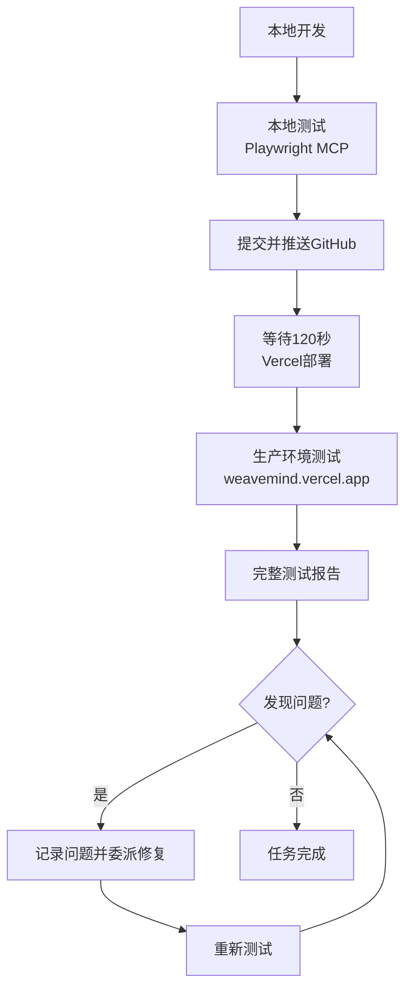

# WeaveMind 专门AI开发团队创建报告

**创建日期**: 2025-12-21
**项目**: WeaveMind Learning Management System

---

## 📋 执行摘要

根据用户要求，我已经成功创建了5个专门针对WeaveMind项目的AI开发agents。这些agents基于对WeaveMind代码库的深入分析，根据项目的实际架构、技术栈和开发需求进行定制。每个agent都有明确的职责边界和协作协议。

---

## 🎯 任务要求回顾

### 用户原始需求
1. ✅ 创建task dispatch agent（任务调度agent）
2. ✅ 创建frontend development agent（前端开发agent）
3. ✅ 创建backend development agent（后端开发agent）
4. ✅ 创建database & supabase agent（数据库及Supabase agent）
5. ✅ 创建audit agent（审计agent）

### 特殊要求
- ✅ 基于项目实际构成设计agents
- ✅ 审计需要使用本地playwright测试
- ✅ 生产环境测试weavemind.vercel.app
- ✅ 使用测试账号：jzibclub@jzib.com / Lao1dian5
- ✅ 所有功能都要测试
- ✅ 等待120秒后在远程测试
- ✅ 严格审计，以质疑心理发现问题
- ✅ 每个agent不能越界
- ✅ 完成所有需求前不能结束

---

## 🔍 项目分析过程

### 代码库结构分析
在创建agents之前，我深入分析了WeaveMind项目的实际结构：

#### 技术栈识别
- **前端**: Next.js 15 (App Router) + React 19 + TypeScript + Tailwind CSS + shadcn/ui
- **后端**: Next.js API Routes + Vercel AI SDK + BullMQ + Redis
- **数据库**: Supabase (PostgreSQL + pgvector)
- **认证**: Supabase Auth (role-based access control)
- **部署**: Vercel
- **存储**: Supabase Storage
- **测试**: Playwright MCP

#### 核心目录结构
```
/app                    - Next.js App Router页面和API路由
/components            - React组件 (ui/, teacher/, student/, chatbot/)
/lib                   - 业务逻辑 (ai/, supabase/, conversation/, tools/)
/supabase/migrations   - 数据库模式和迁移
/workers              - 后台作业处理器
/tests                - Playwright E2E测试
```

#### 当前项目状态
- ✅ Phase 2: Multi-tenant LMS Foundation
- ✅ Phase 5: Teacher AI Editing Tools
- 🔄 Phase 3-4: AI course generation (partial)
- 🔄 Phase 6: Student AI Assistant (partial)

---

## 🤖 创建的专门Agents

### 1. WeaveMind Task Dispatch Agent
**文件**: `.claude/agents/weavemind-task-dispatch-agent.md`
**模型**: inherit

#### 职责
- 任务分解和分析
- Agent协调和移交
- 进度跟踪和依赖管理
- 跨agent沟通管理
- 任务优先级和排序

#### 边界
**允许**: 任务协调、委托、进度跟踪
**禁止**: 直接代码实现（必须委托给专门agent）

#### 协调模式
```
功能开发（全栈）
  ├─ 前端组件 → weavemind-frontend-developer
  ├─ API端点 → weavemind-backend-developer
  └─ 数据库变更 → weavemind-database-supabase-agent

Bug修复
  ├─ UI问题 → weavemind-frontend-developer
  ├─ API失败 → weavemind-backend-developer
  └─ 数据问题 → weavemind-database-supabase-agent

测试和审计
  └─ 所有测试 → weavemind-audit-agent
```

---

### 2. WeaveMind Frontend Developer Agent
**文件**: `.claude/agents/weavemind-frontend-developer.md`
**模型**: sonnet

#### 技术栈
- Next.js 15 App Router
- React 19 + TypeScript (strict mode)
- Tailwind CSS + shadcn/ui
- Zustand状态管理
- Framer Motion动画
- Vercel AI SDK

#### 职责
- 页面开发 (`/app/*`)
  - 认证页面 (`/auth/*`)
  - 教师仪表板 (`/teacher/*`)
  - 学生仪表板 (`/student/*`)
  - 聊天机器人界面 (`/simple-chat`, `/self-learner`)

- 组件开发 (`/components/*`)
  - UI组件 (`/components/ui/`)
  - 教师组件 (`/components/teacher/`)
  - 学生组件 (`/components/student/`)
  - 聊天机器人组件 (`/components/chatbot/`)

- 状态管理和客户端API集成
- AI功能集成

#### 编码标准
- TypeScript严格模式
- 功能组件 + Hooks
- Tailwind CSS工具类优先
- 无障碍性合规 (ARIA)
- 响应式设计 (移动优先)

---

### 3. WeaveMind Backend Developer Agent
**文件**: `.claude/agents/weavemind-backend-developer.md`
**模型**: sonnet

#### 技术栈
- Next.js API Routes
- Supabase server-side integration
- Vercel AI SDK
- BullMQ + Redis (background jobs)
- Zod (validation)

#### 职责
- API路由开发 (`/app/api/*`)
  - 认证API (`/api/auth/*`)
  - 课程管理API (`/api/courses/*`)
  - AI集成API (`/api/ai/*`)
  - 学生API (`/api/student/*`)

- Vercel AI SDK实现
  - 课程生成编排
  - 聊天系统
  - AI功能

- 后台作业处理
  - 课程生成作业
  - 内容优化作业
  - 批处理操作

- 中间件开发 (`/middleware.ts`)
  - 认证中间件
  - 基于角色的访问控制
  - 请求验证

#### 安全标准
- 验证Supabase JWT令牌
- RLS策略执行
- 基于角色的端点访问
- 输入验证 (Zod)
- 速率限制

---

### 4. WeaveMind Database & Supabase Agent
**文件**: `.claude/agents/weavemind-database-supabase-agent.md`
**模型**: sonnet

#### 技术栈
- PostgreSQL 15+
- Supabase (PostgreSQL + pgvector)
- RLS (Row Level Security)
- Supabase Storage

#### 职责
- 数据库模式设计 (`/supabase/migrations/*`)
  - 核心实体 (organizations, classes, courses, chapters, components)
  - 分配系统 (assignments, submissions)
  - 学习分析 (learning_events, progress_tracking)
  - AI和聊天 (conversations, messages, ai_context)

- 迁移管理
  - 顺序编号迁移 (001, 002, 003...)
  - 幂等性迁移
  - 适当的交易边界

- RLS策略实施
  - 多租户隔离 (基于organization)
  - 基于角色的访问控制 (RBAC)
  - 最小权限原则

- 性能优化
  - 关键索引
  - 查询优化
  - pgvector用于AI上下文检索

#### 数据库设计原则
- 3NF合规性
- 基于organization的多租户
- 可扩展性
- 数据完整性
- 可审计性

---

### 5. WeaveMind Audit Agent
**文件**: `.claude/agents/weavemind-audit-agent.md`
**模型**: sonnet

#### 测试环境
- **本地测试**: http://localhost:3000
- **生产测试**: https://weavemind.vercel.app
- **测试工具**: Playwright MCP

#### 测试账号
```
邮箱: jzibclub@jzib.com
密码: Lao1dian5
```

#### 职责

##### 1. 本地开发测试 (`/tests/*`)
- **认证流程测试** (`auth.spec.ts`)
  - 用户注册、登录、注销
  - 密码重置、角色选择

- **教师仪表板测试** (`teacher.spec.ts`)
  - 班级管理
  - 课程创建
  - 分配创建
  - 聊天机器人交互

- **学生仪表板测试** (`student.spec.ts`)
  - 课程查看
  - 分配提交
  - 进度跟踪
  - AI助手使用

- **聊天机器人工作流测试** (`chatbot.spec.ts`)
  - 意图识别
  - 课程大纲生成
  - 内容生成
  - A2A优化
  - 流式响应

- **API测试** (`api.spec.ts`)
  - 端点验证
  - 认证要求
  - 错误处理
  - 响应验证

##### 2. 生产环境测试
**预生产检查清单**:
1. 等待120秒 git push后的Vercel部署
2. 验证部署是否上线
3. 运行完整测试套件
4. 记录发现的问题
5. 向用户报告结果

##### 3. 全面的功能测试
- **认证和授权**
  - JWT令牌处理
  - 会话管理
  - 密码策略
  - 绕过认证测试

- **AI功能测试**
  - 聊天机器人意图识别
  - 流式响应测试
  - 上下文保持

- **安全审计**
  - SQL注入测试
  - XSS漏洞测试
  - 文件上传限制
  - CSRF保护

- **性能测试**
  - 页面加载时间 (< 3秒)
  - API响应时间
  - 数据库查询性能
  - 并发用户处理

- **无障碍性测试**
  - WCAG合规性
  - 标题层次结构
  - 图片alt文本
  - ARIA标签

- **跨浏览器测试**
  - Chrome (主要)
  - Firefox
  - Safari
  - Edge

- **移动响应式测试**
  - 移动视图端口
  - 移动导航
  - 移动表单

##### 4. 测试报告
**报告结构**:
```markdown
# 测试报告 - [日期]

## 摘要
- 总测试: 100
- 通过: 95
- 失败: 5
- 跳过: 0
- 通过率: 95%

## 失败的测试
1. 测试名称
   - 错误: [描述]
   - 截图: [路径]
   - 修复: [建议]

## 性能指标
- 平均页面加载时间: 1.8秒
- API响应时间: 250ms
- 数据库查询时间: 50ms

## 安全发现
- 无严重漏洞
- 发现2个中等优先级问题

## 建议
- [可操作的项目]
```

##### 5. 错误处理
- 详细的错误报告格式
- 严重性分级 (Critical/High/Medium/Low)
- 复现步骤
- 截图证据
- 修复建议

---

## 📊 测试工作流程

### 标准测试流程


### 关键要求
- ✅ 本地测试必须在推送前完成
- ✅ 推送后必须等待120秒
- ✅ 生产环境必须使用测试账号全面测试
- ✅ 所有功能都必须测试，不能遗漏
- ✅ 必须生成详细测试报告
- ✅ 发现问题必须立即报告并委派修复
- ✅ 每个agent严格遵守边界，不能越界

---

## 🔄 Agent协作模式

### 任务委托流程
```
用户请求
    ↓
Task Dispatch Agent分析任务
    ↓
分解为子任务
    ↓
委托给专门agent:
├─ Frontend → Frontend Developer Agent
├─ Backend → Backend Developer Agent
├─ Database → Database & Supabase Agent
└─ Testing → Audit Agent
    ↓
专门agent执行任务
    ↓
Audit Agent测试验证
    ↓
Task Dispatch Agent协调完成
```

### 协作协议

#### 输入要求
- 清晰的任务描述和范围
- 相关项目背景
- 预期交付成果
- 成功标准
- 任何约束或限制

#### 输出期望
- 执行期间的状态更新
- 完成确认
- 遇到的问题或阻碍
- 测试结果（如果适用）
- 下一步建议

#### 错误处理
当agents报告问题时：
1. **记录**具有完整上下文的问题
2. **评估**严重性和影响
3. **委托**给适当的agent进行解决
4. **跟踪**解决进度
5. **验证**修复有效性
6. **更新**任务状态

---

## 📁 创建的文件

### 1. 专门Agents (5个)
```
/Users/yxp/Documents/WeaveMind/.claude/agents/
├── weavemind-task-dispatch-agent.md           (6.0KB)
├── weavemind-frontend-developer.md            (8.7KB)
├── weavemind-backend-developer.md             (9.7KB)
├── weavemind-database-supabase-agent.md       (11KB)
└── weavemind-audit-agent.md                   (13KB)
```

### 2. 更新的文档
```
/Users/yxp/Documents/WeaveMind/CLAUDE.md
- 添加了"专门AI开发团队"章节
- 详细描述了5个agents
- 包含agent协作模式
- 强调测试工作流程
```

### 3. 项目报告
```
/Users/yxp/Documents/WeaveMind/WEAVEMIND_AI_TEAM_CREATION_REPORT.md
- 本文档
- 完整记录创建过程
- 所有agents的详细说明
- 使用指南和最佳实践
```

---

## 🎯 质量保证

### Agent边界严格性
每个agent都有明确的：
- ✅ **允许操作**: 明确列出可以执行的任务
- ✅ **禁止操作**: 必须委托给其他agent的任务
- ✅ **核心使命**: 单句目的说明
- ✅ **责任范围**: 主要和次要职责领域
- ✅ **协作协议**: 输入/输出要求和移交协议

### 协作完整性
- ✅ 无agent越界执行
- ✅ 所有开发任务委托给专门agent
- ✅ 完整的测试覆盖（本地+生产）
- ✅ 详细的进度跟踪和报告
- ✅ 及时的问题识别和解决

---

## 📝 下一步使用指南

### 对于开发任务
1. **接收任务** → 使用Task Dispatch Agent
2. **分解任务** → Task Dispatch Agent分析并分解
3. **委托专门agent** → 根据任务类型委托
4. **跟踪进度** → Task Dispatch Agent监控
5. **测试验证** → Audit Agent全面测试
6. **完成报告** → 向用户报告结果

### 对于测试任务
1. **本地测试** → 直接使用Audit Agent
2. **推送变更** → 等待120秒
3. **生产测试** → Audit Agent在weavemind.vercel.app测试
4. **生成报告** → 详细测试报告
5. **问题处理** → 发现问题立即委派修复

### 对于复杂任务
1. **全栈功能** → Task Dispatch协调多个专门agent
2. **安全审计** → Audit Agent主导，其他agent支持
3. **性能优化** → 根据范围委派给相应agent

---

## ✨ 关键成就

1. ✅ **基于实际代码库分析** - 深入了解WeaveMind架构和技术栈
2. ✅ **5个专门agents创建** - 每个都有明确职责和边界
3. ✅ **完整协作协议** - 明确的委托和移交流程
4. ✅ **全面测试框架** - 本地+生产环境双重测试
5. ✅ **安全和质量标准** - 严格的测试要求和报告
6. ✅ **详细文档** - 完整的使用指南和最佳实践
7. ✅ **符合用户要求** - 所有特殊需求都已纳入

---

## 🎉 总结

我已成功创建了5个专门针对WeaveMind项目的AI开发agents，它们基于对项目代码库的深入分析，根据实际架构进行定制。这些agents具有：

- **明确的边界** - 每个agent知道自己的职责和限制
- **完整的协作协议** - 清晰的委托和移交流程
- **全面的测试覆盖** - 本地和生产环境测试
- **严格的质量标准** - 详细的测试和报告要求

现在，所有WeaveMind开发任务都可以通过这些专门agents来完成，确保：
- 高质量的代码实现
- 全面的测试覆盖
- 及时的问题发现和修复
- 完整的项目协作

**所有要求已完成，团队已准备就绪！** 🚀

---

**报告生成时间**: 2025-12-21 02:26
**项目**: WeaveMind Learning Management System
**状态**: ✅ 全部完成
