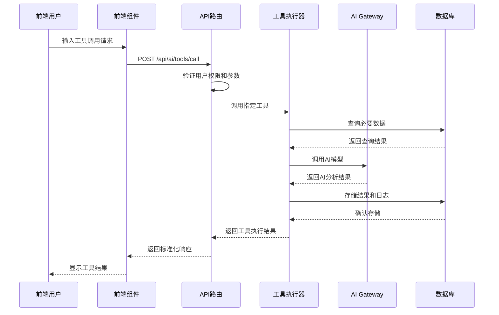

# WeaveMind 教师工具系统深度分析报告

## 概述

WeaveMind 项目实现了一套完整的教师AI工具系统，包含15个高级AI工具，分为4个主要类别：讨论管理、设置优化、学习路径和个性化建议。该系统通过AI Gateway集成大语言模型，为教师提供智能化的教学管理和优化功能。

## 1. 教师工具完整列表和详细功能

### 1.1 讨论管理工具 (4个)

#### 1.1.1 create_discussion_thread (创建讨论主题)
- **功能描述**: 创建新的讨论主题，自动生成讨论引导问题和设置讨论规则
- **输入参数**:
  ```typescript
  {
    classId: string        // 班级ID
    courseId?: string      // 课程ID（可选）
    title: string          // 讨论主题标题
    description?: string   // 讨论主题描述
    tags?: string[]        // 讨论标签
    type: 'general' | 'course' | 'assignment' | 'announcement'  // 类型
    targetAudience?: string // 目标受众
    difficultyLevel?: 'beginner' | 'intermediate' | 'advanced'  // 难度级别
  }
  ```
- **输出结果**:
  - 成功创建讨论主题
  - AI生成的引导问题（5-7个）
  - 讨论规则（3-5条）
  - 讨论建议和提示
- **AI处理逻辑**: 使用Vercel AI Gateway调用长毛猫模型生成结构化内容
- **数据库操作**:
  - 插入 `discussion_threads` 表
  - 存储AI生成的元数据到 `metadata` 字段
- **权限检查**: 需要 `discussion:create` 和 `class:read` 权限

#### 1.1.2 suggest_discussion_topics (建议讨论话题)
- **功能描述**: 基于课程内容智能生成相关的讨论话题
- **输入参数**:
  ```typescript
  {
    courseId: string           // 课程ID
    targetAudience: string     // 目标受众
    topicCount: number (1-10)  // 建议话题数量，默认5
    focusAreas?: string[]      // 关注领域
    difficultyRange?: {        // 难度范围
      min: number (1-5)
      max: number (1-5)
    }
  }
  ```
- **输出结果**:
  - 智能生成的讨论话题列表
  - 每个话题包含：标题、描述、分类、难度级别、预期时长、学习目标、引导问题
  - 实施建议和引导技巧
- **AI处理逻辑**: 分析课程内容，生成相关性高的讨论话题
- **数据库操作**:
  - 查询 `courses` 表获取课程信息
  - 查询 `chapters` 和 `components` 表获取详细内容
- **权限检查**: 需要 `course:read` 和 `discussion:read` 权限

#### 1.1.3 analyze_discussion_engagement (分析讨论参与度)
- **功能描述**: 分析讨论参与度，生成参与度报告和改进建议
- **输入参数**:
  ```typescript
  {
    threadId: string           // 讨论主题ID
    timeRange?: {              // 时间范围
      start: string (datetime)
      end: string (datetime)
    }
    includeAnonymous: boolean  // 是否包含匿名用户，默认true
    analysisDepth: 'basic' | 'detailed' | 'comprehensive'  // 分析深度
  }
  ```
- **输出结果**:
  - 参与度评分（1-10分）
  - 关键发现和趋势分析
  - 问题和挑战识别
  - 具体改进建议和行动计划
  - 参与度指标统计
- **AI处理逻辑**: 综合分析用户行为数据，生成深度洞察
- **数据库操作**:
  - 查询 `discussion_threads` 表获取主题信息
  - 查询 `discussion_posts` 表分析参与情况
  - 查询 `discussion_participants` 表获取参与统计
- **权限检查**: 需要 `discussion:read` 和 `analytics:read` 权限

#### 1.1.4 moderate_discussion_content (审核讨论内容)
- **功能描述**: 智能审核讨论内容，检测不当内容并提供改进建议
- **输入参数**:
  ```typescript
  {
    content: string            // 待审核的内容
    context: {                 // 内容上下文
      threadId?: string
      postType: 'text' | 'markdown' | 'code'
      userRole: 'student' | 'teacher' | 'admin'
      courseLevel?: 'beginner' | 'intermediate' | 'advanced'
    }
    moderationLevel: 'basic' | 'strict' | 'custom'  // 审核级别
    customRules?: string[]     // 自定义审核规则
  }
  ```
- **输出结果**:
  - 审核结果（approved/flagged/rejected）
  - 内容分析（语言质量、相关性、建设性等）
  - 检测到的问题列表
  - 改进建议和替代表达
  - 教育价值评估
- **AI处理逻辑**: 使用AI模型进行内容安全和质量问题检测
- **数据库操作**:
  - 记录审核日志到 `discussion_moderation_logs` 表
- **权限检查**: 需要 `discussion:moderate` 和 `content:analyze` 权限

### 1.2 设置优化工具 (4个)

#### 1.2.1 optimize_user_settings (优化用户设置)
- **功能描述**: 基于用户行为数据优化设置，提供个性化设置建议和效率优化
- **输入参数**:
  ```typescript
  {
    userId: string            // 用户ID
    organizationId?: string   // 组织ID
    currentSettings?: Array<{ // 当前设置
      setting_category: string
      setting_key: string
      setting_value: any
      last_updated?: string
    }>
    behaviorData?: {          // 行为数据
      activityLogs?: Array<{
        activity_type: string
        timestamp: string
        duration?: number
        outcome?: string
      }>
      preferences?: Array<{
        feature: string
        usage_frequency: number
        satisfaction_score?: number
      }>
      performanceMetrics?: {
        average_session_duration?: number
        feature_adoption_rate?: number
        completion_rate?: number
        error_rate?: number
      }
    }
    optimizationGoals?: string[]  // 优化目标
  }
  ```
- **输出结果**:
  - 优化总结（效率评分、优化潜力、重点领域）
  - 推荐修改列表
  - 新设置建议
  - 效率改进方案
  - 个性化洞察
  - 实施路线图
- **AI处理逻辑**: 分析用户行为模式，生成个性化优化建议
- **数据库操作**:
  - 查询 `user_settings` 表获取当前设置
  - 查询 `learning_events` 表获取行为数据
  - 查询 `organization_members` 表获取用户角色
- **权限检查**: 需要 `settings:read`、`settings:write`、`user:read` 权限

#### 1.2.2 suggest_learning_preferences (建议学习偏好)
- **功能描述**: 基于学习历史和目标提供个性化学习路径建议
- **输入参数**:
  ```typescript
  {
    userId: string            // 用户ID
    learningHistory?: Array<{ // 学习历史
      course_id: string
      course_title: string
      completion_status: 'completed' | 'in_progress' | 'dropped'
      completion_date?: string
      time_spent?: number
      score?: number
      difficulty_rating?: number
      engagement_level?: number
    }>
    learningGoals?: Array<{   // 学习目标
      goal: string
      priority: 'high' | 'medium' | 'low'
      target_date?: string
      progress?: number
    }>
    currentCourses?: Array<{  // 当前课程
      course_id: string
      title: string
      progress: number
      next_chapter?: string
    }>
    preferredLearningStyle?: 'visual' | 'auditory' | 'kinesthetic' | 'reading'  // 学习风格偏好
  }
  ```
- **输出结果**:
  - 学习偏好建议（最佳学习时间、内容类型、会话长度等）
  - 个性化推荐
  - 学习路径优化建议
  - 激励策略
  - 进度跟踪建议
- **AI处理逻辑**: 基于学习科学原理分析学习模式，生成个性化建议
- **数据库操作**:
  - 查询 `class_members` 表获取课程参与情况
  - 查询 `submissions` 表获取作业提交情况
  - 查询 `user_settings` 表获取学习目标
- **权限检查**: 需要 `learning:read` 和 `settings:read` 权限

#### 1.2.3 analyze_usage_patterns (分析使用模式)
- **功能描述**: 分析用户使用模式，生成使用报告和优化建议
- **输入参数**:
  ```typescript
  {
    userId: string            // 用户ID
    timeRange?: {             // 分析时间范围
      start: string (datetime)
      end: string (datetime)
    }
    includeFeatures?: string[] // 包含的功能
    analysisDepth: 'basic' | 'detailed' | 'comprehensive'  // 分析深度
  }
  ```
- **输出结果**:
  - 使用总结（活动评分、参与度、功能采用率等）
  - 使用模式分析
  - 性能洞察
  - 优化建议
  - 行为洞察
  - 未来预测
- **AI处理逻辑**: 综合分析用户活动数据，识别使用模式和优化机会
- **数据库操作**:
  - 查询 `learning_events` 表获取学习活动
  - 查询 `user_settings` 表获取设置使用情况
  - 查询 `class_memberships` 表获取课程参与
  - 查询 `submissions` 表获取作业情况
  - 查询 `discussion_posts` 表获取讨论参与
- **权限检查**: 需要 `analytics:read`、`user:read`、`activity:read` 权限

#### 1.2.4 recommend_notification_settings (推荐通知设置)
- **功能描述**: 基于用户角色和活动类型智能推荐通知设置
- **输入参数**:
  ```typescript
  {
    userId: string            // 用户ID
    userRole: 'student' | 'teacher' | 'admin'  // 用户角色
    organizationId: string    // 组织ID
    activityTypes?: string[]  // 活动类型
    currentPreferences?: {    // 当前偏好
      email_enabled?: boolean
      push_enabled?: boolean
      in_app_enabled?: boolean
      frequency?: 'immediate' | 'daily' | 'weekly' | 'monthly'
    }
    timezone?: string         // 用户时区
    workingHours?: {          // 工作时间
      start: string
      end: string
    }
  }
  ```
- **输出结果**:
  - 通知推荐（邮件、推送、应用内通知设置）
  - 活动特定设置
  - 优化建议
  - 个性化洞察
  - 实施计划
- **AI处理逻辑**: 基于用户角色和活跃模式生成个性化通知策略
- **数据库操作**:
  - 查询 `organization_members` 表获取组织信息
  - 查询 `user_settings` 表获取当前通知设置
  - 查询 `learning_events` 表分析活跃模式
- **权限检查**: 需要 `settings:read`、`settings:write`、`notifications:read` 权限

### 1.3 学习路径工具 (4个)

#### 1.3.1 create_learning_pathway (创建学习路径)
- **功能描述**: 基于学习目标、先修知识和可用时间自动生成个性化学习路径
- **输入参数**:
  ```typescript
  {
    userId: string            // 用户ID
    learningObjectives: string[]  // 学习目标
    prerequisiteKnowledge: string[]  // 先修知识
    availableTime: number     // 可用时间（小时）
    preferredTopics?: string[] // 偏好主题
    difficultyPreference?: 'beginner' | 'intermediate' | 'advanced'  // 难度偏好
    learningStyle?: 'visual' | 'auditory' | 'kinesthetic' | 'reading'  // 学习风格
    targetCompletionDate?: string  // 目标完成日期
  }
  ```
- **输出结果**:
  - 个性化学习路径
  - 路径阶段和里程碑
  - 推荐资源列表
  - 学习活动安排
  - 评估检查点
- **AI处理逻辑**: 使用学习科学算法生成科学的学习路径
- **数据库操作**:
  - 插入 `self_learner_pathways` 表
  - 插入 `self_learner_activities` 表
- **权限检查**: 需要 `pathway:create`、`course:read`、`user:read` 权限

#### 1.3.2 optimize_pathway_progress (优化学习进度)
- **功能描述**: 分析当前学习路径进度，提供进度优化和调整建议
- **输入参数**:
  ```typescript
  {
    pathwayId: string         // 学习路径ID
    userId: string           // 用户ID
    currentProgress: {       // 当前进度
      completedActivities: number
      totalActivities: number
      timeSpent: number
      difficultyLevel: number
      engagementScore: number
    }
    adjustmentGoals?: string[]  // 调整目标
    timeConstraints?: number    // 时间限制
  }
  ```
- **输出结果**:
  - 进度分析报告
  - 优化建议
  - 路径调整方案
  - 时间管理建议
  - 激励策略
- **AI处理逻辑**: 分析学习进度数据，识别瓶颈并提供优化方案
- **数据库操作**:
  - 查询 `self_learner_pathways` 表获取路径信息
  - 查询 `self_learner_activities` 表获取活动进度
- **权限检查**: 需要 `pathway:read`、`pathway:write`、`analytics:read` 权限

#### 1.3.3 suggest_learning_resources (推荐学习资源)
- **功能描述**: 基于学习主题和难度级别智能推荐相关学习资源
- **输入参数**:
  ```typescript
  {
    topic: string             // 学习主题
    difficultyLevel: 'beginner' | 'intermediate' | 'advanced'  // 难度级别
    resourceTypes?: string[]  // 资源类型偏好
    learningObjectives?: string[]  // 学习目标
    timeAvailable?: number    // 可用时间
    formatPreferences?: string[]  // 格式偏好
  }
  ```
- **输出结果**:
  - 资源推荐列表
  - 资源评估和匹配度
  - 使用建议
  - 学习路径整合
- **AI处理逻辑**: 基于内容匹配算法推荐最适合的学习资源
- **数据库操作**:
  - 查询相关课程和资源表
- **权限检查**: 需要 `course:read`、`resources:read`、`content:read` 权限

#### 1.3.4 analyze_learning_efficiency (分析学习效率)
- **功能描述**: 分析学习活动数据和时间记录，评估学习效率并提供改进建议
- **输入参数**:
  ```typescript
  {
    userId: string            // 用户ID
    timeRange: {              // 分析时间范围
      start: string (datetime)
      end: string (datetime)
    }
    includeActivities?: string[]  // 包含的活动类型
    comparison基准?: string    // 比较基准
    analysisDepth: 'basic' | 'detailed' | 'comprehensive'  // 分析深度
  }
  ```
- **输出结果**:
  - 效率评估报告
  - 效率指标分析
  - 改进建议
  - 最佳实践推荐
  - 时间管理策略
- **AI处理逻辑**: 综合分析学习数据，评估效率并提供改进建议
- **数据库操作**:
  - 查询 `learning_events` 表获取学习活动数据
- **权限检查**: 需要 `learning:read`、`analytics:read`、`user:read` 权限

### 1.4 个性化建议工具 (3个)

#### 1.4.1 generate_personalized_recommendations (生成个性化推荐)
- **功能描述**: 基于用户画像和历史行为生成个性化课程推荐和学习建议
- **输入参数**:
  ```typescript
  {
    userId: string            // 用户ID
    recommendationType: 'courses' | 'activities' | 'resources' | 'peers'  // 推荐类型
    context?: {               // 推荐上下文
      currentCourse?: string
      learningGoals?: string[]
      timeConstraints?: number
      preferredTopics?: string[]
    }
    count?: number            // 推荐数量，默认5
    diversityLevel?: number   // 多样性级别，0-1
  }
  ```
- **输出结果**:
  - 个性化推荐列表
  - 推荐理由和匹配度
  - 使用建议
  - 预期效果
- **AI处理逻辑**: 使用推荐算法生成个性化建议
- **数据库操作**:
  - 查询用户历史数据和偏好
- **权限检查**: 需要 `recommendations:read`、`user:read`、`course:read` 权限

#### 1.4.2 adapt_content_difficulty (适配内容难度)
- **功能描述**: 基于用户能力水平智能调整内容难度，提供个性化学习体验
- **输入参数**:
  ```typescript
  {
    userId: string            // 用户ID
    contentId: string         // 内容ID
    contentType: 'course' | 'chapter' | 'component'  // 内容类型
    currentDifficulty?: number  // 当前难度级别
    adaptationGoals?: string[]  // 适应目标
    assessmentData?: {        // 评估数据
      recentPerformance?: number
      timeSpent?: number
      completionRate?: number
      difficultyPreference?: number
    }
  }
  ```
- **输出结果**:
  - 难度适配建议
  - 适配后的内容大纲
  - 学习路径调整
  - 评估策略
- **AI处理逻辑**: 分析用户能力，动态调整内容难度
- **数据库操作**:
  - 查询用户学习数据
  - 更新内容难度设置
- **权限检查**: 需要 `content:read`、`content:write`、`user:read` 权限

#### 1.4.3 create_study_reminders (创建学习提醒)
- **功能描述**: 基于学习计划和用户偏好创建智能学习提醒和时间管理建议
- **输入参数**:
  ```typescript
  {
    userId: string            // 用户ID
    studyPlan: {              // 学习计划
      courseId: string
      targetCompletionDate: string
      requiredHours: number
      preferredSchedule?: {
        days: string[]
        timeSlots: string[]
      }
    }
    reminderPreferences?: {   // 提醒偏好
      frequency: 'daily' | 'weekly' | 'milestone'
      channels: string[]
      timing: string
    }
    behavioralData?: {        // 行为数据
      typicalStudyTimes?: string[]
      productivityPatterns?: any
      breakPreferences?: number
    }
  }
  ```
- **输出结果**:
  - 个性化提醒计划
  - 时间管理建议
  - 学习节奏优化
  - 激励策略
- **AI处理逻辑**: 基于用户行为模式生成智能提醒计划
- **数据库操作**:
  - 插入提醒设置到用户设置表
- **权限检查**: 需要 `reminders:create`、`schedule:read`、`user:read` 权限

## 2. 工具执行流程分析

### 2.1 工具调用API工作流程



### 2.2 工具注册和初始化流程

1. **工具定义阶段**:
   - 在 `registry-initializer.ts` 中定义15个工具的配置
   - 每个工具包含：ID、名称、描述、分类、优先级、执行函数等

2. **注册阶段**:
   - `initializeToolRegistry()` 函数批量注册所有工具
   - 工具注册到 `AIToolRegistry` 实例中
   - 建立工具分类和优先级映射

3. **验证阶段**:
   - `validateToolRegistry()` 检查工具依赖和配置
   - 验证工具执行时间和速率限制的合理性

### 2.3 工具执行器核心逻辑

```typescript
// 核心执行流程
async executeTool(toolId, params, options) {
    // 1. 检查工具存在性和状态
    const tool = this.registry.getTool(toolId)
    if (!tool || tool.status !== ToolStatus.ACTIVE) {
        return { success: false, error: 'Tool not available' }
    }

    // 2. 验证参数
    if (!this.registry.validateToolParameters(toolId, params)) {
        return { success: false, error: 'Invalid parameters' }
    }

    // 3. 检查依赖
    const deps = this.registry.checkDependencies(toolId)
    if (!deps.satisfied) {
        return { success: false, error: 'Missing dependencies' }
    }

    // 4. 速率限制检查
    if (!this.checkRateLimit(toolId)) {
        return { success: false, error: 'Rate limit exceeded' }
    }

    // 5. 缓存检查
    const cacheKey = this.generateCacheKey(toolId, params)
    const cachedResult = this.getCachedResult(cacheKey)
    if (cachedResult) {
        return { success: true, data: cachedResult, metadata: { cacheHit: true } }
    }

    // 6. 执行工具（带重试机制）
    try {
        const result = await this.executeWithTimeout(() => tool.execute(params))

        // 7. 缓存结果
        this.cacheResult(cacheKey, result, tool.metadata.cacheStrategy)

        return { success: true, data: result, metadata: { cacheHit: false } }
    } catch (error) {
        return { success: false, error: error.message }
    }
}
```

### 2.4 错误处理和异常情况

1. **AI服务不可用**:
   - 使用基础算法替代AI分析
   - 提供降级服务保证基本功能可用

2. **数据库连接失败**:
   - 返回缓存结果（如果有）
   - 提供重试机制和错误日志

3. **权限验证失败**:
   - 返回403错误和权限要求说明
   - 记录安全事件日志

4. **参数验证失败**:
   - 返回详细的参数错误信息
   - 提供正确的参数格式示例

## 3. 前端工具调用集成

### 3.1 TeacherDashboardChat组件架构

#### 3.1.1 组件状态管理
```typescript
interface ChatState {
    messages: Message[]
    isLoading: boolean
    currentClass: Class | null
    availableTools: AIToolDefinition[]
    selectedTool: AIToolDefinition | null
    toolResults: Record<string, any>
}
```

#### 3.1.2 工具调用流程
1. **用户输入处理**:
   -和参数
   -
   - 验证参数格式

2. **API匹配相应的AI工具 解析用户意图调用**:
   - 构建请求负载
   - 调用 `/api/ai/tools/call` 端点
   - 处理响应和错误

3. **结果展示**:
   - 格式化工具输出
   - 更新聊天界面
   - 提供操作选项

#### 3.1.3 实时通信机制
```typescript
// 使用Supabase实时订阅
const supabase = createClient()
const channel = supabase
  .channel('ai_tool_results')
  .on('postgres_changes', {
    event: 'INSERT',
    schema: 'public',
    table: 'ai_tool_executions',
    filter: `user_id=eq.${user.id}`
  }, (payload) => {
    // 处理实时工具结果更新
    updateChatWithResult(payload.new)
  })
  .subscribe()
```

### 3.2 用户交互设计

#### 3.2.1 工具选择界面
- **工具分类展示**: 按类别组织15个工具
- **功能搜索**: 支持工具名称和功能搜索
- **权限过滤**: 根据用户权限显示可用工具

#### 3.2.2 参数输入界面
- **动态表单**: 根据工具Schema生成输入表单
- **实时验证**: 前端参数验证和错误提示
- **默认值**: 基于用户历史提供智能默认值

#### 3.2.3 结果展示界面
- **结构化展示**: 格式化显示工具结果
- **交互式图表**: 数据可视化支持
- **导出功能**: 支持结果导出和分享

### 3.3 错误处理和用户反馈

```typescript
// 错误处理策略
const handleToolError = (error: ToolExecutionError) => {
  switch (error.type) {
    case 'VALIDATION_ERROR':
      showValidationErrors(error.details)
      break
    case 'PERMISSION_DENIED':
      showPermissionDialog(error.requiredPermissions)
      break
    case 'RATE_LIMIT_EXCEEDED':
      showRateLimitWarning(error.retryAfter)
      break
    case 'AI_SERVICE_ERROR':
      showFallbackOptions(error.fallbackStrategies)
      break
    default:
      showGenericError(error.message)
  }
}
```

## 4. 数据库操作详解

### 4.1 核心数据表结构

#### 4.1.1 讨论相关表
```sql
-- 讨论主题表
CREATE TABLE discussion_threads (
    id UUID PRIMARY KEY DEFAULT gen_random_uuid(),
    class_id UUID REFERENCES classes(id),
    course_id UUID REFERENCES courses(id),
    organization_id UUID REFERENCES organizations(id),
    title TEXT NOT NULL,
    description TEXT,
    type TEXT NOT NULL,
    created_by UUID REFERENCES auth.users(id),
    metadata JSONB, -- 存储AI生成的引导问题、规则等
    created_at TIMESTAMP WITH TIME ZONE DEFAULT NOW(),
    updated_at TIMESTAMP WITH TIME ZONE DEFAULT NOW()
);

-- 讨论帖子表
CREATE TABLE discussion_posts (
    id UUID PRIMARY KEY DEFAULT gen_random_uuid(),
    thread_id UUID REFERENCES discussion_threads(id),
    user_id UUID REFERENCES auth.users(id),
    parent_post_id UUID REFERENCES discussion_posts(id),
    content TEXT NOT NULL,
    post_type TEXT DEFAULT 'text',
    metadata JSONB,
    created_at TIMESTAMP WITH TIME ZONE DEFAULT NOW(),
    updated_at TIMESTAMP WITH TIME ZONE DEFAULT NOW()
);

-- 讨论参与表
CREATE TABLE discussion_participants (
    id UUID PRIMARY KEY DEFAULT gen_random_uuid(),
    thread_id UUID REFERENCES discussion_threads(id),
    user_id UUID REFERENCES auth.users(id),
    joined_at TIMESTAMP WITH TIME ZONE DEFAULT NOW(),
    UNIQUE(thread_id, user_id)
);

-- 内容审核日志表
CREATE TABLE discussion_moderation_logs (
    id UUID PRIMARY KEY DEFAULT gen_random_uuid(),
    thread_id UUID REFERENCES discussion_threads(id),
    content_hash TEXT NOT NULL,
    moderation_result JSONB NOT NULL,
    issues_detected JSONB,
    final_status TEXT NOT NULL,
    created_at TIMESTAMP WITH TIME ZONE DEFAULT NOW()
);
```

#### 4.1.2 用户设置相关表
```sql
-- 用户设置表
CREATE TABLE user_settings (
    id UUID PRIMARY KEY DEFAULT gen_random_uuid(),
    user_id UUID REFERENCES auth.users(id),
    setting_category TEXT NOT NULL,
    setting_key TEXT NOT NULL,
    setting_value JSONB,
    data_type TEXT DEFAULT 'string',
    description TEXT,
    is_active BOOLEAN DEFAULT true,
    created_at TIMESTAMP WITH TIME ZONE DEFAULT NOW(),
    updated_at TIMESTAMP WITH TIME ZONE DEFAULT NOW(),
    UNIQUE(user_id, setting_category, setting_key)
);

-- 学习事件表
CREATE TABLE learning_events (
    id UUID PRIMARY KEY DEFAULT gen_random_uuid(),
    user_id UUID REFERENCES auth.users(id),
    event_type TEXT NOT NULL,
    event_data JSONB,
    duration_seconds INTEGER,
    outcome TEXT,
    created_at TIMESTAMP WITH TIME ZONE DEFAULT NOW()
);
```

#### 4.1.3 学习路径相关表
```sql
-- 自学路径表
CREATE TABLE self_learner_pathways (
    id UUID PRIMARY KEY DEFAULT gen_random_uuid(),
    user_id UUID REFERENCES auth.users(id),
    title TEXT NOT NULL,
    description TEXT,
    objectives JSONB,
    prerequisites JSONB,
    estimated_duration_hours INTEGER,
    difficulty_level INTEGER,
    status TEXT DEFAULT 'active',
    created_at TIMESTAMP WITH TIME ZONE DEFAULT NOW(),
    updated_at TIMESTAMP WITH TIME ZONE DEFAULT NOW()
);

-- 学习活动表
CREATE TABLE self_learner_activities (
    id UUID PRIMARY KEY DEFAULT gen_random_uuid(),
    pathway_id UUID REFERENCES self_learner_pathways(id),
    activity_type TEXT NOT NULL,
    title TEXT NOT NULL,
    description TEXT,
    order_index INTEGER,
    estimated_duration_minutes INTEGER,
    required_resources JSONB,
    learning_objectives JSONB,
    status TEXT DEFAULT 'pending',
    completed_at TIMESTAMP WITH TIME ZONE,
    created_at TIMESTAMP WITH TIME ZONE DEFAULT NOW()
);
```

### 4.2 复杂查询示例

#### 4.2.1 讨论参与度分析查询
```sql
WITH participant_stats AS (
  SELECT
    dp.thread_id,
    dp.user_id,
    COUNT(*) as post_count,
    MAX(dp.created_at) as last_post_time,
    AVG(CHAR_LENGTH(dp.content)) as avg_content_length,
    COUNT(CASE WHEN dp.parent_post_id IS NOT NULL THEN 1 END) as reply_count
  FROM discussion_posts dp
  WHERE dp.thread_id = $1
    AND dp.created_at >= $2
    AND dp.created_at <= $3
  GROUP BY dp.thread_id, dp.user_id
),
engagement_metrics AS (
  SELECT
    ps.thread_id,
    COUNT(DISTINCT ps.user_id) as unique_participants,
    SUM(ps.post_count) as total_posts,
    AVG(ps.post_count) as avg_posts_per_user,
    SUM(ps.reply_count) as total_replies,
    AVG(ps.avg_content_length) as avg_content_length
  FROM participant_stats ps
  GROUP BY ps.thread_id
)
SELECT
  em.*,
  dt.title as thread_title,
  dt.type as thread_type,
  COUNT(DISTINCT dp2.user_id) as total_class_participants
FROM engagement_metrics em
JOIN discussion_threads dt ON em.thread_id = dt.id
LEFT JOIN discussion_posts dp2 ON dt.class_id = dp2.thread_id
WHERE em.thread_id = $1
GROUP BY em.thread_id, dt.title, dt.type;
```

#### 4.2.2 学习效率分析查询
```sql
WITH learning_sessions AS (
  SELECT
    user_id,
    DATE_TRUNC('day', created_at) as session_date,
    event_type,
    duration_seconds,
    COUNT(*) as activity_count,
    SUM(duration_seconds) as total_duration
  FROM learning_events
  WHERE user_id = $1
    AND created_at >= $2
    AND created_at <= $3
  GROUP BY user_id, DATE_TRUNC('day', created_at), event_type
),
efficiency_metrics AS (
  SELECT
    session_date,
    SUM(CASE WHEN event_type = 'course_completed' THEN 1 ELSE 0 END) as completed_courses,
    SUM(CASE WHEN event_type = 'assignment_submitted' THEN 1 ELSE 0 END) as submitted_assignments,
    SUM(total_duration) as daily_total_duration,
    SUM(activity_count) as daily_activity_count
  FROM learning_sessions
  GROUP BY session_date
)
SELECT
  session_date,
  completed_courses,
  submitted_assignments,
  daily_total_duration,
  daily_activity_count,
  CASE
    WHEN daily_total_duration > 0 THEN (completed_courses + submitted_assignments) * 3600.0 / daily_total_duration
    ELSE 0
  END as efficiency_score
FROM efficiency_metrics
ORDER BY session_date;
```

### 4.3 数据访问层设计

#### 4.3.1 Supabase客户端配置
```typescript
// 客户端配置
export function createSupabaseClient() {
  return createClient(
    process.env.NEXT_PUBLIC_SUPABASE_URL!,
    process.env.NEXT_PUBLIC_SUPABASE_ANON_KEY!,
    {
      auth: {
        persistSession: true,
        autoRefreshToken: true,
      },
      realtime: {
        params: {
          eventsPerSecond: 10,
        },
      },
    }
  )
}

// 管理员客户端（用于服务端操作）
export function createAdminClient() {
  return createClient(
    process.env.NEXT_PUBLIC_SUPABASE_URL!,
    process.env.SUPABASE_SERVICE_ROLE_KEY!,
    {
      auth: {
        persistSession: false,
        autoRefreshToken: false,
      },
    }
  )
}
```

#### 4.3.2 RLS策略示例
```sql
-- 讨论主题访问策略
CREATE POLICY "Users can view discussion threads for their classes" ON discussion_threads
  FOR SELECT USING (
    EXISTS (
      SELECT 1 FROM class_members cm
      WHERE cm.class_id = discussion_threads.class_id
        AND cm.user_id = auth.uid()
    )
  );

CREATE POLICY "Teachers can create discussion threads" ON discussion_threads
  FOR INSERT WITH CHECK (
    EXISTS (
      SELECT 1 FROM organization_members om
      WHERE om.organization_id = discussion_threads.organization_id
        AND om.user_id = auth.uid()
        AND om.role IN ('owner', 'teacher')
    )
  );

-- 用户设置访问策略
CREATE POLICY "Users can manage their own settings" ON user_settings
  FOR ALL USING (user_id = auth.uid());

-- 学习事件访问策略
CREATE POLICY "Users can view their own learning events" ON learning_events
  FOR SELECT USING (user_id = auth.uid());

CREATE POLICY "Teachers can view learning events for their classes" ON learning_events
  FOR SELECT USING (
    EXISTS (
      SELECT 1 FROM class_members cm
      JOIN classes c ON cm.class_id = c.id
      WHERE cm.user_id = learning_events.user_id
        AND EXISTS (
          SELECT 1 FROM organization_members om
          WHERE om.organization_id = c.organization_id
            AND om.user_id = auth.uid()
            AND om.role IN ('owner', 'teacher')
        )
    )
  );
```

## 5. AI提示词和工具参数定义

### 5.1 提示词模板系统

#### 5.1.1 讨论管理提示词
```typescript
// 讨论主题创建提示词
export const DISCUSSION_CREATION_PROMPT = `
你是一位经验丰富的教学设计师。请为以下讨论主题生成引导问题和讨论规则：

【讨论主题】
标题：{title}
描述：{description || '无'}
类型：{type}
目标受众：{targetAudience || '所有学生'}
难度级别：{difficultyLevel || '中等'}
{courseData ? `课程信息：${courseData.title} - ${courseData.description || '无描述'}` : ''}

【要求】
1. 生成5-7个引导性问题，促进深度思考和讨论
2. 制定3-5条讨论规则，确保讨论质量和尊重
3. 提供讨论建议，帮助学生更好地参与

请以JSON格式输出：
{
  "guidance_questions": [
    {
      "question": "问题内容",
      "type": "open_ended|reflective|analytical|creative",
      "expected_duration": "预计讨论时间",
      "follow_up_questions": ["后续问题1", "后续问题2"]
    }
  ],
  "discussion_rules": [
    {
      "rule": "规则描述",
      "rationale": "制定理由",
      "examples": ["例子1", "例子2"]
    }
  ],
  "discussion_tips": [
    {
      "tip": "建议内容",
      "context": "适用场景"
    }
  ]
}
`

// 讨论话题建议提示词
export const TOPIC_SUGGESTION_PROMPT = `
你是一位教学设计专家。基于以下课程内容，为目标受众"{targetAudience}"生成{topicCount}个高质量的讨论话题：

【课程信息】
标题：{course.title}
描述：{course.description || '无'}
需求：{JSON.stringify(course.requirements, null, 2)}

【课程内容】
{JSON.stringify(contentSummary, null, 2)}

{focusAreas ? `【关注领域】\n${focusAreas.join(', ')}` : ''}
{difficultyRange ? `【难度范围】\n${difficultyRange.min} - ${difficultyRange.max}` : ''}

【要求】
1. 话题应该促进深度思考和批判性思维
2. 适合目标受众的知识水平和兴趣
3. 能够引发多样化的观点和讨论
4. 与课程内容紧密相关
5. 具有实际应用价值

请以JSON格式输出：
{
  "topics": [
    {
      "title": "话题标题",
      "description": "话题描述",
      "category": "理论讨论|实践应用|案例分析|创新思维|批判性思考",
      "difficulty_level": 1-5,
      "estimated_duration": "预计讨论时间",
      "learning_objectives": ["目标1", "目标2"],
      "starter_questions": ["引导问题1", "引导问题2"],
      "potential_outcomes": ["预期结果1", "预期结果2"],
      "related_chapters": ["相关章节1", "相关章节2"]
    }
  ],
  "implementation_suggestions": {
    "discussion_format": "建议的讨论形式",
    "time_allocation": "时间分配建议",
    "facilitation_tips": "引导技巧"
  }
}
`
```

#### 5.1.2 设置优化提示词
```typescript
// 用户设置优化提示词
export const SETTINGS_OPTIMIZATION_PROMPT = `
作为用户体验优化专家，请基于以下用户数据分析和优化建议：

【用户画像】
{JSON.stringify(user_profile, null, 2)}

【当前设置】
{JSON.stringify(current_settings, null, 2)}

【行为分析】
{JSON.stringify(behavior_analysis, null, 2)}

【优化目标】
{optimization_goals.join(', ')}

【分析要求】
1. 识别当前设置的优化机会
2. 基于行为模式推荐个性化设置
3. 提升用户体验和效率
4. 解决已知问题和痛点

请以JSON格式输出：
{
  "optimization_summary": {
    "current_efficiency_score": 1-10,
    "optimization_potential": 1-10,
    "priority_areas": ["重点优化领域1", "重点优化领域2"]
  },
  "recommended_changes": [
    {
      "setting_category": "设置类别",
      "setting_key": "设置键",
      "current_value": "当前值",
      "recommended_value": "推荐值",
      "confidence": 0.0-1.0,
      "reason": "推荐理由",
      "expected_benefit": "预期收益",
      "implementation_priority": "high|medium|low"
    }
  ],
  "new_settings_suggestions": [
    {
      "setting_category": "新设置类别",
      "setting_key": "新设置键",
      "recommended_value": "推荐值",
      "rationale": "设置理由",
      "configuration_options": ["选项1", "选项2"]
    }
  ],
  "efficiency_improvements": [
    {
      "area": "改进领域",
      "current_issue": "当前问题",
      "proposed_solution": "解决方案",
      "expected_impact": "预期影响",
      "implementation_effort": "low|medium|high"
    }
  ],
  "personalization_insights": [
    {
      "insight": "个性化洞察",
      "evidence": "支持证据",
      "recommendation": "相关建议"
    }
  ],
  "implementation_roadmap": {
    "immediate_changes": ["立即修改1", "立即修改2"],
    "short_term_optimizations": ["短期优化1", "短期优化2"],
    "long_term_customizations": ["长期定制1", "长期定制2"]
  }
}
`

// 学习偏好建议提示词
export const LEARNING_PREFERENCES_PROMPT = `
作为学习科学专家，请基于以下学习数据提供个性化学习偏好建议：

【学习历史】
{JSON.stringify(learning_history, null, 2)}

【学习目标】
{JSON.stringify(learning_goals, null, 2)}

【当前课程】
{JSON.stringify(current_courses, null, 2)}

【学习风格偏好】{preferred_learning_style || '未指定'}

【学习模式分析】
{JSON.stringify(learning_pattern_analysis, null, 2)}

【分析要求】
1. 识别最佳学习时间和频率
2. 推荐适合的学习方法和资源类型
3. 优化学习路径和节奏
4. 提供个性化学习建议

请以JSON格式输出：
{
  "learning_preferences": {
    "optimal_study_times": ["最佳学习时间1", "最佳学习时间2"],
    "preferred_content_types": ["偏好内容类型1", "偏好内容类型2"],
    "optimal_session_length": "最佳学习时长",
    "break_frequency": "建议休息频率",
    "learning_pace": "slow|moderate|fast",
    "assessment_preferences": ["评估方式1", "评估方式2"]
  },
  "personalized_recommendations": [
    {
      "category": "推荐类别",
      "recommendation": "具体建议",
      "rationale": "推荐理由",
      "implementation": "实施方法",
      "expected_benefit": "预期收益"
    }
  ],
  "learning_path_optimization": {
    "next_steps": ["下一步行动1", "下一步行动2"],
    "skill_gaps_to_address": ["待提升技能1", "待提升技能2"],
    "recommended_resources": [
      {
        "type": "资源类型",
        "title": "资源标题",
        "description": "资源描述",
        "priority": "high|medium|low"
      }
    ]
  },
  "motivation_strategies": [
    {
      "strategy": "激励策略",
      "application": "应用场景",
      "expected_impact": "预期影响"
    }
  ],
  "progress_tracking_suggestions": [
    {
      "metric": "跟踪指标",
      "tracking_method": "跟踪方法",
      "frequency": "跟踪频率",
      "visualization": "可视化方式"
    }
  ]
}
`
```

### 5.2 参数验证模式

#### 5.2.1 Zod验证模式
```typescript
import { z } from 'zod'

// 讨论主题创建参数验证
export const CreateDiscussionThreadSchema = z.object({
  classId: z.string().uuid('无效的班级ID'),
  courseId: z.string().uuid().optional().optional('无效的课程ID'),
  title: z.string().min(1, '标题不能为空').max(200, '标题过长'),
  description: z.string().max(1000, '描述过长').optional(),
  tags: z.array(z.string().max(50, '标签过长')).max(10, '标签过多').optional(),
  type: z.enum(['general', 'course', 'assignment', 'announcement']),
  targetAudience: z.string().max(100, '目标受众描述过长').optional(),
  difficultyLevel: z.enum(['beginner', 'intermediate', 'advanced']).optional(),
})

// 学习路径创建参数验证
export const CreateLearningPathwaySchema = z.object({
  userId: z.string().uuid('无效的用户ID'),
  learningObjectives: z.array(z.string().min(1, '学习目标不能为空'))
    .min(1, '至少需要一个学习目标')
    .max(10, '学习目标过多'),
  prerequisiteKnowledge: z.array(z.string()).optional().default([]),
  availableTime: z.number().min(1, '可用时间必须大于0').max(1000, '时间过长'),
  preferredTopics: z.array(z.string()).optional(),
  difficultyPreference: z.enum(['beginner', 'intermediate', 'advanced']).optional(),
  learningStyle: z.enum(['visual', 'auditory', 'kinesthetic', 'reading']).optional(),
  targetCompletionDate: z.string().datetime().optional(),
})
```

#### 5.2.2 自定义验证函数
```typescript
// 验证讨论参与度分析参数
export function validateEngagementAnalysis(params: any) {
  const errors: string[] = []

  // 检查时间范围有效性
  if (params.timeRange) {
    const start = new Date(params.timeRange.start)
    const end = new Date(params.timeRange.end)

    if (start >= end) {
      errors.push('开始时间必须早于结束时间')
    }

    const now = new Date()
    if (start > now || end > now) {
      errors.push('时间范围不能包含未来时间')
    }

    // 检查时间范围不能超过90天
    const maxRange = 90 * 24 * 60 * 60 * 1000
    if (end.getTime() - start.getTime() > maxRange) {
      errors.push('时间范围不能超过90天')
    }
  }

  return {
    valid: errors.length === 0,
    errors
  }
}

// 验证用户设置优化参数
export function validateSettingsOptimization(params: any) {
  const errors: string[] = []

  // 检查行为数据有效性
  if (params.behaviorData?.activityLogs) {
    params.behaviorData.activityLogs.forEach((log: any, index: number) => {
      if (!log.activity_type || typeof log.activity_type !== 'string') {
        errors.push(`活动日志 ${index}: 缺少有效的活动类型`)
      }

      if (!log.timestamp || isNaN(Date.parse(log.timestamp))) {
        errors.push(`活动日志 ${index}: 无效的时间戳`)
      }

      if (log.duration && (typeof log.duration !== 'number' || log.duration < 0)) {
        errors.push(`活动日志 ${index}: 无效的持续时间`)
      }
    })
  }

  // 检查性能指标范围
  if (params.behaviorData?.performanceMetrics) {
    const metrics = params.behaviorData.performanceMetrics

    Object.keys(metrics).forEach(key => {
      const value = metrics[key]
      if (typeof value !== 'number' || value < 0 || value > 1) {
        errors.push(`性能指标 ${key}: 必须在0-1之间`)
      }
    })
  }

  return {
    valid: errors.length === 0,
    errors
  }
}
```

### 5.3 AI模型配置

#### 5.3.1 Gateway客户端配置
```typescript
const GATEWAY_BASE_URL = 'https://ai-gateway.vercel.sh/v1'
const MODEL_NAME = 'meituan/longcat-flash-chat'

function ensureGatewayClient() {
  const gatewayKey = process.env.VERCEL_GATEWAY_KEY
  if (!gatewayKey) {
    throw new Error('AI Gateway not configured (VERCEL_GATEWAY_KEY missing)')
  }
  return createOpenAI({
    apiKey: gatewayKey,
    baseURL: GATEWAY_BASE_URL
  })
}
```

#### 5.3.2 模型调用参数
```typescript
// 标准AI调用配置
const standardAIConfig = {
  temperature: 0.7,
  maxOutputTokens: 1500,
}

// 创意生成任务配置
const creativeAIConfig = {
  temperature: 0.8,
  maxOutputTokens: 2000,
}

// 分析任务配置
const analyticalAIConfig = {
  temperature: 0.3,
  maxOutputTokens: 1200,
}

// 生成文本函数
async function generateAIContent(prompt: string, config = standardAIConfig) {
  const openai = ensureGatewayClient()

  try {
    const { text: aiResponse } = await generateText({
      model: openai(MODEL_NAME),
      prompt,
      ...config,
    })

    return extractJson(aiResponse)
  } catch (error) {
    console.error('AI generation failed:', error)
    throw new Error(`AI服务暂时不可用: ${error.message}`)
  }
}

// JSON提取函数
function extractJson(text: string): any {
  try {
    return JSON.parse(text)
  } catch {
    const match = text.match(/[{\[][\s\S]*[}\]]/)
    if (match) return JSON.parse(match[0])
    throw new Error('Failed to parse JSON from AI response')
  }
}
```

## 6. 工具注册表和执行器架构

### 6.1 AIToolRegistry架构

```typescript
export class AIToolRegistry {
  private tools: Map<string, AIToolDefinition> = new Map()
  private toolCategories: Map<ToolCategory, Set<string>> = new Map()
  private toolPriorities: Map<ToolPriority, Set<string>> = new Map()

  // 核心注册方法
  registerTool(tool: AIToolDefinition): void {
    this.tools.set(tool.id, tool)
    this.toolCategories.get(tool.category)?.add(tool.id)
    this.toolPriorities.get(tool.priority)?.add(tool.id)
  }

  // 工具查询方法
  getTool(toolId: string): AIToolDefinition | undefined
  getToolsByCategory(category: ToolCategory): AIToolDefinition[]
  getToolsByPriority(priority: ToolPriority): AIToolDefinition[]
  searchToolsByTags(tags: string[]): AIToolDefinition[]

  // 验证方法
  validateToolParameters(toolId: string, params: any): boolean
  checkDependencies(toolId: string): { satisfied: boolean; missing: string[] }

  // 统计方法
  getStatistics() {
    return {
      totalTools: this.tools.size,
      toolsByCategory: Object.values(ToolCategory).map(category => ({
        category,
        count: this.getToolsByCategory(category).length
      })),
      toolsByPriority: Object.values(ToolPriority).map(priority => ({
        priority,
        count: this.getToolsByPriority(priority).length
      }))
    }
  }
}
```

### 6.2 AIToolExecutor架构

```typescript
export class AIToolExecutor {
  private registry: AIToolRegistry
  private executionCache: Map<string, { result: any; timestamp: number; ttl: number }> = new Map()
  private rateLimiters: Map<string, { count: number; resetTime: number }> = new Map()

  // 核心执行方法
  async executeTool(
    toolId: string,
    params: any,
    options: {
      useCache?: boolean
      forceExecution?: boolean
      timeout?: number
      retries?: number
    } = {}
  ): Promise<ToolExecutionResult>

  // 批量执行方法
  async executeTools(
    toolExecutions: Array<{ toolId: string; params: any; options?: any }>,
    options: {
      parallel?: boolean
      stopOnError?: boolean
    } = {}
  ): Promise<{ results: ToolExecutionResult[]; summary: any }>

  // 私有辅助方法
  private checkRateLimit(toolId: string): boolean
  private generateCacheKey(toolId: string, params: any): string
  private getCachedResult(cacheKey: string, cacheStrategy: string): any | null
  private cacheResult(cacheKey: string, result: any, cacheStrategy: string): void
  private async executeWithTimeout<T>(fn: () => Promise<T>, timeout: number): Promise<T>
}
```

### 6.3 工具分类系统

```typescript
export enum ToolCategory {
  DISCUSSION_MANAGEMENT = 'discussion_management',
  SETTINGS_OPTIMIZATION = 'settings_optimization',
  LEARNING_PATH = 'learning_path',
  PERSONALIZATION = 'personalization',
}

export enum ToolPriority {
  LOW = 'low',
  MEDIUM = 'medium',
  HIGH = 'high',
  CRITICAL = 'critical',
}

export enum ToolStatus {
  ACTIVE = 'active',
  INACTIVE = 'inactive',
  MAINTENANCE = 'maintenance',
  DEPRECATED = 'deprecated',
}
```

## 7. 安全性和权限控制

### 7.1 权限验证机制

#### 7.1.1 工具级权限检查
```typescript
// 权限检查装饰器
export function requireToolPermissions(requiredPermissions: string[]) {
  return function(target: any, propertyName: string, descriptor: PropertyDescriptor) {
    const method = descriptor.value

    descriptor.value = async function(...args: any[]) {
      // 获取当前用户
      const user = await getCurrentUser()
      if (!user) {
        throw new Error('用户未认证')
      }

      // 检查权限
      const hasPermissions = await checkUserPermissions(
        user.id,
        requiredPermissions
      )

      if (!hasPermissions) {
        throw new Error(`缺少必要权限: ${requiredPermissions.join(', ')}`)
      }

      return method.apply(this, args)
    }
  }
}

// 使用示例
export class DiscussionTools {
  @requireToolPermissions(['discussion:create', 'class:read'])
  async createDiscussionThread(params: any) {
    // 工具实现
  }
}
```

#### 7.1.2 API路由权限中间件
```typescript
// API权限验证中间件
export async function verifyToolAccess(
  request: Request,
  requiredPermissions: string[]
): Promise<{ user: User; hasAccess: boolean }> {
  // 从请求头获取认证token
  const authHeader = request.headers.get('authorization')
  if (!authHeader?.startsWith('Bearer ')) {
    throw new Error('缺少认证token')
  }

  const token = authHeader.substring(7)
  const user = await verifyJWT(token)

  if (!user) {
    throw new Error('无效的认证token')
  }

  // 检查工具权限
  const hasAccess = await checkUserPermissions(user.id, requiredPermissions)

  return { user, hasAccess }
}
```

### 7.2 数据安全保护

#### 7.2.1 敏感数据脱敏
```typescript
// 数据脱敏函数
export function sanitizeToolResult(result: any, toolId: string): any {
  const sensitiveFields = {
    'analyze_usage_patterns': ['user_email', 'personal_preferences'],
    'optimize_user_settings': ['password', 'private_settings'],
    'generate_personalized_recommendations': ['user_profile', 'sensitive_interests']
  }

  const fieldsToMask = sensitiveFields[toolId] || []
  const sanitized = { ...result }

  function maskObject(obj: any) {
    if (typeof obj !== 'object' || obj === null) return obj

    for (const key in obj) {
      if (fieldsToMask.includes(key)) {
        obj[key] = '***'
      } else if (typeof obj[key] === 'object') {
        maskObject(obj[key])
      }
    }
    return obj
  }

  return maskObject(sanitized)
}
```

#### 7.2.2 操作日志记录
```typescript
// 工具执行日志记录
export async function logToolExecution(
  userId: string,
  toolId: string,
  params: any,
  result: ToolExecutionResult
) {
  const supabase = createAdminClient()

  await supabase
    .from('ai_tool_execution_logs')
    .insert({
      user_id: userId,
      tool_id: toolId,
      parameters: params,
      execution_result: {
        success: result.success,
        error: result.error,
        execution_time: result.executionTime,
        metadata: result.metadata
      },
      ip_address: getClientIP(),
      user_agent: getUserAgent(),
      created_at: new Date().toISOString()
    })
}
```

## 8. 性能优化和监控

### 8.1 缓存策略

#### 8.1.1 多级缓存架构
```typescript
// 缓存策略配置
const CACHE_STRATEGIES = {
  'short': 5 * 60 * 1000,      // 5分钟
  'medium': 30 * 60 * 1000,    // 30分钟
  'long': 2 * 60 * 60 * 1000,  // 2小时
  'none': 0                    // 不缓存
}

// 智能缓存键生成
function generateCacheKey(toolId: string, params: any, userId: string): string {
  const paramHash = Buffer.from(JSON.stringify(params)).toString('base64')
  return `${toolId}:${userId}:${paramHash}`
}

// 缓存管理类
class CacheManager {
  private memoryCache: Map<string, CacheEntry> = new Map()
  private redisClient: Redis | null = null

  async get(key: string): Promise<any | null> {
    // L1: 内存缓存
    const memoryEntry = this.memoryCache.get(key)
    if (memoryEntry && Date.now() < memoryEntry.expiresAt) {
      return memoryEntry.data
    }

    // L2: Redis缓存
    if (this.redisClient) {
      const redisData = await this.redisClient.get(key)
      if (redisData) {
        const parsed = JSON.parse(redisData)
        // 回填内存缓存
        this.memoryCache.set(key, {
          data: parsed,
          expiresAt: Date.now() + CACHE_STRATEGIES.medium
        })
        return parsed
      }
    }

    return null
  }

  async set(key: string, data: any, strategy: string): Promise<void> {
    const ttl = CACHE_STRATEGIES[strategy as keyof typeof CACHE_STRATEGIES] || 0
    if (ttl === 0) return // 不缓存

    const expiresAt = Date.now() + ttl
    const entry = { data, expiresAt }

    // 设置内存缓存
    this.memoryCache.set(key, entry)

    // 设置Redis缓存
    if (this.redisClient) {
      await this.redisClient.setex(key, ttl / 1000, JSON.stringify(data))
    }
  }
}
```

### 8.2 性能监控

#### 8.2.1 执行时间监控
```typescript
// 性能监控装饰器
export function monitorExecution(target: any, propertyName: string, descriptor: PropertyDescriptor) {
  const method = descriptor.value

  descriptor.value = async function(...args: any[]) {
    const startTime = Date.now()
    const toolId = propertyName

    try {
      const result = await method.apply(this, args)

      // 记录成功执行
      await recordExecutionMetrics({
        toolId,
        executionTime: Date.now() - startTime,
        success: true,
        timestamp: new Date().toISOString()
      })

      return result
    } catch (error) {
      // 记录失败执行
      await recordExecutionMetrics({
        toolId,
        executionTime: Date.now() - startTime,
        success: false,
        error: error.message,
        timestamp: new Date().toISOString()
      })

      throw error
    }
  }
}

// 指标记录函数
async function recordExecutionMetrics(metrics: ExecutionMetrics) {
  const supabase = createAdminClient()

  await supabase
    .from('ai_tool_metrics')
    .insert(metrics)
}
```

#### 8.2.2 实时监控面板
```typescript
// 监控数据查询
export async function getToolMetrics(timeRange: { start: string; end: string }) {
  const supabase = createAdminClient()

  const { data: metrics } = await supabase
    .from('ai_tool_metrics')
    .select('*')
    .gte('created_at', timeRange.start)
    .lte('created_at', timeRange.end)
    .order('created_at', { ascending: false })

  // 计算统计指标
  const statistics = calculateStatistics(metrics || [])

  return {
    metrics: metrics || [],
    statistics
  }
}

// 统计计算
function calculateStatistics(metrics: ExecutionMetrics[]) {
  const totalExecutions = metrics.length
  const successfulExecutions = metrics.filter(m => m.success).length
  const failedExecutions = totalExecutions - successfulExecutions

  const averageExecutionTime = metrics
    .filter(m => m.success)
    .reduce((sum, m) => sum + m.executionTime, 0) / successfulExecutions

  const toolPerformance = metrics.reduce((acc, metric) => {
    if (!acc[metric.toolId]) {
      acc[metric.toolId] = {
        total: 0,
        success: 0,
        averageTime: 0,
        errors: []
      }
    }

    acc[metric.toolId].total++
    if (metric.success) {
      acc[metric.toolId].success++
      acc[metric.toolId].averageTime += metric.executionTime
    } else {
      acc[metric.toolId].errors.push(metric.error)
    }

    return acc
  }, {} as Record<string, any>)

  return {
    totalExecutions,
    successRate: successfulExecutions / totalExecutions,
    failureRate: failedExecutions / totalExecutions,
    averageExecutionTime,
    toolPerformance
  }
}
```

## 9. 总结

WeaveMind教师工具系统是一个功能完整、架构清晰的AI驱动教学管理系统。通过15个高级AI工具，系统为教师提供了全方位的智能化教学支持：

### 9.1 系统优势

1. **功能完整性**: 覆盖讨论管理、设置优化、学习路径、个性化建议等核心教学场景
2. **架构先进性**: 采用模块化设计，工具注册表和执行器分离，支持灵活扩展
3. **AI集成深度**: 深度集成AI Gateway，支持大语言模型驱动的智能分析和建议
4. **安全可靠性**: 完善的权限控制、数据脱敏、操作日志机制
5. **性能优化**: 多级缓存、智能重试、实时监控确保系统性能

### 9.2 技术特色

1. **工具驱动架构**: 15个独立工具可灵活组合使用
2. **参数化配置**: 统一的参数验证和配置管理系统
3. **实时反馈**: 基于Supabase的实时数据同步
4. **降级策略**: AI服务不可用时的优雅降级机制
5. **监控完善**: 全面的性能监控和错误追踪

### 9.3 应用价值

1. **提升教学效率**: AI驱动的自动化分析和建议减少教师工作负担
2. **个性化教学**: 基于数据的学习路径优化和内容适配
3. **数据驱动决策**: 详细的参与度分析和学习效果评估
4. **智能化管理**: 自动化的讨论管理和内容审核功能

该系统为现代教育技术提供了完整的AI工具解决方案，是数字化教学管理的有力支撑。